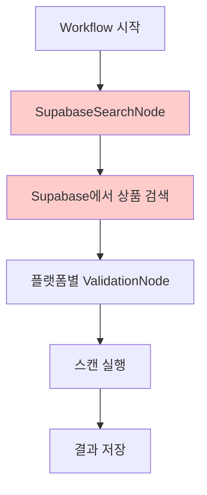
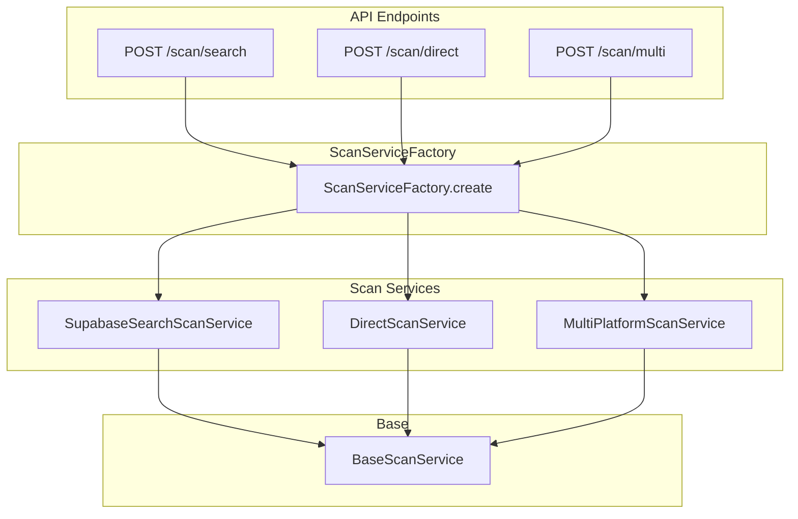

# Phase 2: 검색 방식 다양화 (Scan Service 리팩토링)

## 📋 개요

### 목적

- **검색 방식 다양화**: Supabase 검색 외 단일 상품 ID 크롤링, 다중 쇼핑몰 검색 지원
- **URL 템플릿 시스템**: 플랫폼별 URL 패턴 추상화
- **서비스 계층 추상화**: Strategy Pattern + Factory Pattern 적용

### Phase 1 완료 상태

| 플랫폼      | Extractor | 테스트 | 워크플로우 검증 |
| ----------- | --------- | ------ | --------------- |
| Oliveyoung  | ✅        | ✅     | ✅              |
| Hwahae      | ✅        | ✅     | ✅              |
| Musinsa     | ✅        | ✅     | ✅              |
| Ably        | ✅        | ✅     | ✅              |
| Kurly       | ✅        | ✅     | ✅              |
| Zigzag      | ✅        | ✅     | ✅              |

---

## 🔍 현재 상태 분석

### 1. 현재 검색 방식의 제약



**현재 제약사항**:

- ✅ Supabase `product_sets` 검색만 지원
- ❌ 단일 상품 ID 직접 크롤링 불가
- ❌ 다중 쇼핑몰 동시 검색 불가
- ❌ 외부 ID 직접 입력 불가

### 2. 현재 서비스 구조

```text
src/services/
├── HwahaeScanService.ts      # 플랫폼별 개별 서비스 (Facade)
├── OliveyoungScanService.ts
├── ZigzagScanService.ts
├── ProductSearchService.ts   # Supabase 검색만
├── ScannerRegistry.ts        # Scanner 캐싱
├── NodeStrategyFactory.ts    # 워크플로우 노드 Factory
├── WorkflowExecutionService.ts
├── WorkflowLoaderService.ts
└── scan/                     # 비어있음 (Phase 2에서 구현)
```

### 3. 현재 URL 패턴 분석

| 플랫폼     | 타입       | URL 패턴                                              | 상품 ID 형식            |
| ---------- | ---------- | ----------------------------------------------------- | ----------------------- |
| Oliveyoung | Playwright | `https://m.oliveyoung.co.kr/.../getGoodsDetail.do?goodsNo=${goodsId}` | `A000000231822`         |
| Hwahae     | HTTP API   | `https://gateway.hwahae.co.kr/v14/commerce/goods/${goodsId}` | `93953`                 |
| Musinsa    | HTTP API   | `https://goods-detail.musinsa.com/api2/goods/${goodsId}` | `4809996`               |
| Ably       | Playwright | `https://m.a-bly.com/goods/${goodsId}`                | `21986991`              |
| Kurly      | Playwright | `https://www.kurly.com/goods/${productId}`            | `5179413`               |
| Zigzag     | GraphQL    | `https://api.zigzag.kr/.../GetCatalogProductDetailPageOption` | `32019619` (GraphQL 변수) |

### 4. YAML 설정 현황

```yaml
# 현재: endpoints만 존재 (일부 플랫폼)
endpoints:
  goodsDetail: "${baseUrl}/${apiVersion}/commerce/goods/${goodsId}"

# 목표: urlTemplates 섹션 추가
urlTemplates:
  productDetail: "https://m.oliveyoung.co.kr/m/goods/getGoodsDetail.do?goodsNo=${productId}"
  search: "https://www.oliveyoung.co.kr/store/search/searchMain.do?query=${encodedQuery}"
  
productIdPattern:
  regex: "goodsNo=([A-Z0-9]+)"
  group: 1
```

---

## 🎯 목표 아키텍처

### 1. 3가지 검색 모드 지원



### 2. 목표 디렉토리 구조

```text
src/services/scan/
├── interfaces/
│   ├── IScanService.ts           # 스캔 서비스 인터페이스
│   ├── IScanParams.ts            # 스캔 파라미터 타입
│   └── IScanResult.ts            # 스캔 결과 타입
│
├── base/
│   └── BaseScanService.ts        # 추상 베이스 클래스
│
├── SupabaseSearchScanService.ts  # 모드 1: Supabase 검색 기반
├── DirectScanService.ts          # 모드 2: 단일 상품 ID 직접
├── MultiPlatformScanService.ts   # 모드 3: 다중 플랫폼 병렬
│
├── ScanServiceFactory.ts         # Factory Pattern
│
└── url/
    ├── UrlTemplateEngine.ts      # URL 템플릿 처리
    └── ProductIdExtractor.ts     # URL에서 상품 ID 추출
```

---

## 📝 세부 구현 계획

### Step 2.1: URL 템플릿 시스템

#### 2.1.1. YAML 설정 확장

각 플랫폼 YAML에 `urlTemplates` 섹션 추가:

```yaml
# oliveyoung.yaml
platform: oliveyoung
name: "올리브영"
baseUrl: "https://m.oliveyoung.co.kr"

# 신규: URL 템플릿
urlTemplates:
  productDetail: "https://m.oliveyoung.co.kr/m/goods/getGoodsDetail.do?goodsNo=${productId}"
  # search는 필요시 추가

# 신규: 상품 ID 추출 패턴
productIdPattern:
  regex: "goodsNo=([A-Z0-9]+)"
  group: 1
```

**플랫폼별 urlTemplates 정의**:

| 플랫폼     | productDetail URL                                                     |
| ---------- | --------------------------------------------------------------------- |
| oliveyoung | `https://m.oliveyoung.co.kr/m/goods/getGoodsDetail.do?goodsNo=${productId}` |
| hwahae     | `https://gateway.hwahae.co.kr/v14/commerce/goods/${productId}`        |
| musinsa    | `https://goods-detail.musinsa.com/api2/goods/${productId}`            |
| ably       | `https://m.a-bly.com/goods/${productId}`                              |
| kurly      | `https://www.kurly.com/goods/${productId}`                            |
| zigzag     | GraphQL endpoint (별도 처리)                                          |

#### 2.1.2. UrlTemplateEngine 구현

**파일**: `src/services/scan/url/UrlTemplateEngine.ts`

```typescript
/**
 * URL 템플릿 엔진
 * YAML urlTemplates를 실제 URL로 변환
 */
export class UrlTemplateEngine {
  /**
   * 템플릿 변수 치환
   * @param template URL 템플릿 (예: "https://.../${productId}")
   * @param variables 치환할 변수들
   * @returns 완성된 URL
   */
  static render(template: string, variables: Record<string, string>): string {
    return template.replace(/\$\{(\w+)\}/g, (_, key) => {
      const value = variables[key];
      if (value === undefined) {
        throw new Error(`Missing template variable: ${key}`);
      }
      return value;
    });
  }

  /**
   * 플랫폼 설정에서 상품 상세 URL 생성
   */
  static buildProductDetailUrl(platform: string, productId: string): string {
    const config = ConfigLoader.getInstance().loadConfig(platform);
    const template = config.urlTemplates?.productDetail;
    
    if (!template) {
      throw new Error(`No productDetail URL template for platform: ${platform}`);
    }
    
    return this.render(template, { productId });
  }
}
```

#### 2.1.3. ProductIdExtractor 구현

**파일**: `src/services/scan/url/ProductIdExtractor.ts`

```typescript
/**
 * URL에서 상품 ID 추출
 * YAML productIdPattern 사용
 */
export class ProductIdExtractor {
  /**
   * URL에서 상품 ID 추출
   */
  static extract(platform: string, url: string): string | null {
    const config = ConfigLoader.getInstance().loadConfig(platform);
    const pattern = config.productIdPattern;
    
    if (!pattern?.regex) {
      // 기본 추출 로직 (ValidationNode와 동일)
      return this.extractByPlatform(platform, url);
    }
    
    const regex = new RegExp(pattern.regex);
    const match = url.match(regex);
    
    if (!match) return null;
    return match[pattern.group || 1] || null;
  }

  /**
   * 플랫폼별 기본 추출 로직 (기존 ValidationNode 코드 재사용)
   */
  private static extractByPlatform(platform: string, url: string): string | null {
    switch (platform) {
      case 'oliveyoung':
        return new URL(url).searchParams.get('goodsNo');
      case 'hwahae':
      case 'musinsa':
      case 'ably':
      case 'kurly':
        return url.split('/').pop() || null;
      case 'zigzag':
        return url.split('/').pop()?.split('?')[0] || null;
      default:
        return null;
    }
  }
}
```

---

### Step 2.2: BaseScanService 추상화

#### 2.2.1. 인터페이스 정의

**파일**: `src/services/scan/interfaces/IScanService.ts`

```typescript
import { ScanParams, ScanResult } from './IScanParams';

/**
 * 스캔 서비스 인터페이스
 */
export interface IScanService {
  /**
   * 스캔 실행
   */
  scan(params: ScanParams): Promise<ScanResult>;
  
  /**
   * 서비스 타입 식별자
   */
  readonly type: ScanServiceType;
}

export type ScanServiceType = 'supabase-search' | 'direct' | 'multi-platform';
```

**파일**: `src/services/scan/interfaces/IScanParams.ts`

```typescript
/**
 * 스캔 파라미터 (모드별 Union Type)
 */
export type ScanParams = 
  | SupabaseSearchParams 
  | DirectScanParams 
  | MultiPlatformParams;

/**
 * 모드 1: Supabase 검색 기반
 */
export interface SupabaseSearchParams {
  mode: 'supabase-search';
  productSetId?: string;        // UUID로 검색
  linkUrlPattern?: string;      // URL 패턴으로 검색
  saleStatus?: string;          // 판매 상태 필터
  platform?: string;            // 플랫폼 필터 (선택)
  limit?: number;               // 결과 제한
}

/**
 * 모드 2: 단일 상품 ID 직접 크롤링
 */
export interface DirectScanParams {
  mode: 'direct';
  platform: string;             // 플랫폼 (필수)
  productId: string;            // 상품 ID (필수)
  saveToSupabase?: boolean;     // 결과 저장 여부
  strategyId?: string;          // 스캔 전략 (선택)
}

/**
 * 모드 3: 다중 플랫폼 병렬 스캔
 */
export interface MultiPlatformParams {
  mode: 'multi-platform';
  productSetId: string;         // 상품 세트 UUID (필수)
  platforms: string[];          // 스캔할 플랫폼 목록
  limit?: number;               // 플랫폼당 결과 제한
  concurrency?: number;         // 동시 실행 수
}
```

**파일**: `src/services/scan/interfaces/IScanResult.ts`

```typescript
/**
 * 스캔 결과
 */
export interface ScanResult {
  success: boolean;
  results: ProductScanResult[];
  summary: ScanSummary;
  errors?: ScanError[];
}

export interface ProductScanResult {
  platform: string;
  productId: string;
  url: string;
  product: ScannedProduct | null;
  scanDuration: number;         // ms
  timestamp: string;
  error?: string;
}

export interface ScannedProduct {
  productName: string;
  thumbnail: string | null;
  originalPrice: number;
  discountedPrice: number;
  saleStatus: string;
  // 플랫폼별 추가 필드
  [key: string]: unknown;
}

export interface ScanSummary {
  totalRequested: number;
  successCount: number;
  failureCount: number;
  totalDuration: number;        // ms
}

export interface ScanError {
  platform: string;
  productId: string;
  code: string;
  message: string;
}
```

#### 2.2.2. BaseScanService 구현

**파일**: `src/services/scan/base/BaseScanService.ts`

```typescript
import { IScanService, ScanServiceType } from '../interfaces/IScanService';
import { ScanParams, ScanResult, ProductScanResult } from '../interfaces/IScanParams';
import { ScannerRegistry } from '@/services/ScannerRegistry';
import { UrlTemplateEngine } from '../url/UrlTemplateEngine';
import { logger } from '@/config/logger';

/**
 * 스캔 서비스 베이스 클래스
 * Template Method Pattern
 */
export abstract class BaseScanService implements IScanService {
  abstract readonly type: ScanServiceType;

  /**
   * 스캔 실행 (추상 메서드)
   */
  abstract scan(params: ScanParams): Promise<ScanResult>;

  /**
   * 단일 상품 스캔 실행 (공통 로직)
   */
  protected async executeScan(
    platform: string,
    productId: string,
    strategyId?: string
  ): Promise<ProductScanResult> {
    const startTime = Date.now();
    
    try {
      // Scanner 가져오기
      const scanner = ScannerRegistry.getInstance().getScanner(platform, strategyId);
      
      // 스캔 실행
      const product = await scanner.scan(productId);
      
      // URL 생성
      const url = UrlTemplateEngine.buildProductDetailUrl(platform, productId);
      
      return {
        platform,
        productId,
        url,
        product: this.mapToScannedProduct(product),
        scanDuration: Date.now() - startTime,
        timestamp: new Date().toISOString(),
      };
    } catch (error) {
      const message = error instanceof Error ? error.message : String(error);
      
      logger.error({ platform, productId, error: message }, 'Scan failed');
      
      return {
        platform,
        productId,
        url: '',
        product: null,
        scanDuration: Date.now() - startTime,
        timestamp: new Date().toISOString(),
        error: message,
      };
    }
  }

  /**
   * 결과 요약 생성
   */
  protected createSummary(
    results: ProductScanResult[],
    startTime: number
  ): ScanSummary {
    return {
      totalRequested: results.length,
      successCount: results.filter(r => r.product !== null).length,
      failureCount: results.filter(r => r.product === null).length,
      totalDuration: Date.now() - startTime,
    };
  }

  /**
   * 스캔 결과를 공통 형식으로 변환
   */
  protected abstract mapToScannedProduct(product: unknown): ScannedProduct;
}
```

---

### Step 2.3: 3가지 ScanService 구현

#### 2.3.1. SupabaseSearchScanService (모드 1)

**파일**: `src/services/scan/SupabaseSearchScanService.ts`

```typescript
import { BaseScanService } from './base/BaseScanService';
import { ScanServiceType } from './interfaces/IScanService';
import { SupabaseSearchParams, ScanResult, ScannedProduct } from './interfaces/IScanParams';
import { ProductSearchService } from '@/services/ProductSearchService';
import { ProductIdExtractor } from './url/ProductIdExtractor';
import { logger } from '@/config/logger';

/**
 * Supabase 검색 기반 스캔 서비스 (기존 방식)
 */
export class SupabaseSearchScanService extends BaseScanService {
  readonly type: ScanServiceType = 'supabase-search';
  
  private searchService: ProductSearchService;

  constructor() {
    super();
    this.searchService = new ProductSearchService();
  }

  async scan(params: SupabaseSearchParams): Promise<ScanResult> {
    const startTime = Date.now();
    
    logger.info({ params }, '[SupabaseSearchScanService] Scan started');

    // 1. Supabase에서 상품 검색
    const products = await this.searchService.searchProducts({
      link_url_pattern: params.linkUrlPattern,
      sale_status: params.saleStatus,
      limit: params.limit,
    });

    // 2. 플랫폼 필터링
    const filtered = params.platform
      ? products.filter(p => p.link_url?.includes(params.platform))
      : products;

    // 3. 각 상품 스캔
    const results = await Promise.all(
      filtered.map(async (product) => {
        const platform = this.detectPlatform(product.link_url);
        const productId = ProductIdExtractor.extract(platform, product.link_url || '');
        
        if (!productId) {
          return {
            platform,
            productId: '',
            url: product.link_url || '',
            product: null,
            scanDuration: 0,
            timestamp: new Date().toISOString(),
            error: 'Failed to extract productId',
          };
        }
        
        return this.executeScan(platform, productId);
      })
    );

    // 4. 에러 수집
    const errors = results
      .filter(r => r.error)
      .map(r => ({
        platform: r.platform,
        productId: r.productId,
        code: 'SCAN_FAILED',
        message: r.error!,
      }));

    return {
      success: errors.length === 0,
      results,
      summary: this.createSummary(results, startTime),
      errors: errors.length > 0 ? errors : undefined,
    };
  }

  /**
   * URL에서 플랫폼 감지
   */
  private detectPlatform(url: string | null): string {
    if (!url) return 'unknown';
    
    if (url.includes('oliveyoung')) return 'oliveyoung';
    if (url.includes('hwahae')) return 'hwahae';
    if (url.includes('musinsa')) return 'musinsa';
    if (url.includes('a-bly')) return 'ably';
    if (url.includes('kurly')) return 'kurly';
    if (url.includes('zigzag')) return 'zigzag';
    
    return 'unknown';
  }

  protected mapToScannedProduct(product: unknown): ScannedProduct {
    const p = product as Record<string, unknown>;
    return {
      productName: (p.productName as string) || '',
      thumbnail: (p.thumbnail as string) || null,
      originalPrice: (p.originalPrice as number) || 0,
      discountedPrice: (p.discountedPrice as number) || 0,
      saleStatus: (p.saleStatus as string) || 'unknown',
    };
  }
}
```

#### 2.3.2. DirectScanService (모드 2)

**파일**: `src/services/scan/DirectScanService.ts`

```typescript
import { BaseScanService } from './base/BaseScanService';
import { ScanServiceType } from './interfaces/IScanService';
import { DirectScanParams, ScanResult, ScannedProduct } from './interfaces/IScanParams';
import { SupabaseProductRepository } from '@/repositories/SupabaseProductRepository';
import { logger } from '@/config/logger';

/**
 * 단일 상품 ID 직접 스캔 서비스
 */
export class DirectScanService extends BaseScanService {
  readonly type: ScanServiceType = 'direct';
  
  private repository: SupabaseProductRepository;

  constructor() {
    super();
    this.repository = new SupabaseProductRepository();
  }

  async scan(params: DirectScanParams): Promise<ScanResult> {
    const startTime = Date.now();
    
    logger.info({ params }, '[DirectScanService] Scan started');

    // 1. 스캔 실행
    const result = await this.executeScan(
      params.platform,
      params.productId,
      params.strategyId
    );

    // 2. Supabase 저장 (선택적)
    if (params.saveToSupabase && result.product) {
      try {
        // TODO: ProductSet 저장 로직 구현
        logger.info({ productId: params.productId }, 'Saved to Supabase');
      } catch (error) {
        logger.warn({ error }, 'Failed to save to Supabase');
      }
    }

    return {
      success: result.product !== null,
      results: [result],
      summary: this.createSummary([result], startTime),
      errors: result.error ? [{
        platform: params.platform,
        productId: params.productId,
        code: 'SCAN_FAILED',
        message: result.error,
      }] : undefined,
    };
  }

  protected mapToScannedProduct(product: unknown): ScannedProduct {
    const p = product as Record<string, unknown>;
    return {
      productName: (p.productName as string) || '',
      thumbnail: (p.thumbnail as string) || null,
      originalPrice: (p.originalPrice as number) || 0,
      discountedPrice: (p.discountedPrice as number) || 0,
      saleStatus: (p.saleStatus as string) || 'unknown',
    };
  }
}
```

#### 2.3.3. MultiPlatformScanService (모드 3)

**파일**: `src/services/scan/MultiPlatformScanService.ts`

```typescript
import { BaseScanService } from './base/BaseScanService';
import { ScanServiceType } from './interfaces/IScanService';
import { MultiPlatformParams, ScanResult, ScannedProduct, ProductScanResult } from './interfaces/IScanParams';
import { ProductSearchService } from '@/services/ProductSearchService';
import { ProductIdExtractor } from './url/ProductIdExtractor';
import { logger } from '@/config/logger';

/**
 * 다중 플랫폼 병렬 스캔 서비스
 */
export class MultiPlatformScanService extends BaseScanService {
  readonly type: ScanServiceType = 'multi-platform';
  
  private searchService: ProductSearchService;

  constructor() {
    super();
    this.searchService = new ProductSearchService();
  }

  async scan(params: MultiPlatformParams): Promise<ScanResult> {
    const startTime = Date.now();
    
    logger.info({ params }, '[MultiPlatformScanService] Scan started');

    // 1. Supabase에서 상품 검색 (productSetId 기준)
    const allProducts = await this.searchService.searchProducts({
      // productSetId로 검색하는 로직 필요
      limit: params.limit,
    });

    // 2. 플랫폼별 그룹핑
    const grouped = this.groupByPlatform(allProducts, params.platforms);

    // 3. 플랫폼별 병렬 스캔 (concurrency 제한)
    const allResults: ProductScanResult[] = [];
    const concurrency = params.concurrency || 3;

    for (const [platform, products] of Object.entries(grouped)) {
      // 배치 처리 (concurrency 만큼씩)
      for (let i = 0; i < products.length; i += concurrency) {
        const batch = products.slice(i, i + concurrency);
        
        const batchResults = await Promise.all(
          batch.map(async (product) => {
            const productId = ProductIdExtractor.extract(platform, product.link_url || '');
            if (!productId) {
              return {
                platform,
                productId: '',
                url: product.link_url || '',
                product: null,
                scanDuration: 0,
                timestamp: new Date().toISOString(),
                error: 'Failed to extract productId',
              };
            }
            return this.executeScan(platform, productId);
          })
        );
        
        allResults.push(...batchResults);
      }
    }

    // 4. 에러 수집
    const errors = allResults
      .filter(r => r.error)
      .map(r => ({
        platform: r.platform,
        productId: r.productId,
        code: 'SCAN_FAILED',
        message: r.error!,
      }));

    return {
      success: errors.length === 0,
      results: allResults,
      summary: this.createSummary(allResults, startTime),
      errors: errors.length > 0 ? errors : undefined,
    };
  }

  /**
   * 플랫폼별 상품 그룹핑
   */
  private groupByPlatform(
    products: Array<{ link_url?: string | null }>,
    platforms: string[]
  ): Record<string, Array<{ link_url?: string | null }>> {
    const grouped: Record<string, Array<{ link_url?: string | null }>> = {};
    
    for (const platform of platforms) {
      grouped[platform] = products.filter(p => 
        p.link_url?.includes(platform)
      );
    }
    
    return grouped;
  }

  protected mapToScannedProduct(product: unknown): ScannedProduct {
    const p = product as Record<string, unknown>;
    return {
      productName: (p.productName as string) || '',
      thumbnail: (p.thumbnail as string) || null,
      originalPrice: (p.originalPrice as number) || 0,
      discountedPrice: (p.discountedPrice as number) || 0,
      saleStatus: (p.saleStatus as string) || 'unknown',
    };
  }
}
```

---

### Step 2.4: ScanServiceFactory

**파일**: `src/services/scan/ScanServiceFactory.ts`

```typescript
import { IScanService, ScanServiceType } from './interfaces/IScanService';
import { SupabaseSearchScanService } from './SupabaseSearchScanService';
import { DirectScanService } from './DirectScanService';
import { MultiPlatformScanService } from './MultiPlatformScanService';

/**
 * 스캔 서비스 팩토리
 * Factory Pattern
 */
export class ScanServiceFactory {
  private static instances: Map<ScanServiceType, IScanService> = new Map();

  /**
   * 스캔 서비스 생성 (Singleton)
   */
  static create(mode: ScanServiceType): IScanService {
    // 캐시된 인스턴스 반환
    if (this.instances.has(mode)) {
      return this.instances.get(mode)!;
    }

    // 새 인스턴스 생성
    let service: IScanService;
    
    switch (mode) {
      case 'supabase-search':
        service = new SupabaseSearchScanService();
        break;
      case 'direct':
        service = new DirectScanService();
        break;
      case 'multi-platform':
        service = new MultiPlatformScanService();
        break;
      default:
        throw new Error(`Unknown scan mode: ${mode}`);
    }

    this.instances.set(mode, service);
    return service;
  }

  /**
   * 파라미터에서 모드 감지
   */
  static detectMode(params: Record<string, unknown>): ScanServiceType {
    if (params.mode) {
      return params.mode as ScanServiceType;
    }
    
    // 파라미터로 모드 추론
    if (params.platforms && Array.isArray(params.platforms)) {
      return 'multi-platform';
    }
    if (params.platform && params.productId) {
      return 'direct';
    }
    
    return 'supabase-search';
  }

  /**
   * 모든 인스턴스 정리 (테스트용)
   */
  static clearAll(): void {
    this.instances.clear();
  }
}
```

---

### Step 2.5: API 라우트 추가

**파일**: `src/routes/v1/scan.router.ts` (신규)

```typescript
/**
 * 스캔 라우터 (3가지 모드)
 * POST /api/v1/scan/search   - Supabase 검색 기반
 * POST /api/v1/scan/direct   - 단일 상품 직접 스캔
 * POST /api/v1/scan/multi    - 다중 플랫폼 병렬 스캔
 */

import { Router, Request, Response } from 'express';
import { ScanServiceFactory } from '@/services/scan/ScanServiceFactory';
import { createRequestLogger } from '@/utils/LoggerContext';

const router = Router();

/**
 * POST /api/v1/scan/search
 * Supabase 검색 기반 스캔
 */
router.post('/search', async (req: Request, res: Response) => {
  const logger = createRequestLogger(
    req.headers['x-request-id'] as string,
    req.method,
    req.path
  );

  try {
    const params = {
      mode: 'supabase-search' as const,
      ...req.body,
    };

    const service = ScanServiceFactory.create('supabase-search');
    const result = await service.scan(params);

    res.json(result);
  } catch (error) {
    logger.error({ error }, 'Scan search failed');
    res.status(500).json({
      success: false,
      error: error instanceof Error ? error.message : 'Unknown error',
    });
  }
});

/**
 * POST /api/v1/scan/direct
 * 단일 상품 직접 스캔
 */
router.post('/direct', async (req: Request, res: Response) => {
  const logger = createRequestLogger(
    req.headers['x-request-id'] as string,
    req.method,
    req.path
  );

  try {
    const { platform, productId, saveToSupabase, strategyId } = req.body;

    // 필수 파라미터 검증
    if (!platform || !productId) {
      res.status(400).json({
        success: false,
        error: 'platform and productId are required',
      });
      return;
    }

    const params = {
      mode: 'direct' as const,
      platform,
      productId,
      saveToSupabase,
      strategyId,
    };

    const service = ScanServiceFactory.create('direct');
    const result = await service.scan(params);

    res.json(result);
  } catch (error) {
    logger.error({ error }, 'Direct scan failed');
    res.status(500).json({
      success: false,
      error: error instanceof Error ? error.message : 'Unknown error',
    });
  }
});

/**
 * POST /api/v1/scan/multi
 * 다중 플랫폼 병렬 스캔
 */
router.post('/multi', async (req: Request, res: Response) => {
  const logger = createRequestLogger(
    req.headers['x-request-id'] as string,
    req.method,
    req.path
  );

  try {
    const { productSetId, platforms, limit, concurrency } = req.body;

    // 필수 파라미터 검증
    if (!productSetId || !platforms || !Array.isArray(platforms)) {
      res.status(400).json({
        success: false,
        error: 'productSetId and platforms (array) are required',
      });
      return;
    }

    const params = {
      mode: 'multi-platform' as const,
      productSetId,
      platforms,
      limit,
      concurrency,
    };

    const service = ScanServiceFactory.create('multi-platform');
    const result = await service.scan(params);

    res.json(result);
  } catch (error) {
    logger.error({ error }, 'Multi-platform scan failed');
    res.status(500).json({
      success: false,
      error: error instanceof Error ? error.message : 'Unknown error',
    });
  }
});

export default router;
```

---

## 📋 구현 체크리스트

### ✅ Phase 2.1 완료 (2025-01-25)

**1단계: 기반 인프라**

- [x] 인터페이스 정의
  - [x] `src/services/extract/interfaces/IExtractService.ts`
  - [x] `src/services/extract/interfaces/IExtractParams.ts`
  - [x] `src/services/extract/interfaces/IExtractResult.ts`
  - [x] `src/services/extract/interfaces/index.ts` (barrel export)

- [x] URL 유틸리티
  - [x] `src/services/extract/url/PlatformDetector.ts` (URL → 플랫폼 감지)
  - [x] `src/services/extract/url/UrlTemplateEngine.ts` (productId → URL 생성)
  - [x] `src/services/extract/url/index.ts` (barrel export)

- [x] YAML 설정 확장 (6개 플랫폼)
  - [x] oliveyoung.yaml - `urlTemplates`, `productIdPattern` 추가
  - [x] hwahae.yaml - `urlTemplates`, `productIdPattern` 추가
  - [x] musinsa.yaml - `urlTemplates`, `productIdPattern` 추가
  - [x] ably.yaml - `urlTemplates`, `productIdPattern` 추가
  - [x] kurly.yaml - `urlTemplates`, `productIdPattern` 추가
  - [x] zigzag.yaml - `urlTemplates`, `productIdPattern` 추가

**2단계: ExtractByProductSetService**

- [x] `src/services/extract/ExtractByProductSetService.ts` 구현
- [x] `src/services/extract/index.ts` (barrel export)

**3단계: API v2 라우터**

- [x] `src/routes/v2/products.router.ts` 생성
- [x] `src/routes/v2/index.ts` 생성
- [x] `src/server.ts`에 v2 라우터 등록

**4단계: 테스트**

- [x] `tests/services/extract/PlatformDetector.test.ts` (23 tests)
- [x] `tests/services/extract/UrlTemplateEngine.test.ts` (20 tests)
- [x] TypeScript 0 errors

### 후순위 (미구현)

- [ ] `ExtractByUrlService.ts` - URL 기반 추출
- [ ] `ExtractByIdService.ts` - (platform, productId) 기반 추출
- [ ] `ExtractServiceFactory.ts` - Factory Pattern

---

## 📊 예상 효과

### 기능 확장

| 기능                   | Before | After |
| ---------------------- | ------ | ----- |
| Supabase 검색 기반     | ✅     | ✅    |
| 단일 상품 ID 직접 스캔 | ❌     | ✅    |
| 다중 플랫폼 병렬 스캔  | ❌     | ✅    |
| URL 템플릿 시스템      | ❌     | ✅    |

### 아키텍처 개선

- **Strategy Pattern**: ScanService 전략 분리
- **Factory Pattern**: ScanServiceFactory 통한 인스턴스 생성
- **Template Method**: BaseScanService 공통 로직 추상화
- **SRP**: 각 서비스가 단일 책임 (검색/직접/다중)

### API 확장

```text
# 신규 엔드포인트
POST /api/v1/scan/search   # Supabase 검색 기반
POST /api/v1/scan/direct   # 단일 상품 직접 스캔
POST /api/v1/scan/multi    # 다중 플랫폼 병렬 스캔
```

---

## 📅 예상 일정

| 단계          | 작업                    | 예상 소요 |
| ------------- | ----------------------- | --------- |
| Step 2.1      | URL 템플릿 시스템       | 1일       |
| Step 2.2      | BaseScanService 추상화  | 0.5일     |
| Step 2.3      | 3가지 ScanService 구현  | 2일       |
| Step 2.4      | ScanServiceFactory      | 0.5일     |
| Step 2.5      | API 라우트 + 미들웨어   | 1일       |
| 테스트        | 단위 + 통합 + E2E       | 1일       |
| **Total**     |                         | **6일**   |

---

## 🔗 관련 문서

- [REFACTORING_PLAN.md](./REFACTORING_PLAN.md) - 전체 리팩토링 계획
- [PHASE1_ALL_PLATFORMS_PLAN.md](./PHASE1_ALL_PLATFORMS_PLAN.md) - Phase 1 완료 상태
- [WORKFLOW_DAG.md](./WORKFLOW_DAG.md) - 워크플로우 시스템

---

## 💬 논의 필요 사항

### 1. MultiPlatformScanService의 동시성 제어

- 현재: `concurrency` 파라미터로 제어
- 고려: 전역 리소스 매니저 도입 (Phase 2.5에서 추가 검토)

### 2. Zigzag GraphQL 특수 처리

- 현재: GraphQL endpoint 사용
- 고려: `UrlTemplateEngine`에서 GraphQL 별도 처리 필요

### 3. 캐싱 전략

- 현재: `ScanServiceFactory`에서 Singleton 캐싱
- 고려: Redis 기반 결과 캐싱 (반복 스캔 최적화)

---

## 🚨 중요 분석: Scanner vs ValidationNode 아키텍처 차이

### 문제 발견 배경 (2025-11-25)

`ExtractSingleProductNode`에서 `ScannerRegistry`를 통해 플랫폼별 Scanner를 사용하도록 구현했으나, Kurly 등 일부 플랫폼에서 `productName is required` 에러 발생.

### 원인 분석

**ValidationNode와 Scanner는 서로 다른 아키텍처입니다:**

| 플랫폼 | ValidationNode 방식 | Scanner 방식 |
|--------|---------------------|--------------|
| hwahae | `HwahaeScanService.scanProduct()` | `HwahaeScannerFactory` → HTTP Scanner |
| zigzag | `ZigzagScanService.scanProduct()` | `ZigzagScannerFactory` → GraphQL Scanner |
| musinsa | `MusinsaHttpScanner.scan()` | `MusinsaScannerFactory` → HTTP Scanner |
| oliveyoung | `PlaywrightScriptExecutor.scrapeProduct()` | `OliveyoungScannerFactory` → BrowserScanner |
| ably | `PlaywrightScriptExecutor.scrapeProduct()` | `AblyScannerFactory` → BrowserScanner |
| kurly | `PlaywrightScriptExecutor.scrapeProduct()` | `KurlyScannerFactory` → BrowserScanner |

**핵심 차이점:**

1. **ValidationNode (검증됨)**: 
   - Playwright 기반: `PlaywrightScriptExecutor.scrapeProduct()` 직접 호출
   - HTTP/GraphQL: 전용 서비스 클래스 사용 (HwahaeScanService, ZigzagScanService)
   - 모든 워크플로우에서 검증된 방식

2. **Scanner (별도 추상화)**:
   - `BrowserScanner`가 Extractor를 호출하고 결과 변환
   - 데이터 변환 과정에서 필드 매핑 문제 발생 가능
   - ValidationNode와 별도로 테스트 필요

### 해결책

`ExtractSingleProductNode`는 **ValidationNode와 동일한 검증된 방식**을 사용하도록 변경:

```typescript
// 플랫폼별 스캔 분기 (ValidationNode와 동일)
private async scanByPlatform(platform: string, productId: string): Promise<PlatformScanResult> {
  switch (platform) {
    case "hwahae":
      return this.scanHwahae(productId);      // HwahaeScanService
    case "zigzag":
      return this.scanZigzag(productId);      // ZigzagScanService
    case "musinsa":
      return this.scanMusinsa(productId);     // MusinsaHttpScanner
    case "oliveyoung":
    case "ably":
    case "kurly":
      return this.scanWithPlaywright(platform, productId);  // PlaywrightScriptExecutor
  }
}
```

### 교훈

- **추상화가 항상 정답은 아님**: Scanner 아키텍처가 존재해도, 모든 케이스에서 검증되지 않았다면 사용 주의
- **검증된 코드 재사용**: ValidationNode가 동작한다면, 동일한 방식을 사용하는 것이 안전
- **아키텍처 이해 필수**: 두 가지 추상화(Scanner vs ValidationNode)가 공존할 때, 각각의 동작 방식 이해 필요

### 관련 파일

- `src/strategies/ExtractSingleProductNode.ts` - 수정됨 (플랫폼별 분기 적용)
- `src/strategies/base/BaseValidationNode.ts` - 참조 (검증된 패턴)
- `src/strategies/*ValidationNode.ts` - 참조 (플랫폼별 구현)
