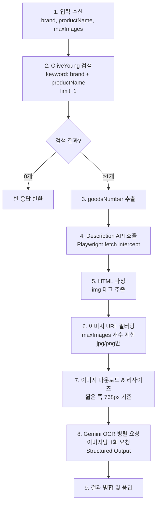
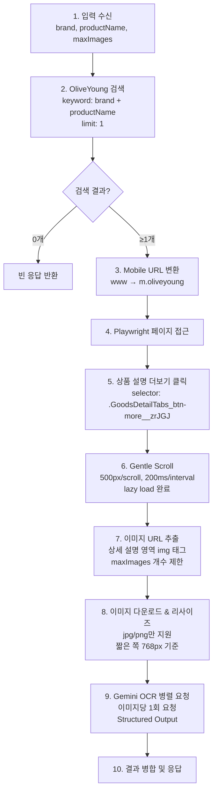

# 상품 상세 설명 생성기 (Product Description Generator)

## 📋 개요

올리브영 상품 페이지의 상세 이미지들을 OCR 처리하여 텍스트 기반 상품 설명을 생성하는 기능.

## 🎯 핵심 요구사항

| 항목 | 설명 |
|------|------|
| **입력** | `brand`, `productName`, `maxImages` (기본: 10) |
| **검색** | OliveYoung 단일 플랫폼 |
| **OCR 엔진** | Gemini 2.5 Flash (thinking budget: 0) |
| **이미지 처리** | 병렬 요청, 리사이즈 적용 |

## 🔍 OliveYoung 페이지 분석 결과

### 발견된 API (권장) ✅ 검증 완료

```
GET https://m.oliveyoung.co.kr/goods/api/v1/description?goodsNumber={goodsNumber}
```

**응답 구조**:
```json
{
  "data": {
    "descriptionTypeCode": "10",
    "descriptionContents": "<div>...</div>",  // ✅ HTML 여기에 있음
    "goodsDetailImages": [...]  // 이미지 배열 (nullable)
  },
  "status": "SUCCESS",
  "code": 200
}
```

- **장점**: Playwright 스크롤 불필요, 빠른 처리
- **단점**: Cloudflare 보호 → Playwright 세션 필요

### 이미지 URL 패턴 ✅ 검증 완료

| 소스 | URL 패턴 | 특징 |
|------|----------|------|
| 올리브영 Crop CDN | `image.oliveyoung.co.kr/cfimages/cf-goods/uploads/images/html/crop/...` | 크롭 처리된 이미지 |
| 올리브영 Attached | `image.oliveyoung.co.kr/cfimages/cf-goods/uploads/images/html/attached/...` | 원본 첨부 이미지 |
| 브랜드 외부 CDN | `{brand}.speedgabia.com/...` | 브랜드별 외부 호스팅 |
| AP Global CDN | `amc.apglobal.com/asset/...` | 일부 브랜드 사용 |

### 이미지 추출 테스트 결과

```bash
# 테스트 스크립트
npx tsx scripts/test-description-image-extract.ts "브랜드" "상품명" [maxImages]

# 예시 결과 (아렌시아 떡솝)
총 발견: 33개 → 필터 통과: 28개 → 최종: 5개 (max: 5)
```

### DOM 구조 (Playwright 방식 - 참고용)

```
상품설명 탭: button[name="상품설명"]
상품설명 더보기 버튼: .GoodsDetailTabs_btn-more__zrJGJ
상품 상세 정보 섹션: section (heading: "상품 상세 정보")
```

## 🔄 처리 흐름

### Option A: API 방식 (권장)



### Option B: Playwright Scroll 방식 (원본 요구사항)



### 방식 비교

| 항목 | API 방식 | Scroll 방식 |
|------|---------|-------------|
| **속도** | ⚡ 빠름 (~1s) | 🐢 느림 (~5-10s) |
| **안정성** | ✅ 높음 | ⚠️ DOM 변경에 취약 |
| **이미지 완전성** | ✅ 전체 HTML 파싱 | ⚠️ lazy load 의존 |
| **구현 복잡도** | 낮음 | 높음 |

## 📐 이미지 리사이즈 규칙

### 목적

- Gemini 토큰 최적화 (384px 타일 기준)
- 최대 6타일 원칙 준수

### 리사이즈 알고리즘

```typescript
interface ResizeConfig {
  targetShortSide: 768;    // 짧은 쪽 기준
  maxAspectRatio: 2 / 3;   // 최대 비율 (가로:세로)
  tileSize: 384;           // Gemini 타일 크기
  maxTiles: 6;             // 최대 타일 수 (2x3 또는 3x2)
}
```

### 리사이즈 로직

```
1. 원본 이미지 로드 (width x height)

2. 비율 계산:
   - ratio = width / height

3. 비율 검증 및 조정:
   - if ratio > 1 (가로형): 
     - if ratio > 3/2: ratio = 3/2 (강제 crop)
   - if ratio < 1 (세로형):
     - if ratio < 2/3: ratio = 2/3 (강제 crop)

4. 스케일링:
   - shortSide = min(width, height)
   - scale = 768 / shortSide
   - newWidth = width * scale
   - newHeight = height * scale

5. 384 배수로 정렬:
   - finalWidth = ceil(newWidth / 384) * 384
   - finalHeight = ceil(newHeight / 384) * 384

6. 최종 검증:
   - tiles = (finalWidth / 384) * (finalHeight / 384)
   - assert tiles <= 6
```

### 예시

| 원본 크기 | 비율 | 리사이즈 결과 | 타일 수 |
|-----------|------|---------------|---------|
| 800x1200 | 2:3 | 768x1152 | 4 (2x3) |
| 600x1200 | 1:2 | 768x1152 (crop) | 4 (2x3) |
| 1200x600 | 2:1 | 1152x768 (crop) | 4 (3x2) |
| 1000x1000 | 1:1 | 768x768 | 4 (2x2) |

### 지원 포맷

- ✅ JPEG/JPG
- ✅ PNG
- ❌ WebP, GIF, HEIC, HEIF (미지원)

## 🏗️ 아키텍처 설계

### 디렉토리 구조

```
src/
├── services/
│   └── description/
│       ├── ProductDescriptionService.ts     # Facade
│       ├── interfaces/
│       │   └── IDescriptionService.ts
│       └── index.ts
├── extractors/
│   └── description/
│       ├── OliveYoungDescriptionExtractor.ts
│       └── index.ts
├── llm/
│   ├── ImageOcrService.ts                   # 신규
│   ├── prompts/
│   │   └── imageOcrPrompt.ts                # 신규
│   └── schemas/
│       └── ImageOcrSchema.ts                # 신규
├── utils/
│   └── ImageProcessor.ts                    # 신규 (리사이즈)
├── routes/
│   └── descriptionRoutes.ts                 # 신규
└── controllers/
    └── DescriptionController.ts             # 신규
```

### 클래스 다이어그램

```
┌─────────────────────────────────┐
│     DescriptionController       │
│  POST /api/v2/description/gen   │
└───────────────┬─────────────────┘
                │
                ▼
┌─────────────────────────────────┐
│  ProductDescriptionService      │  ← Facade Pattern
│  - generateDescription()        │
└───────────────┬─────────────────┘
                │
     ┌──────────┼──────────┐
     ▼          ▼          ▼
┌─────────┐ ┌──────────┐ ┌────────────────┐
│Searcher │ │Extractor │ │ImageOcrService │
└─────────┘ └──────────┘ └────────────────┘
     │           │              │
     ▼           ▼              ▼
OliveYoung   Description    GoogleGenAI
 Searcher     Extractor      Client
```

### 핵심 클래스

#### 1. ProductDescriptionService (Facade)

```typescript
interface DescriptionRequest {
  brand: string;
  productName: string;
  maxImages?: number;  // default: 10
}

interface DescriptionResult {
  success: boolean;
  product?: {
    name: string;
    brand: string;
    url: string;
    thumbnail: string;
  };
  description?: {
    texts: string[];        // OCR 추출 텍스트들
    imageCount: number;     // 처리된 이미지 수
    totalTokens: number;    // 사용된 토큰 수
  };
  error?: string;
}
```

#### 2. OliveYoungDescriptionExtractor

```typescript
interface ExtractedImages {
  urls: string[];
  totalFound: number;
  filtered: number;
}

class OliveYoungDescriptionExtractor {
  // Playwright 기반 이미지 추출
  async extractDescriptionImages(
    productUrl: string,
    maxImages: number
  ): Promise<ExtractedImages>;
  
  // Mobile URL 변환
  private toMobileUrl(pcUrl: string): string;
  
  // Gentle scroll 실행
  private async gentleScroll(page: Page): Promise<void>;
  
  // "상품 설명 더보기" 클릭
  private async expandDescription(page: Page): Promise<void>;
}
```

#### 3. ImageOcrService

```typescript
interface OcrRequest {
  imageUrls: string[];
  prompt: string;
}

interface OcrResult {
  imageUrl: string;
  text: string;
  success: boolean;
  tokens: {
    input: number;
    output: number;
  };
}

class ImageOcrService {
  // 병렬 OCR 처리
  async processImages(request: OcrRequest): Promise<OcrResult[]>;
  
  // 단일 이미지 OCR
  private async processImage(
    imageUrl: string,
    prompt: string
  ): Promise<OcrResult>;
}
```

#### 4. ImageProcessor (Utility)

```typescript
interface ProcessedImage {
  buffer: Buffer;
  width: number;
  height: number;
  mimeType: 'image/jpeg' | 'image/png';
  tiles: number;
}

class ImageProcessor {
  // 이미지 다운로드 + 리사이즈
  async process(imageUrl: string): Promise<ProcessedImage | null>;
  
  // 리사이즈 로직
  private resize(
    buffer: Buffer,
    targetShortSide: number
  ): Promise<Buffer>;
  
  // 비율 조정
  private enforceAspectRatio(
    width: number,
    height: number
  ): { width: number; height: number };
}
```

## 🔌 API 엔드포인트

### POST `/api/v2/description/generate`

#### Request

```json
{
  "brand": "에스트라",
  "productName": "아토베리어 크림",
  "maxImages": 5
}
```

#### Response (Success)

```json
{
  "success": true,
  "data": {
    "product": {
      "productId": "A000000123456",
      "name": "아토베리어365 크림",
      "brand": "에스트라",
      "url": "https://m.oliveyoung.co.kr/goods/...",
      "thumbnail": "https://image.oliveyoung.co.kr/..."
    },
    "description": {
      "texts": [
        "피부과 전문의와 함께 개발한 저자극 수분 크림",
        "세라마이드 성분으로 피부 장벽 강화",
        "..."
      ],
      "imageCount": 5,
      "usage": {
        "promptTokens": 1500,
        "outputTokens": 500,
        "totalTokens": 2000
      }
    },
    "durationMs": 8500
  }
}
```

#### Response (No Results)

```json
{
  "success": true,
  "data": {
    "product": null,
    "description": null,
    "message": "검색 결과가 없습니다."
  }
}
```

## 🛠️ 기술 스택

| 구성요소 | 기술 |
|----------|------|
| 웹 스크래핑 | Playwright + Stealth |
| 이미지 처리 | Sharp |
| LLM | Gemini 2.5 Flash |
| HTTP 클라이언트 | Native Fetch |
| 스키마 검증 | Zod |

## 📊 Gemini OCR 설정

### 모델 설정

```typescript
{
  model: 'gemini-2.5-flash',
  thinkingBudget: 0,
  temperature: 0.1,
  maxOutputTokens: 2048,
  responseMimeType: 'application/json'
}
```

### 이미지 전달 방식

- `inlineData` 사용 (Base64 인코딩)
- Reference: [Gemini Image Understanding](https://ai.google.dev/gemini-api/docs/image-understanding#javascript_1)

```typescript
const contents = [
  {
    inlineData: {
      mimeType: 'image/jpeg',
      data: base64ImageData
    }
  },
  { text: ocrPrompt }
];
```

### Structured Output Schema (예시)

```typescript
const ImageOcrSchema = z.object({
  hasText: z.boolean(),
  extractedText: z.string(),
  textType: z.enum(['product_info', 'ingredient', 'usage', 'warning', 'other']),
  confidence: z.number().min(0).max(1)
});
```

## 📝 구현 우선순위

### Phase 1: 핵심 기능

1. [ ] `ImageProcessor` - 이미지 다운로드 & 리사이즈
2. [ ] `ImageOcrService` - Gemini OCR 병렬 처리
3. [ ] `OliveYoungDescriptionExtractor` - 이미지 URL 추출

### Phase 2: 통합

4. [ ] `ProductDescriptionService` - 서비스 통합
5. [ ] `DescriptionController` + Routes
6. [ ] API 테스트

### Phase 3: 최적화

7. [ ] 에러 핸들링 강화
8. [ ] 토큰 비용 로깅
9. [ ] 성능 최적화

## ⚠️ 제약사항 및 주의사항

### OliveYoung 관련

- Cloudflare 보호로 직접 API 호출 불가 → Playwright 필수
- Mobile 페이지 구조가 PC와 상이
- "상품 설명 더보기" 버튼 selector 변경 가능성

### 이미지 처리

- jpg/png 외 포맷은 스킵 (webp 변환 미지원)
- 너무 작은 이미지 (100px 미만) 스킵
- 아이콘/로고 이미지 필터링 필요 (추후)

### Gemini 제약

- Rate limit: 15 RPM (free tier)
- 이미지당 최대 6타일 (768x1152 기준)
- Base64 인코딩 오버헤드 ~33%

## 📚 참고 문서

- [Gemini Image Understanding](https://ai.google.dev/gemini-api/docs/image-understanding#javascript_1)
- [Gemini Structured Output](https://ai.google.dev/gemini-api/docs/structured-outputs)
- [Sharp Image Processing](https://sharp.pixelplumbing.com/)

---

## 🔜 다음 단계

이미지 선택 로직에 대한 추가 요구사항 대기 중.
