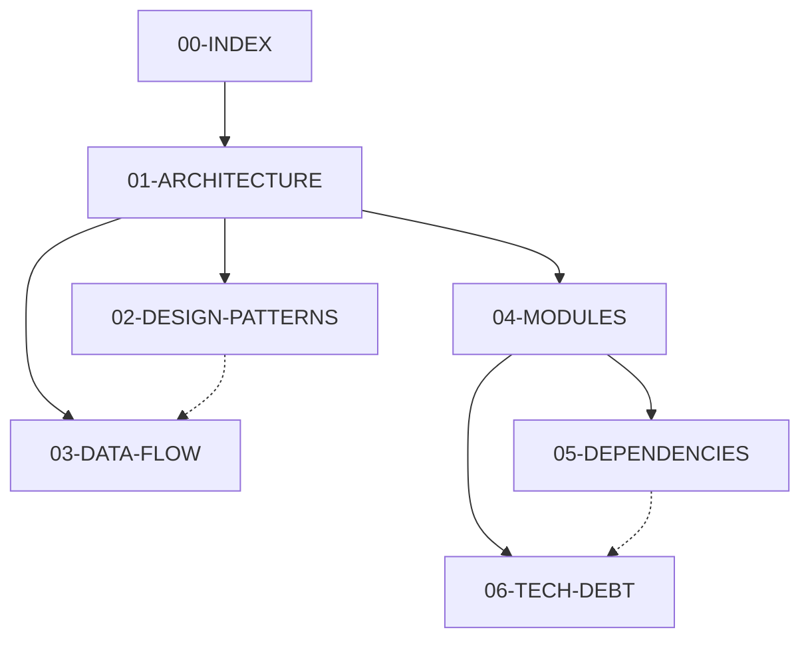
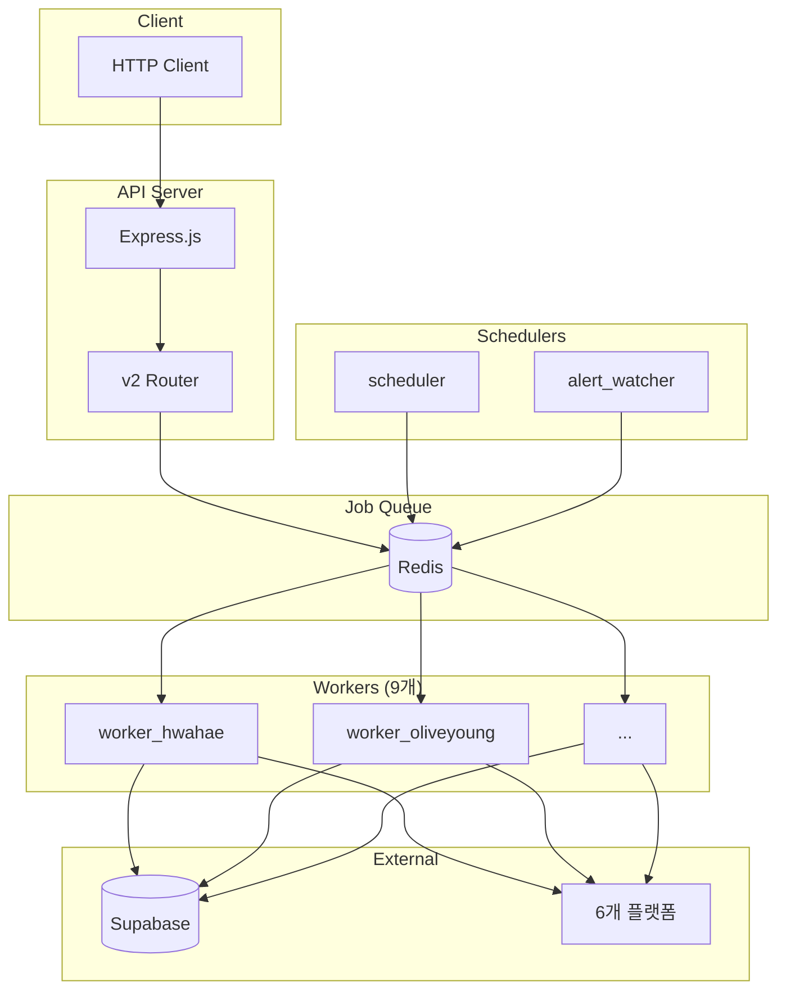

# Scoob Scraper 분석 문서

## 프로젝트 현황

| 항목            | 수치  |
| --------------- | ----- |
| TypeScript 파일 | 283개 |
| Docker 서비스   | 12개  |
| 워크플로우      | 23개  |
| 플랫폼          | 6개   |

---

## 문서 목록

| 문서                                             | 내용                               | 용도          |
| ------------------------------------------------ | ---------------------------------- | ------------- |
| [01-ARCHITECTURE.md](./01-ARCHITECTURE.md)       | 레이어 구조, 컨테이너, 데이터 흐름 | 전체 파악     |
| [02-DESIGN-PATTERNS.md](./02-DESIGN-PATTERNS.md) | 9개 디자인 패턴 분석               | 리팩터링 기준 |
| [03-DATA-FLOW.md](./03-DATA-FLOW.md)             | 스캔/워크플로우/검색 흐름          | 디버깅        |
| [04-MODULES.md](./04-MODULES.md)                 | src/ 디렉토리별 상세               | 코드 탐색     |
| [05-DEPENDENCIES.md](./05-DEPENDENCIES.md)       | 모듈 의존성, 외부 라이브러리       | 결합도 분석   |
| [06-TECH-DEBT.md](./06-TECH-DEBT.md)             | 개선점, 로드맵                     | 리팩터링 계획 |

---

## 문서 관계

---

## 빠른 참조

### 핵심 파일

| 역할              | 파일                                       |
| ----------------- | ------------------------------------------ |
| API 진입점        | `src/server.ts`                            |
| 워커 진입점       | `src/worker.ts`                            |
| 워크플로우 Facade | `src/services/WorkflowExecutionService.ts` |
| 스캐너 Registry   | `src/services/ScannerRegistry.ts`          |
| 스캐너 Factory    | `src/scanners/base/ScannerFactory.ts`      |
| DAG 실행          | `src/workflow/engine/ParallelExecutor.ts`  |

### 디자인 패턴

| 패턴            | 적용                                |
| --------------- | ----------------------------------- |
| Strategy        | IScanner, ISearcher, INodeStrategy  |
| Factory         | ScannerFactory, NodeStrategyFactory |
| Template Method | BaseScanner.scan()                  |
| Singleton       | Registry, ConfigLoader              |
| Repository      | Supabase*, Redis*                   |
| Facade          | WorkflowExecutionService            |

### 리팩터링 우선순위

1. **P0**: 에러 처리 표준화
2. **P1**: 대용량 파일 분리
3. **P2**: 테스트 커버리지
4. **P3**: Factory 동적 로딩

---

## 시스템 개요

---

## 최종 수정일

2024-01-02
