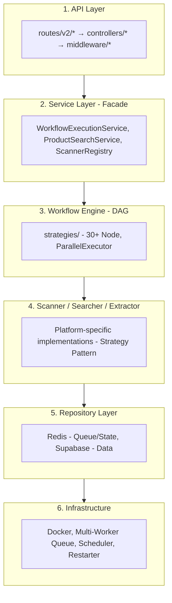
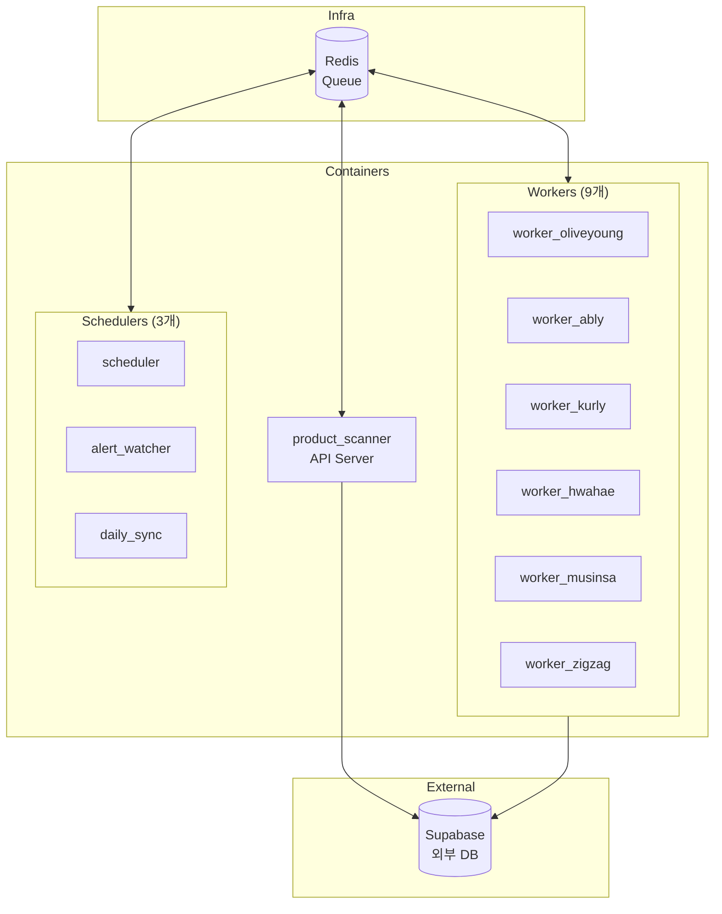
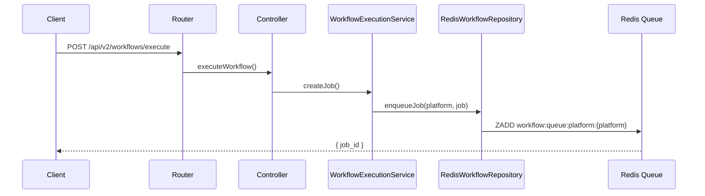
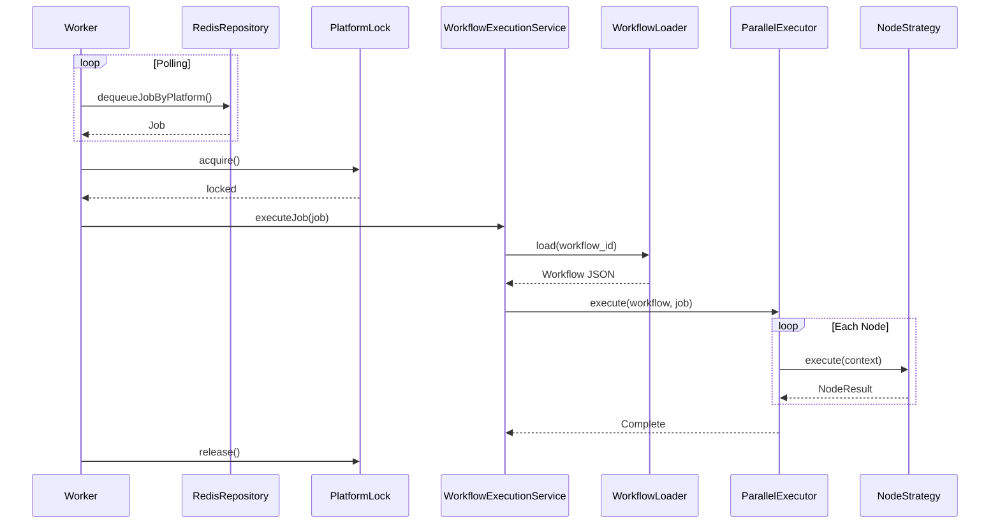
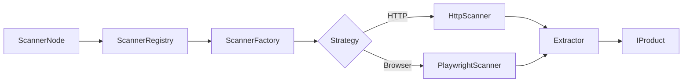
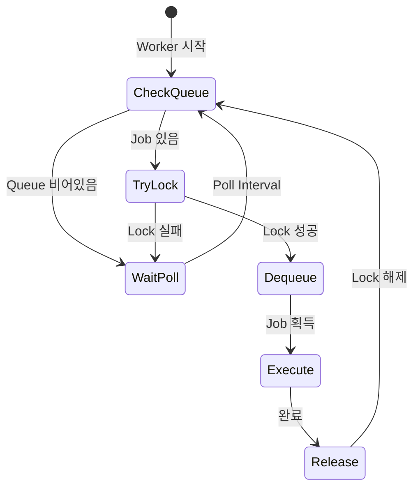
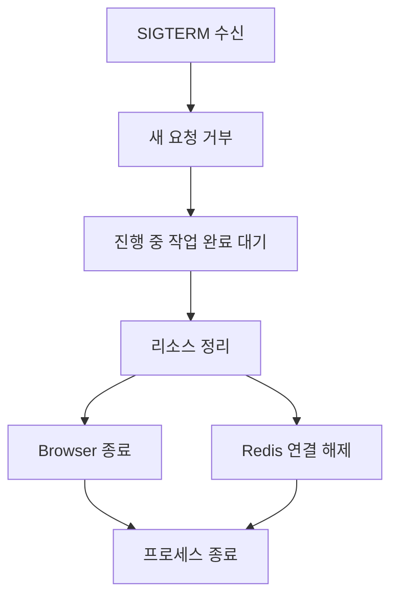

# 시스템 아키텍처

## 개요

| 항목            | 수치  |
| --------------- | ----- |
| TypeScript 파일 | 283개 |
| Docker 서비스   | 12개  |
| 워크플로우      | 23개  |
| 플랫폼          | 6개   |

## 레이어 구조



## 컨테이너 아키텍처

### 서비스 구성 (12개)

| 카테고리       | 서비스               | 메모리      | 역할                    |
| -------------- | -------------------- | ----------- | ----------------------- |
| API            | product_scanner      | 4GB         | Express API (Port 3989) |
| Browser Worker | worker_oliveyoung    | 4GB+2GB shm | Playwright 기반         |
| Browser Worker | worker_ably          | 4GB+2GB shm | Playwright 기반         |
| Browser Worker | worker_kurly         | 4GB+2GB shm | Playwright 기반         |
| Browser Worker | worker_search        | 4GB+2GB shm | 검색 큐 처리            |
| API Worker     | worker_hwahae        | 2GB         | HTTP API 기반           |
| API Worker     | worker_musinsa       | 2GB         | HTTP API 기반           |
| API Worker     | worker_zigzag        | 2GB         | GraphQL 기반            |
| API Worker     | worker_default       | 2GB         | 기타 플랫폼             |
| API Worker     | worker_alert         | 2GB         | 알림 처리               |
| Scheduler      | scheduler            | 256MB       | 자동 Job 생성           |
| Scheduler      | alert_watcher        | 256MB       | 테이블 모니터링         |
| Scheduler      | daily_sync_scheduler | 32MB        | 일일 동기화             |
| Infra          | redis                | 1GB         | Job Queue               |
| Infra          | restarter            | 64MB        | 컨테이너 관리           |

### 컨테이너 관계



## 엔트리 포인트

| 파일                          | 역할            | 실행                    |
| ----------------------------- | --------------- | ----------------------- |
| `src/server.ts`               | API 서버        | `npm run dev`           |
| `src/worker.ts`               | 워크플로우 실행 | `npm run worker`        |
| `src/scheduler.ts`            | 자동 스케줄링   | `npm run scheduler`     |
| `src/search-worker.ts`        | 검색 큐 처리    | `npm run search-worker` |
| `src/alert-watcher.ts`        | 알림 감시       | `npm run alert-watcher` |
| `src/daily-sync-scheduler.ts` | 일일 동기화     | cron 기반               |

## 핵심 데이터 흐름

### 1. API 요청 → Job 생성



### 2. Worker → Job 실행



### 3. 스캔 플로우



## Multi-Queue 아키텍처

### Redis 키 패턴

```
workflow:queue:platform:hwahae      # Platform별 Job Queue (Sorted Set)
workflow:queue:platform:oliveyoung
workflow:queue:platform:zigzag
workflow:queue:platform:musinsa
workflow:queue:platform:ably
workflow:queue:platform:kurly
workflow:queue:platform:default
workflow:queue:platform:alert

workflow:job:{jobId}                # Job 데이터 (Hash)
workflow:lock:platform:{platform}   # Platform Lock (SET NX EX)
workflow:running:platform:{platform}# 실행 중 Job 정보

heartbeat:{service}                 # Heartbeat (60초 TTL)
worker:kill:{platform}              # Kill Flag (원격 재시작)
```

### Platform Lock 메커니즘



## Graceful Shutdown



## 환경 설정

### 핵심 환경변수

| 변수               | 용도               | 기본값     |
| ------------------ | ------------------ | ---------- |
| `WORKER_PLATFORMS` | Worker 담당 플랫폼 | 전체       |
| `POLL_INTERVAL_MS` | 큐 폴링 간격       | 5000       |
| `REDIS_HOST`       | Redis 호스트       | redis      |
| `LOG_LEVEL`        | 로그 레벨          | info       |
| `TZ`               | 타임존             | Asia/Seoul |

## 관련 문서

- [02-DESIGN-PATTERNS.md](./02-DESIGN-PATTERNS.md) - 디자인 패턴
- [03-DATA-FLOW.md](./03-DATA-FLOW.md) - 데이터 흐름 상세
- [04-MODULES.md](./04-MODULES.md) - 모듈 상세
