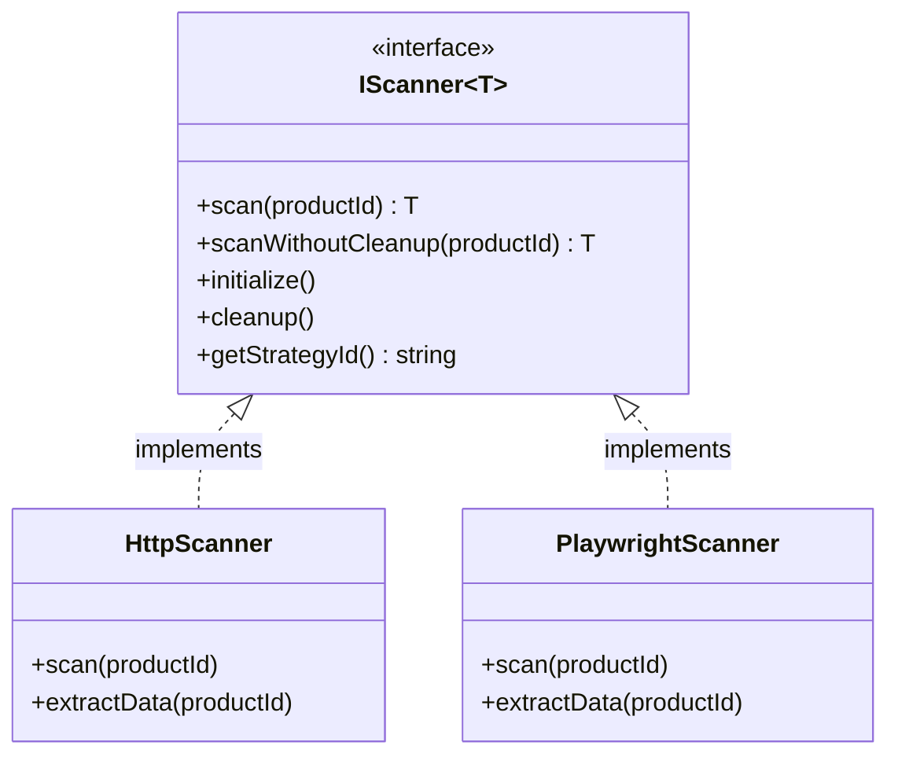
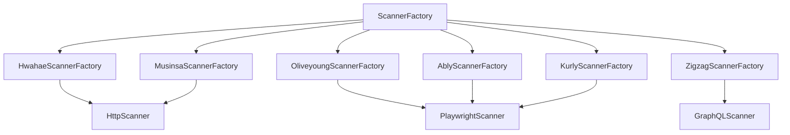
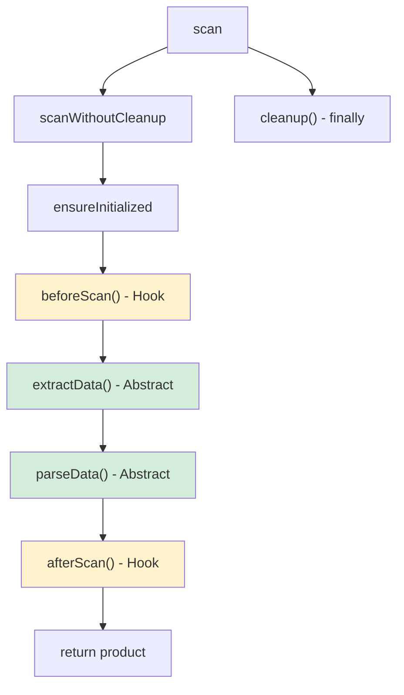
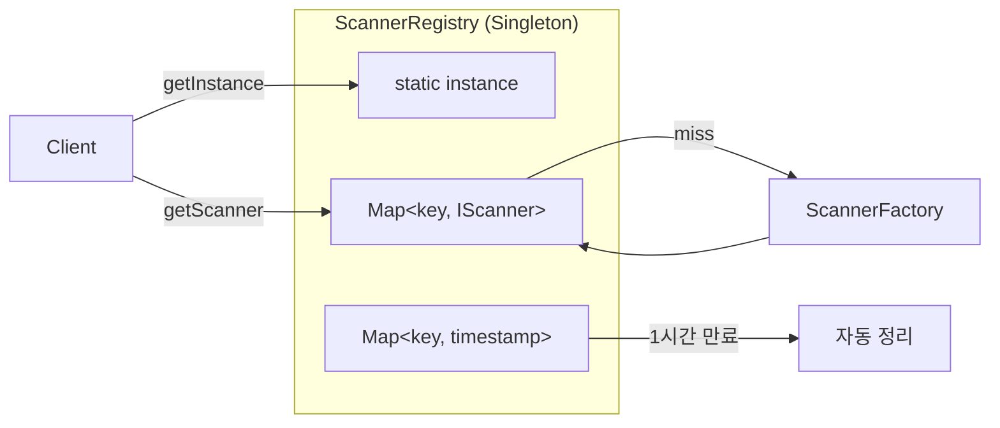
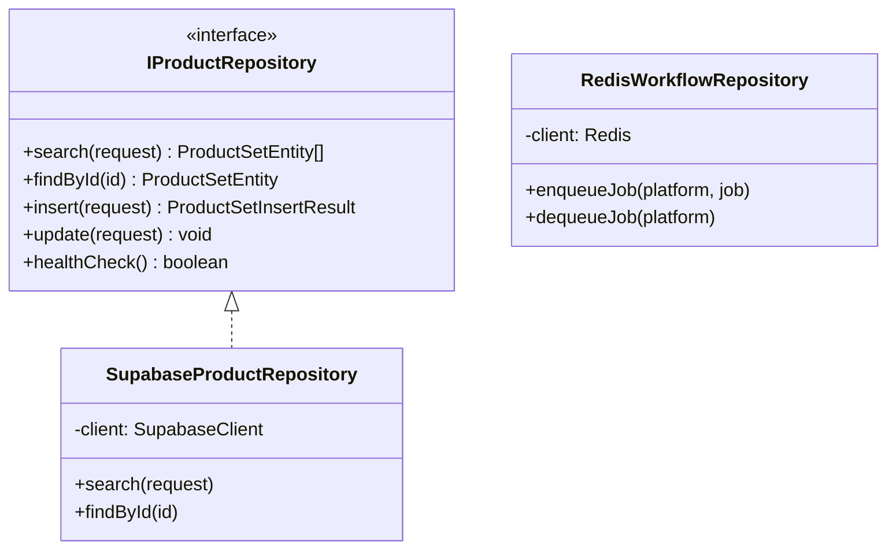
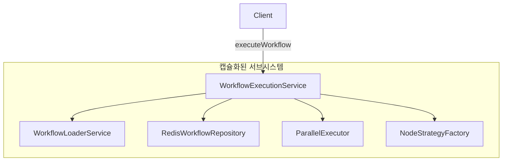
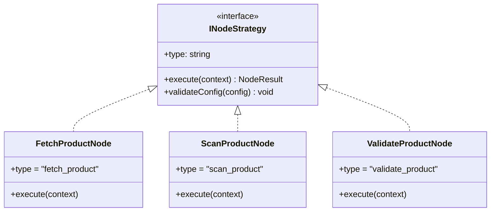
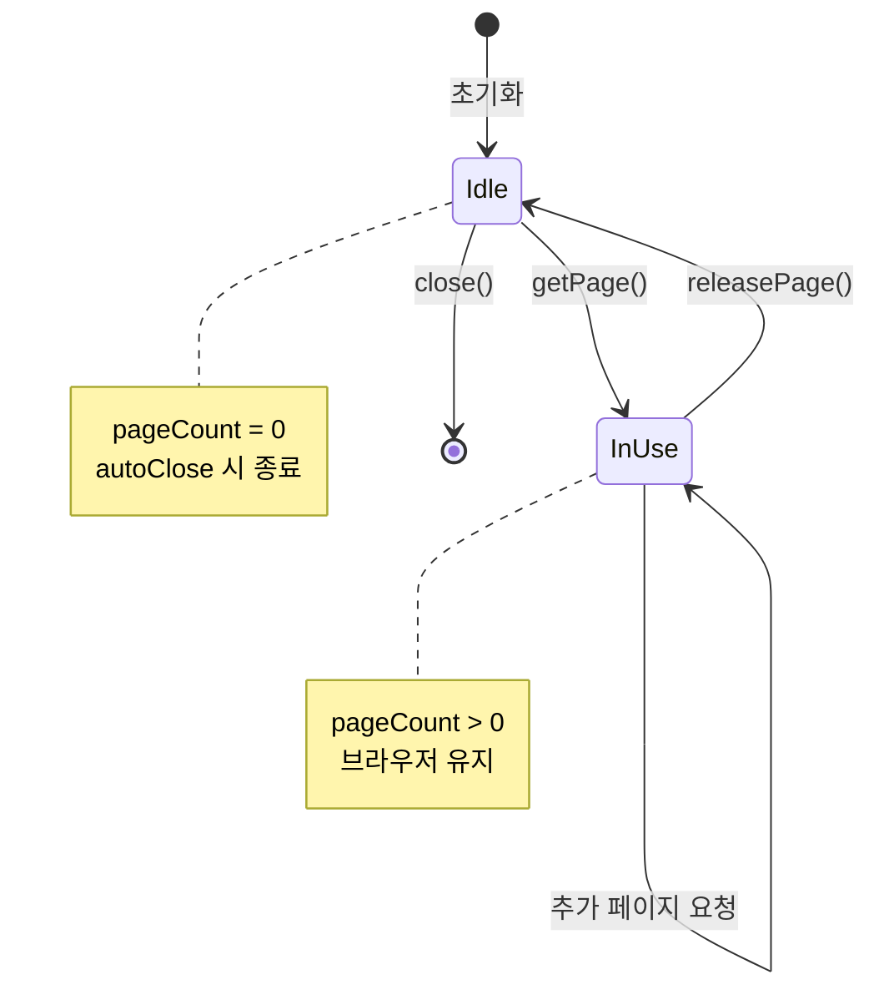
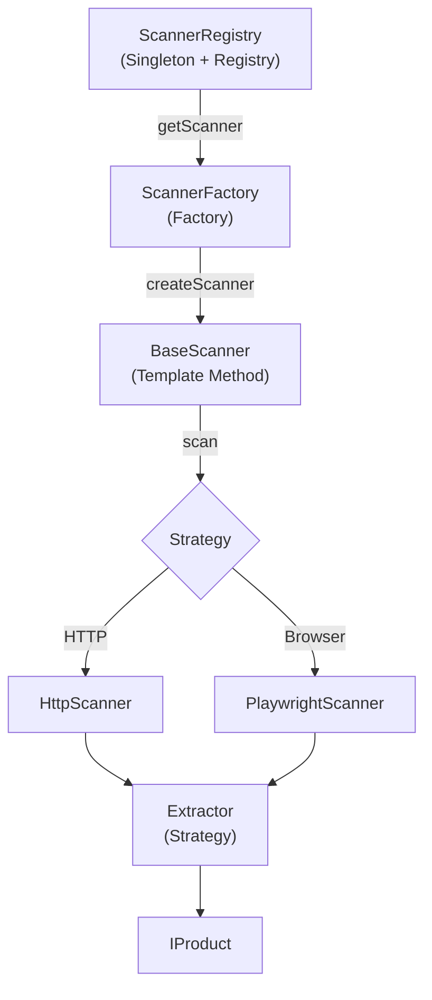
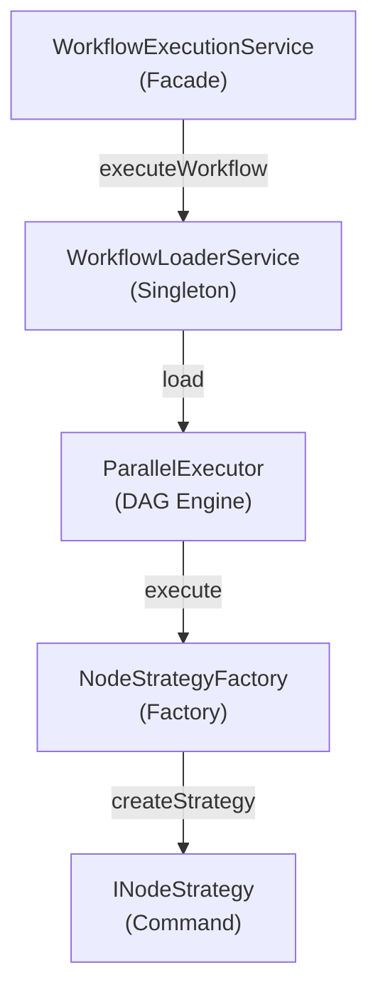

# 디자인 패턴

## 적용 패턴 요약

| 패턴            | 적용 위치                           | 목적                 |
| --------------- | ----------------------------------- | -------------------- |
| Strategy        | Scanner, Searcher, Extractor        | 플랫폼별 전략 분리   |
| Factory         | ScannerFactory, NodeStrategyFactory | 인스턴스 생성 캡슐화 |
| Template Method | BaseScanner                         | 공통 흐름 정의       |
| Singleton       | Registry, ConfigLoader              | 단일 인스턴스        |
| Registry        | ScannerRegistry, SearcherRegistry   | 인스턴스 캐싱/관리   |
| Repository      | Supabase*, Redis*                   | 데이터 접근 추상화   |
| Facade          | WorkflowExecutionService            | 복잡도 숨김          |
| Command         | INodeStrategy                       | 워크플로우 노드 실행 |
| Object Pool     | BrowserPool                         | 리소스 재사용        |

---

## Strategy Pattern

### 목적

플랫폼별 스캔/검색/추출 전략을 런타임에 교체

### 구조



### 핵심 인터페이스

```typescript
// src/core/interfaces/IScanner.ts
interface IScanner<T extends IProduct = IProduct> {
  scan(productId: string): Promise<T>;
  scanWithoutCleanup(productId: string): Promise<T>;
  initialize(): Promise<void>;
  cleanup(): Promise<void>;
  getStrategyId(): string;
}
```

### 적용 사례

| 인터페이스      | 구현체                         | 위치                   |
| --------------- | ------------------------------ | ---------------------- |
| `IScanner`      | HttpScanner, PlaywrightScanner | scanners/strategies/   |
| `ISearcher`     | 플랫폼별 Searcher              | searchers/platforms/   |
| `IExtractor`    | 플랫폼별 Extractor             | extractors/{platform}/ |
| `INodeStrategy` | 노드별 Strategy                | strategies/\*/         |

### SOLID 준수

- **OCP**: 새 전략 추가 시 기존 코드 수정 불필요
- **LSP**: 모든 구현체는 인터페이스로 대체 가능
- **DIP**: 상위 모듈이 추상화에 의존

---

## Factory Pattern

### 목적

스캐너/전략 인스턴스 생성 로직 캡슐화

### 구조



### 핵심 코드

```typescript
// src/scanners/base/ScannerFactory.ts
export class ScannerFactory {
  static createScanner(platform: string, strategyId?: string): IScanner {
    const factory = this.getFactory(platform);
    return factory.create(strategyId);
  }

  private static getFactory(platform: string): IPlatformScannerFactory {
    // 플랫폼별 Factory 반환
  }
}
```

### 적용 사례

| Factory               | 역할                      |
| --------------------- | ------------------------- |
| `ScannerFactory`      | 플랫폼별 스캐너 생성      |
| `NodeStrategyFactory` | 워크플로우 노드 전략 생성 |
| `ExtractorFactory`    | 데이터 추출기 생성        |
| `SearcherFactory`     | 검색기 생성               |

---

## Template Method Pattern

### 목적

스캔 프로세스의 공통 흐름 정의

### 구조

```typescript
// src/scanners/base/BaseScanner.ts
abstract class BaseScanner<T extends IProduct> implements IScanner<T> {
  // Template Method
  async scan(productId: string): Promise<T> {
    try {
      return await this.scanWithoutCleanup(productId);
    } finally {
      await this.cleanup(); // 항상 정리
    }
  }

  async scanWithoutCleanup(productId: string): Promise<T> {
    await this.ensureInitialized();
    await this.beforeScan(); // Hook
    const rawData = await this.extractData(productId); // 추상
    const product = await this.parseData(rawData); // 추상
    await this.afterScan(); // Hook
    return product;
  }

  // 하위 클래스 구현 필수
  protected abstract extractData(productId: string): Promise<unknown>;
  protected abstract parseData(rawData: unknown): Promise<T>;

  // Hook 메서드 (선택적 오버라이드)
  protected async beforeScan(): Promise<void> {}
  protected async afterScan(): Promise<void> {}
}
```

### 흐름



---

## Singleton + Registry Pattern

### 목적

인스턴스 단일화 + TTL 기반 캐싱

### 구조



### 핵심 코드

```typescript
// src/services/ScannerRegistry.ts
export class ScannerRegistry {
  private static instance: ScannerRegistry;
  private scanners: Map<string, IScanner> = new Map();
  private lastAccessTime: Map<string, number> = new Map();

  // Singleton
  static getInstance(): ScannerRegistry {
    if (!ScannerRegistry.instance) {
      ScannerRegistry.instance = new ScannerRegistry();
    }
    return ScannerRegistry.instance;
  }

  // Registry: 캐시 + 생성
  getScanner(platform: string, strategyId?: string): IScanner {
    const key = this.makeKey(platform, strategyId);

    if (!this.scanners.has(key)) {
      const scanner = ScannerFactory.createScanner(platform, strategyId);
      this.scanners.set(key, scanner);
    }

    this.lastAccessTime.set(key, Date.now());  // TTL 갱신
    return this.scanners.get(key)!;
  }

  // TTL 기반 자동 정리 (1시간 미사용 시 제거)
  private async cleanupExpiredScanners(): Promise<void> { ... }
}
```

### 적용 사례

| Registry           | TTL    | 역할            |
| ------------------ | ------ | --------------- |
| `ScannerRegistry`  | 1시간  | 스캐너 인스턴스 |
| `SearcherRegistry` | -      | 검색기 인스턴스 |
| `ConfigLoader`     | 무제한 | YAML 설정 캐시  |

---

## Repository Pattern

### 목적

데이터 접근 로직 캡슐화

### 구조



### 구현체

| 인터페이스           | 구현체                      | 저장소   |
| -------------------- | --------------------------- | -------- |
| `IProductRepository` | `SupabaseProductRepository` | Supabase |
| -                    | `RedisWorkflowRepository`   | Redis    |
| -                    | `RedisSearchRepository`     | Redis    |

### 특징

- Supabase 클라이언트 Singleton
- 쿼리 빌더 패턴
- Pagination 지원

---

## Facade Pattern

### 목적

복잡한 서브시스템을 단순한 인터페이스로 제공

### 구조



### 핵심 코드

```typescript
// src/services/WorkflowExecutionService.ts
export class WorkflowExecutionService {
  private repository: RedisWorkflowRepository;
  private loader: WorkflowLoaderService;

  // Facade: 복잡한 워크플로우 실행을 단순화
  async executeWorkflow(request: WorkflowExecuteRequest): Promise<string> {
    // 1. 워크플로우 로드
    const workflow = await this.loader.load(request.workflow_id);

    // 2. Job 생성
    const job = this.createJob(workflow, request);

    // 3. 큐에 추가
    await this.repository.enqueueJob(job.platform, job);

    return job.job_id;
  }
}
```

### 적용 사례

| Facade                     | 캡슐화 대상                  |
| -------------------------- | ---------------------------- |
| `WorkflowExecutionService` | Loader, Repository, Executor |
| `ProductSearchService`     | Repository, Mapper           |
| `UnifiedSearchService`     | 6개 플랫폼 Searcher          |

---

## Command Pattern

### 목적

워크플로우 노드 실행을 객체로 캡슐화

### 구조



### 핵심 인터페이스

```typescript
// src/core/interfaces/INodeStrategy.ts
interface INodeStrategy {
  readonly type: string;
  execute(context: NodeContext): Promise<NodeResult>;
  validateConfig(config: Record<string, unknown>): void;
}

// 컨텍스트
interface NodeContext {
  job_id: string;
  workflow_id: string;
  node_id: string;
  config: Record<string, unknown>;
  input: Record<string, unknown>; // 이전 노드 출력
  params: Record<string, unknown>;
}

// 결과
interface NodeResult {
  success: boolean;
  data: Record<string, unknown>;
  error?: { message: string; code?: string };
  next_nodes?: string[]; // DAG 지원
}
```

---

## Object Pool Pattern

### 목적

Playwright 브라우저 인스턴스 재사용

### 구조



### 핵심 코드

```typescript
// src/scanners/base/BrowserPool.ts
export class BrowserPool implements IBrowserPool {
  private browser: Browser | null = null;
  private pageCount: number = 0;

  async getPage(): Promise<Page> {
    if (!this.browser) {
      this.browser = await chromium.launch({ headless: true });
    }
    this.pageCount++;
    return await this.browser.newPage();
  }

  async releasePage(page: Page): Promise<void> {
    await page.close();
    this.pageCount--;

    // 모든 페이지 반환 시 브라우저 종료 옵션
    if (this.pageCount === 0 && this.autoClose) {
      await this.close();
    }
  }
}
```

---

## 패턴 조합

### Scanner 시스템



### Workflow 시스템



---

## SOLID 원칙 준수

| 원칙    | 구현                                         |
| ------- | -------------------------------------------- |
| **SRP** | Scanner = 스캔만, Repository = 데이터 접근만 |
| **OCP** | YAML로 새 플랫폼 추가, 기존 코드 수정 불필요 |
| **LSP** | 모든 Scanner가 IScanner로 대체 가능          |
| **ISP** | IScanner, IExtractor, INodeStrategy 분리     |
| **DIP** | 모든 상위 모듈이 인터페이스에 의존           |

---

## 관련 문서

- [01-ARCHITECTURE.md](./01-ARCHITECTURE.md) - 시스템 아키텍처
- [04-MODULES.md](./04-MODULES.md) - 모듈 상세
- [03-DATA-FLOW.md](./03-DATA-FLOW.md) - 데이터 흐름
