# 데이터 흐름

## 주요 플로우

1. **API 요청 → Job 생성**
2. **Worker → Job 실행**
3. **스캔 플로우**
4. **검색 플로우**

---

## 1. API 요청 → Job 생성

### 시퀀스

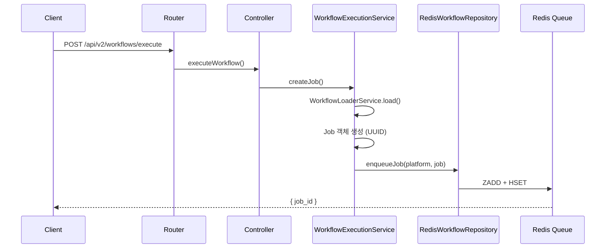

### 데이터 변환

```typescript
// Request
{
  workflow_id: "hwahae-update-v2",
  platform: "hwahae",
  params: { product_set_id: "xxx" }
}

// → Job (내부)
{
  job_id: "uuid-xxx",
  workflow_id: "hwahae-update-v2",
  platform: "hwahae",
  status: "PENDING",
  params: { product_set_id: "xxx" },
  created_at: "2024-01-01T00:00:00+09:00"
}

// → Redis 저장
ZADD workflow:queue:platform:hwahae {priority} {job_id}
HSET workflow:job:{job_id} {...job}
```

---

## 2. Worker → Job 실행

### 시퀀스

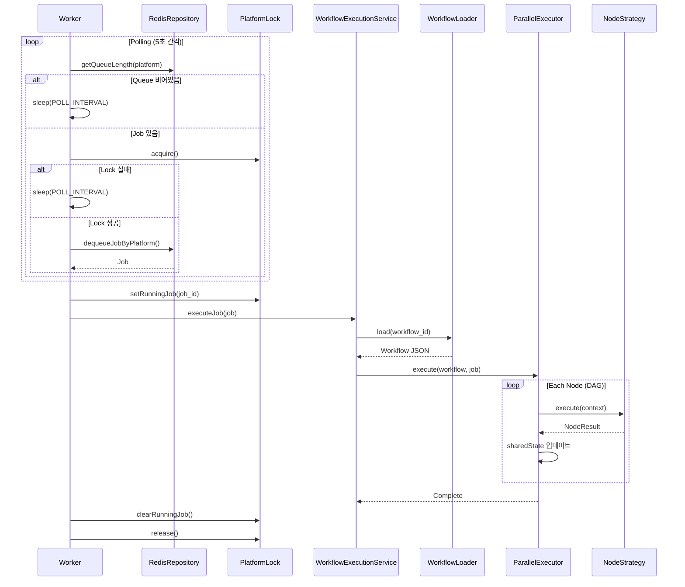

### 노드 간 데이터 전달

```mermaid
flowchart LR
    subgraph Node1["Node 1: fetch"]
        A1[input: {}]
        A2["output: { product }"]
    end

    subgraph Node2["Node 2: scan"]
        B1["input: { product }"]
        B2["output: { scanned }"]
    end

    subgraph Node3["Node 3: save"]
        C1["input: { scanned }"]
        C2["output: { saved: true }"]
    end

    A2 --> B1
    B2 --> C1
```

---

## 3. 스캔 플로우

### 시퀀스

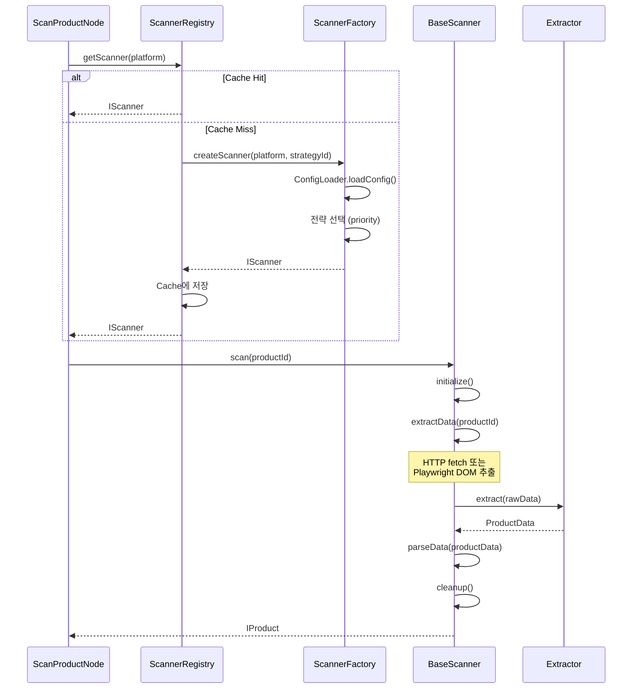

### 데이터 변환

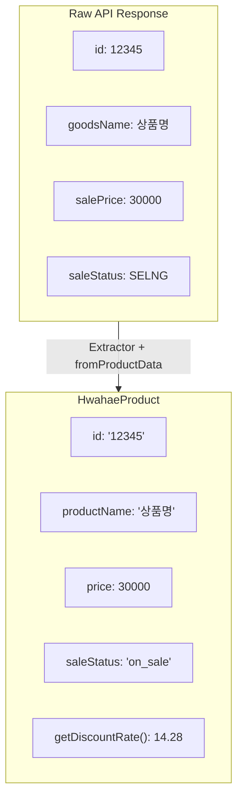

### 전략별 추출 방식

| 플랫폼   | 1차 전략      | 2차 전략   | 특징                   |
| -------- | ------------- | ---------- | ---------------------- |
| 화해     | REST API      | Playwright | API 우선, DOM fallback |
| 올리브영 | Playwright    | -          | DOM 셀렉터             |
| 무신사   | HTTP API      | -          | 가장 빠름 (~1초)       |
| 지그재그 | GraphQL       | Playwright | 첫구매 쿠폰 처리       |
| 에이블리 | Network API   | Meta Tag   | API 캡처               |
| 마켓컬리 | **NEXT_DATA** | -          | Next.js SSR            |

---

## 4. 검색 플로우

### 동기 검색

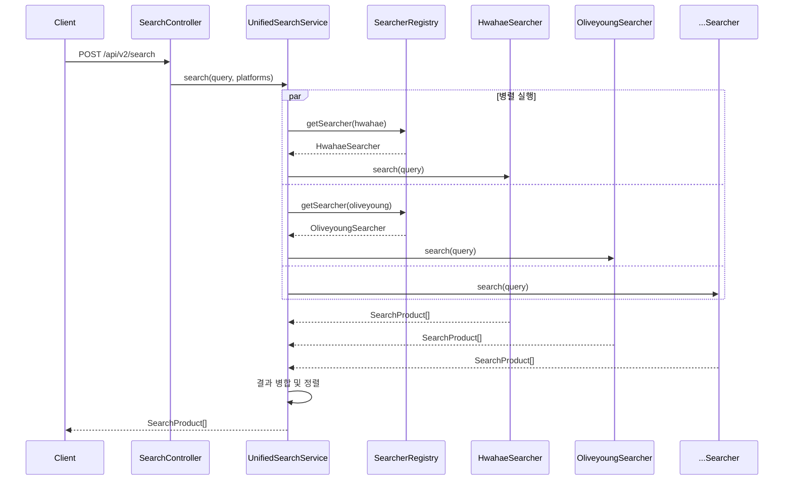

### 비동기 검색 (Queue 기반)

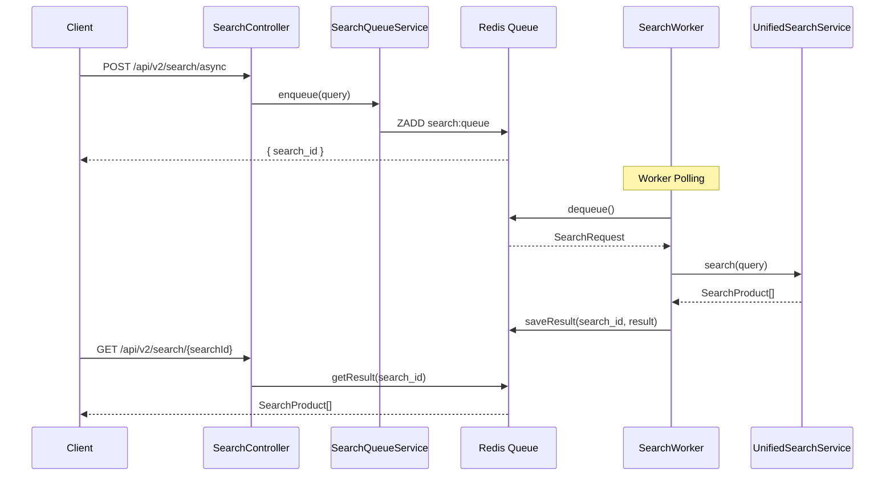

---

## 5. 워크플로우 JSON 구조

### 예시: hwahae-update-v2.json

```json
{
  "workflow_id": "hwahae-update-v2",
  "name": "Hwahae Update",
  "version": "2.0.0",
  "start_node": "fetch",
  "nodes": {
    "fetch": { "type": "fetch_product", "next_nodes": ["scan"] },
    "scan": { "type": "scan_product", "next_nodes": ["validate"] },
    "validate": { "type": "validate_product", "next_nodes": ["compare"] },
    "compare": { "type": "compare_product", "next_nodes": ["save"] },
    "save": { "type": "save_result", "next_nodes": ["update"] },
    "update": { "type": "update_product_set", "next_nodes": ["notify"] },
    "notify": { "type": "notify_result", "next_nodes": [] }
  }
}
```

### DAG 실행 순서

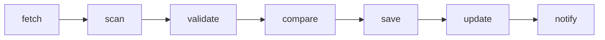

### 병렬 분기 예시

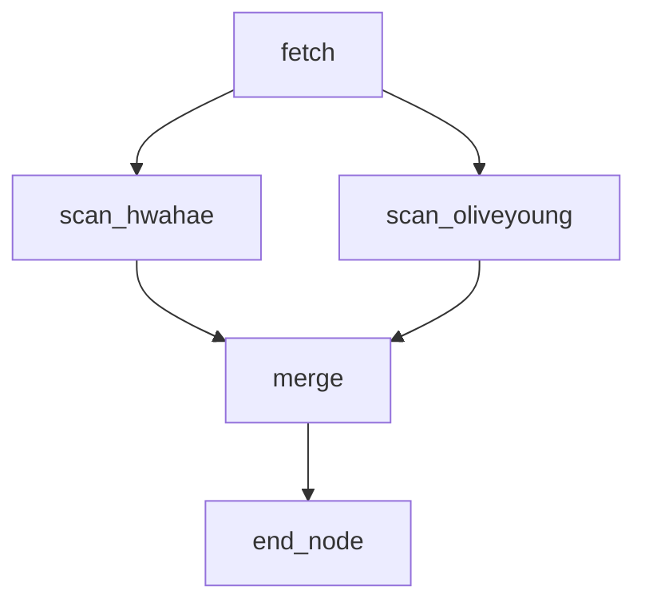

---

## 6. 타입 변환 맵

### 상품 데이터

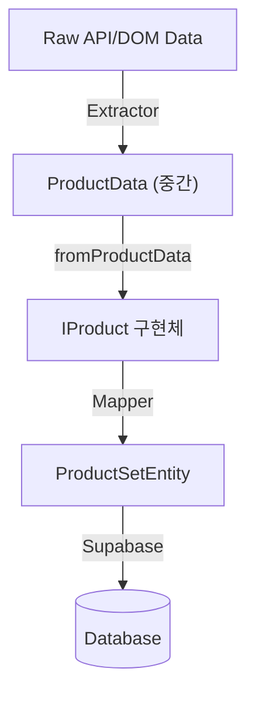

### 워크플로우 데이터

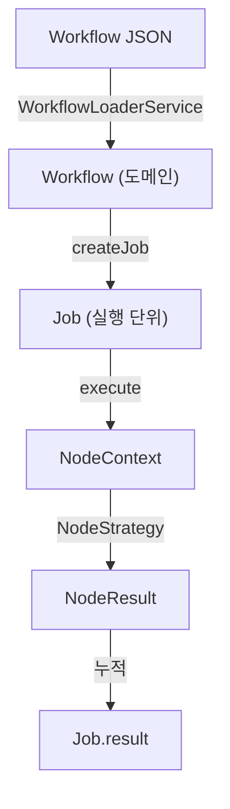

---

## 7. Redis 데이터 구조

### Job Queue (Sorted Set)

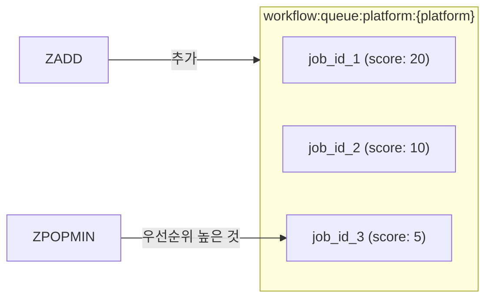

### Job 데이터 (Hash)

```
workflow:job:{jobId}
  ├─ job_id
  ├─ workflow_id
  ├─ platform
  ├─ status (PENDING|RUNNING|COMPLETED|FAILED)
  ├─ params (JSON)
  ├─ result (JSON)
  ├─ created_at
  ├─ started_at
  └─ completed_at
```

### Platform Lock

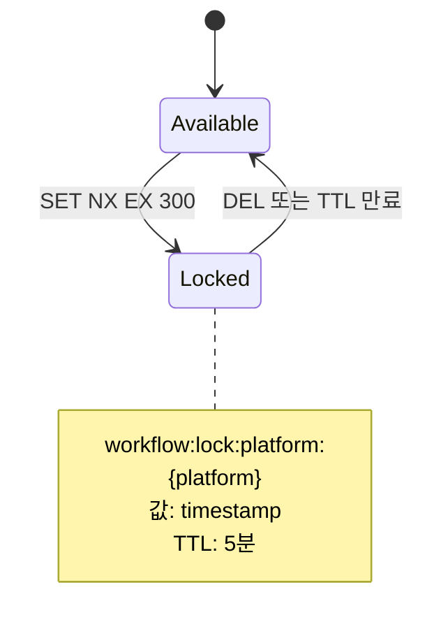

---

## 관련 문서

- [01-ARCHITECTURE.md](./01-ARCHITECTURE.md) - 시스템 아키텍처
- [02-DESIGN-PATTERNS.md](./02-DESIGN-PATTERNS.md) - 디자인 패턴
- [04-MODULES.md](./04-MODULES.md) - 모듈 상세
