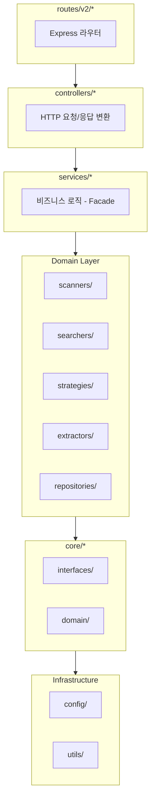
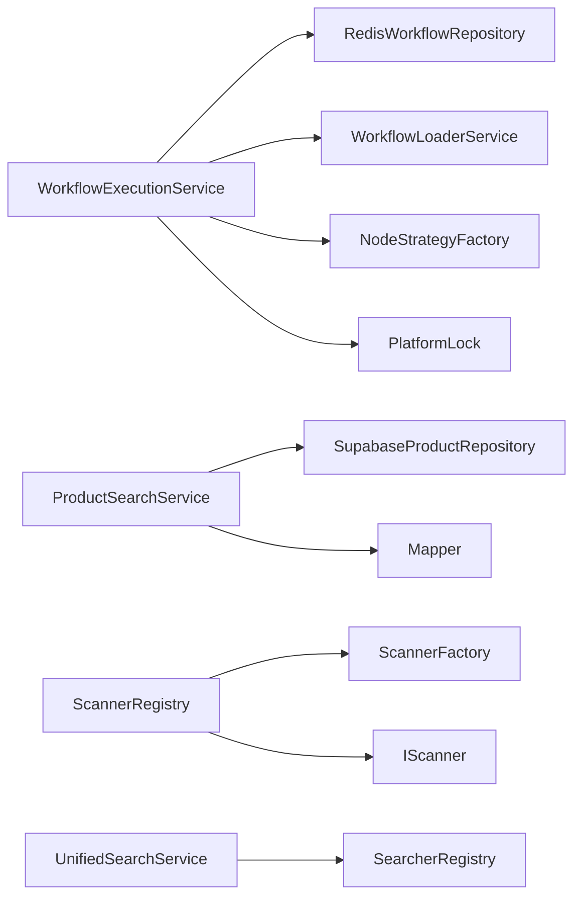
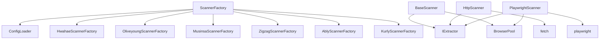
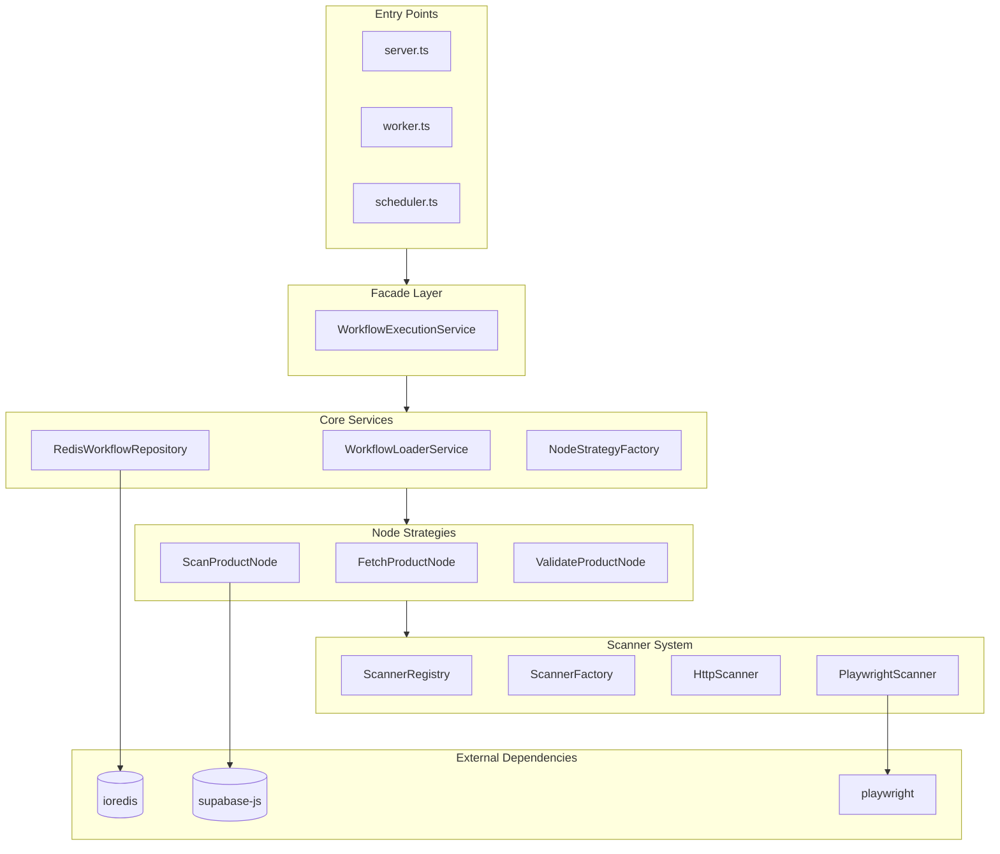
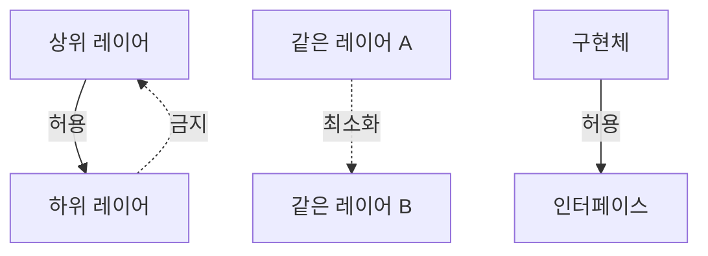
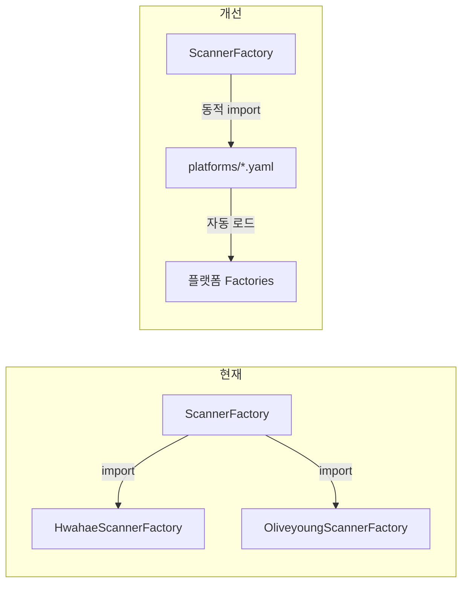

# 의존성 분석

## 레이어별 의존관계

---

## 모듈별 의존 관계

### services/

### scanners/

### repositories/

| 모듈                        | 의존 대상             |
| --------------------------- | --------------------- |
| `RedisWorkflowRepository`   | ioredis               |
| `SupabaseProductRepository` | @supabase/supabase-js |
| `PlatformLock`              | ioredis               |

### strategies/

| 모듈                   | 의존 대상                       |
| ---------------------- | ------------------------------- |
| `FetchProductNode`     | SupabaseProductRepository       |
| `ScanProductNode`      | ScannerRegistry                 |
| `ValidateProductNode`  | Validator                       |
| `UpdateProductSetNode` | SupabaseProductUpdateRepository |

---

## 외부 라이브러리

### 핵심 의존성

| 라이브러리                       | 버전  | 용도             |
| -------------------------------- | ----- | ---------------- |
| `express`                        | ^4.x  | HTTP 서버        |
| `playwright-extra`               | ^4.x  | 브라우저 자동화  |
| `puppeteer-extra-plugin-stealth` | ^2.x  | 봇 감지 우회     |
| `@supabase/supabase-js`          | ^2.x  | 데이터베이스     |
| `ioredis`                        | ^5.x  | Redis 클라이언트 |
| `js-yaml`                        | ^4.x  | YAML 파싱        |
| `zod`                            | ^3.x  | 스키마 검증      |
| `pino`                           | ^8.x  | 로깅             |
| `uuid`                           | ^9.x  | UUID 생성        |
| `@google/genai`                  | ^0.x  | LLM (Gemini)     |
| `node-cron`                      | ^3.x  | 스케줄링         |
| `dotenv`                         | ^16.x | 환경변수         |

### 개발 의존성

| 라이브러리   | 용도      |
| ------------ | --------- |
| `typescript` | 타입 체크 |
| `tsx`        | TS 실행   |
| `@types/*`   | 타입 정의 |

---

## 의존성 그래프 (핵심)

---

## 순환 의존성 분석

### 현재 상태

- **순환 의존성 없음** (단방향 의존 구조)

### 의존 방향 규칙

---

## 결합도 분석

### 높은 결합도 (주의)

| 모듈                       | 결합 대상          | 비고                     |
| -------------------------- | ------------------ | ------------------------ |
| `WorkflowExecutionService` | 5개 모듈           | Facade 특성상 불가피     |
| `ScannerFactory`           | 6개 플랫폼 Factory | 플랫폼 추가 시 수정 필요 |

### 낮은 결합도 (양호)

| 모듈                   | 비고            |
| ---------------------- | --------------- |
| `IScanner` 구현체      | 인터페이스 의존 |
| `INodeStrategy` 구현체 | 인터페이스 의존 |
| `Repository` 구현체    | 인터페이스 의존 |

---

## 개선 포인트

### 1. ScannerFactory 동적 로딩

### 2. ConfigLoader 의존성 주입

현재: Singleton 직접 호출
개선: 생성자 주입

### 3. Repository 인터페이스 통일

현재: 일부 Repository는 인터페이스 없음
개선: 모든 Repository에 인터페이스 정의

---

## 관련 문서

- [01-ARCHITECTURE.md](./01-ARCHITECTURE.md) - 시스템 아키텍처
- [04-MODULES.md](./04-MODULES.md) - 모듈 상세
- [06-TECH-DEBT.md](./06-TECH-DEBT.md) - 기술 부채
