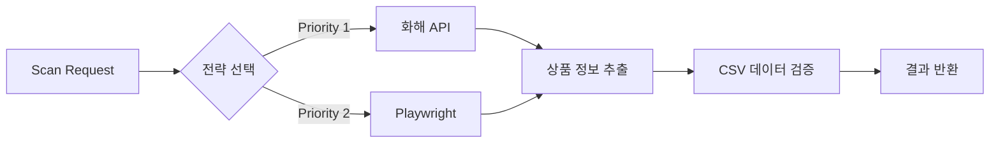
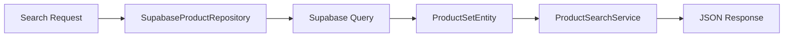

# Product Scanner

화해 상품 정보를 스캔하고 Supabase 데이터베이스의 상품을 검색하는 서비스입니다.

## 📌 용도

### 1. 화해 상품 스캔

- 화해 API 및 Playwright를 활용한 상품 정보 스캔
- 다중 전략 기반 스크래핑 (API 우선, Playwright 대체)
- CSV 데이터와 API 데이터 검증

### 2. Supabase 상품 검색

- Supabase `product_sets` 테이블 검색
- URL 패턴 기반 상품 조회
- 상품 ID(UUID) 기반 상세 조회

## 🔄 작동 방식

### 화해 상품 스캔



### Supabase 상품 검색



### 스크래핑 전략

1. **API 전략**: 화해 공식 API 호출 (우선순위 1)
2. **Playwright 전략**: 브라우저 자동화로 데이터 추출 (우선순위 2)
3. **자동 대체**: API 실패 시 Playwright로 자동 전환

## 🏗️ 아키텍처

### 디자인 패턴

- **Strategy Pattern**: 사이트별 스크래핑 전략 (API vs Playwright)
- **Repository Pattern**: 데이터 접근 로직 캡슐화 (Supabase)
- **Factory Pattern**: 스크래퍼 인스턴스 생성
- **Facade Pattern**: 서비스 계층 단순화
- **Singleton Pattern**: Supabase 클라이언트 재사용
- **Template Method Pattern**: 공통 스캔 플로우 정의

### SOLID 원칙

- **SRP**: 각 클래스는 단일 책임 (스캔, 검색, 데이터 접근, API 처리)
- **OCP**: 새 사이트 추가 시 기존 코드 수정 없이 확장
- **DIP**: 추상화된 인터페이스에 의존 (IProductRepository, IProductSearchService)

## 📁 디렉토리 구조

```text
product_scanner/
├── src/                           # 소스 코드
│   ├── server.ts                  # 엔트리포인트
│   ├── config/                    # 설정 파일 & 로더
│   │   ├── constants.ts           # 애플리케이션 상수
│   │   ├── logger.ts              # Pino 로거 설정
│   │   ├── ConfigLoader.ts
│   │   └── platforms/             # YAML 설정
│   │       └── hwahae.yaml
│   ├── core/                      # 도메인 모델 & 인터페이스
│   │   ├── domain/
│   │   │   ├── HwahaeProduct.ts
│   │   │   ├── HwahaeConfig.ts
│   │   │   └── ProductSet.ts      # 상품 세트 도메인
│   │   └── interfaces/
│   │       ├── IScraper.ts
│   │       ├── IProductRepository.ts    # Repository 인터페이스
│   │       └── IProductSearchService.ts # Service 인터페이스
│   ├── services/                  # 비즈니스 로직
│   │   ├── ScanService.ts
│   │   └── ProductSearchService.ts      # 상품 검색 서비스 (Facade)
│   ├── repositories/              # 데이터 접근 계층
│   │   └── SupabaseProductRepository.ts # Supabase Repository
│   ├── scrapers/                  # 스크래퍼
│   │   ├── base/
│   │   │   └── BaseScraper.ts
│   │   ├── PlaywrightScraper.ts
│   │   └── HttpScraper.ts
│   ├── extractors/                # 데이터 추출기
│   │   ├── PriceExtractor.ts
│   │   └── StockExtractor.ts
│   ├── fetchers/                  # API Fetcher
│   │   └── HwahaeApiFetcher.ts
│   ├── validators/                # 검증기
│   │   └── HwahaeValidator.ts
│   ├── controllers/               # HTTP 컨트롤러
│   │   ├── ScanController.ts
│   │   └── ProductSearchController.ts   # 상품 검색 컨트롤러
│   ├── middleware/                # 미들웨어
│   │   ├── errorHandler.ts
│   │   ├── requestLogger.ts       # HTTP 요청 로거
│   │   └── validation.ts
│   └── utils/                     # 유틸리티
│       ├── logger-context.ts      # 로거 컨텍스트 헬퍼
│       └── timestamp.ts           # 타임스탬프 유틸
├── tests/                         # 테스트 파일
│   ├── hwahae-validator.test.ts
│   └── supabase.test.ts
├── scripts/                       # 독립 실행 스크립트
│   └── hwahae-validator.ts
├── docs/                          # 문서
│   └── hwahae-validator.md
├── docker/                        # Docker 설정
│   ├── README.md                  # Docker 상세 가이드
│   ├── Dockerfile                 # 배포용
│   ├── Dockerfile.dev             # 개발용
│   ├── docker-compose.yml         # 배포 환경
│   └── docker-compose.dev.yml     # 개발 환경
└── logs/                          # 로그 (runtime)
```

## 🚀 사용법

### API 엔드포인트

#### 1. 헬스체크

```bash
GET /health
```

#### 2. 화해 상품 스캔

**검증 (CSV vs API)**

```bash
POST /api/scan/validate
Content-Type: application/json

{
  "goodsId": "61560",
  "csvData": {
    "goods_no": "61560",
    "product_name": "블랙 쿠션 파운데이션",
    "price": "59900"
  }
}
```

**상품 스캔**

```bash
POST /api/scan/:goodsId
```

**사용 가능한 전략 목록**

```bash
GET /api/scan/strategies
```

#### 3. Supabase 상품 검색

**상품 검색 (쿼리 파라미터)**

```bash
GET /api/products/search?link_url=hwahae.co.kr&sale_status=on_sale&limit=10
```

**상품 ID 조회 (UUID)**

```bash
GET /api/products/:productSetId
```

**Supabase 연결 상태**

```bash
GET /api/products/health
```

### 환경 변수

```bash
# 서버 설정
PORT=3000
NODE_ENV=production

# Supabase 설정
SUPABASE_URL=https://your-project.supabase.co
SUPABASE_SERVICE_ROLE_KEY=your-service-role-key

# 데이터베이스 설정 (선택)
PRODUCT_TABLE_NAME=product_sets  # 기본값

# API 설정 (선택)
MAX_SEARCH_LIMIT=100      # 최대 검색 결과 개수
DEFAULT_SEARCH_LIMIT=3    # 기본 검색 결과 개수

# 로깅 설정 (선택)
LOG_LEVEL=info            # 로그 레벨: debug, info, warn, error
LOG_DIR=./logs            # 로그 파일 저장 디렉토리
LOG_PRETTY=true           # 개발 환경에서 예쁜 출력 (true/false)
TZ=Asia/Seoul             # 타임존 설정
```

## 📊 로깅 시스템

### Pino 기반 구조화 로깅

**주요 특징**:

- 구조화된 JSON 로깅 (파싱 및 분석 용이)
- 서비스별 로그 파일 분리 (server, worker)
- 일일 자동 로테이션 (YYYYMMDD 형식)
- Health check 요청 파일 로그 제외 (콘솔만)
- 타임존 지원 (Asia/Seoul)

### 로그 출력 전략

**콘솔 출력**:

- WARNING/ERROR: 항상 출력
- INFO: `important: true` 플래그 있는 로그만 출력
- Health check: 콘솔에만 출력

**파일 출력**:

- `server-YYYYMMDD.log`: API 서버 로그
- `worker-YYYYMMDD.log`: Worker 및 Repository 로그
- `error-YYYYMMDD.log`: 전체 에러 통합 로그
- 일일 로테이션, 30일 보관, 100MB 초과 시 자동 분할
- 1일 후 자동 gzip 압축

### 컨텍스트 추적

**Request 컨텍스트**:

```typescript
import { createRequestLogger } from "@/utils/logger-context";
const logger = createRequestLogger(requestId, method, path);
logger.info({ query, body }, "요청 수신");
```

**Job 컨텍스트** (Workflow):

```typescript
import { createJobLogger } from "@/utils/logger-context";
const logger = createJobLogger(jobId, workflowId);
logger.info({ status }, "Job 시작");
```

**중요 정보 로깅** (콘솔 출력):

```typescript
import { logImportant } from "@/utils/logger-context";
logImportant(logger, "워크플로우 완료", { workflowId, duration });
```

## 💾 Supabase 통합

### Repository Pattern 구현

**계층 구조**:

```text
ProductSearchController (HTTP)
    ↓
ProductSearchService (Facade)
    ↓
SupabaseProductRepository (Repository)
    ↓
Supabase Client (Singleton)
```

### 주요 기능

1. **상품 검색 (`search`)**
   - URL 패턴 기반 검색 (ILIKE)
   - 판매 상태 필터링
   - 결과 개수 제한

2. **상품 조회 (`findById`)**
   - UUID 기반 단일 상품 조회
   - 404 처리

3. **헬스체크 (`healthCheck`)**
   - Supabase 연결 상태 확인

### 데이터 모델

**ProductSet 도메인 엔티티**:

```typescript
{
  product_set_id: string,    // UUID
  product_id: string,         // UUID
  product_name: string | null,
  link_url: string | null,
  thumbnail?: string | null,
  sale_status?: string | null,
  original_price?: number | null,
  discounted_price?: number | null
}
```

### 검증

- **Zod 스키마 검증**: 모든 DB 레코드는 `ProductSetSchema`로 검증
- **도메인 엔티티**: `ProductSetEntity`로 변환하여 비즈니스 로직 처리
- **타입 안전성**: TypeScript strict mode로 완전한 타입 안전성 보장

## 📝 YAML 설정 예시

화해 플랫폼 설정은 [config/platforms/hwahae.yaml](src/config/platforms/hwahae.yaml)을 참고하세요.

## 🐳 Docker 개발/배포 환경

### 🚀 개발 환경 (Volume Mount + Hot Reload)

로컬에서 파일을 수정하면 자동으로 컨테이너에 반영되고 재시작됩니다.

```bash
# 1. 개발 환경 시작
make dev
# 또는: docker-compose -f docker-compose.dev.yml up

# 2. 로컬에서 파일 수정
#    → 자동으로 tsx watch가 감지하여 재시작

# 3. 타입 체크 (컨테이너 내)
make type-check

# 4. 테스트 실행
make test

# 5. 작업 완료 후 종료
make dev-down
```

**개발 환경 특징:**

- ✅ 로컬 파일 수정 → 즉시 Docker 컨테이너에 반영
- ✅ tsx watch로 hot reload (재빌드 불필요)
- ✅ node_modules 격리 (로컬/컨테이너 충돌 방지)
- ✅ 타입 체크 컨테이너 내 실행 (환경 100% 일치)

### 📦 배포 환경 (Multi-stage Build)

최적화된 production 이미지를 빌드하고 실행합니다.

```bash
# 배포용 이미지 빌드 & 실행
make prod

# 상태 확인
make status

# 로그 확인
make logs

# 종료
make down
```

### 🔍 주요 차이점

| 항목         | 개발 환경              | 배포 환경                   |
| ------------ | ---------------------- | --------------------------- |
| Dockerfile   | Dockerfile.dev         | Dockerfile (Multi-stage)    |
| Compose      | docker-compose.dev.yml | docker-compose.yml          |
| Volume Mount | ✅ Yes (./:/app)       | ❌ No                       |
| Hot Reload   | ✅ tsx watch           | ❌ tsx (일반)               |
| Image Size   | ~800MB                 | ~600MB (최적화)             |
| node_modules | 컨테이너 격리          | 이미지 내장                 |
| 빌드 시간    | 최초 1회               | 매번 빌드 (production only) |
| 용도         | 로컬 개발, 디버깅      | 배포, 운영 환경             |

### 📖 상세 가이드

자세한 Docker 설정 및 사용법은 [docker/README.md](./docker/README.md)를 참고하세요.

### ⚡ Makefile 명령어

```bash
make dev          # 개발 환경 시작
make dev-down     # 개발 환경 종료
make prod         # 배포 환경 시작
make down         # 배포 환경 종료
make type-check   # 타입 체크 (컨테이너 내)
make test         # 테스트 실행
make logs         # 로그 확인
make clean        # 전체 정리 (컨테이너 & 이미지 삭제)
make help         # 도움말
```

## 📊 주요 특징

### 다중 전략 스크래핑

- **API 우선**: 화해 공식 API를 우선 사용 (빠르고 안정적)
- **Playwright 대체**: API 실패 시 자동으로 브라우저 자동화로 전환
- **검증 기능**: CSV 데이터와 API 데이터 비교 검증

### Repository Pattern

- **추상화**: `IProductRepository` 인터페이스로 데이터 접근 계층 분리
- **테스트 가능**: Dependency Injection으로 Mock Repository 주입 가능
- **Singleton**: Supabase 클라이언트 재사용으로 연결 효율 최적화

### 타입 안전성

- **TypeScript Strict Mode**: 100% 타입 안전성
- **Zod 검증**: 런타임 데이터 검증으로 타입 불일치 방지
- **도메인 엔티티**: 비즈니스 로직을 도메인 모델로 캡슐화

## 🔒 보안

- **환경 변수**: Supabase Service Role Key는 환경 변수로 관리
- **입력 검증**: Middleware를 통한 요청 파라미터 검증
- **에러 처리**: 민감한 정보 노출 방지

## ⚡ 성능

- **Singleton Pattern**: Supabase 클라이언트 재사용
- **쿼리 최적화**: 필요한 필드만 SELECT
- **다중 전략**: API 우선으로 응답 시간 단축
