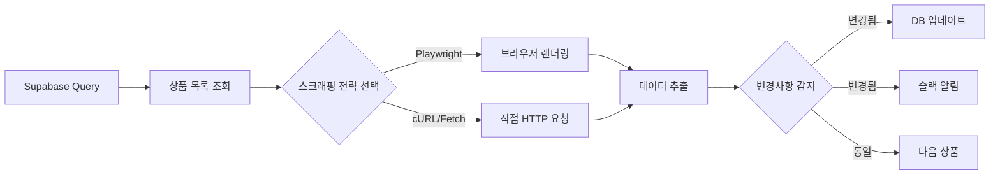

# Product Scanner

Supabase 데이터베이스의 상품 정보를 주기적으로 스캔하여 가격 및 재고 변동을 모니터링하는 서비스입니다.

## 📌 용도

Supabase에 저장된 상품 데이터의 `link_url` 또는 `product_url`을 기반으로 실시간 상품 정보를 수집하여:

- 가격 변동 감지 및 DB 업데이트
- 재고 상태(품절/판매중) 변경 감지
- 상품 정보 변경사항 슬랙 알림 발송

## 🔄 작동 방식



### 스크래핑 전략

1. **Playwright 전략**: 동적 렌더링이 필요한 사이트 (SPA, JavaScript 렌더링)
2. **HTTP 전략**: API 또는 정적 HTML로 데이터 제공하는 사이트
3. **하이브리드 전략**: 사이트별 최적 방법 자동 선택

## 🏗️ 아키텍처

### 디자인 패턴

- **Strategy Pattern**: 사이트별 스크래핑 전략 (Playwright vs HTTP)
- **Factory Pattern**: 스크래퍼 인스턴스 생성
- **Observer Pattern**: 변경사항 감지 및 알림
- **Template Method Pattern**: 공통 스캔 플로우 정의

### SOLID 원칙

- **SRP**: 각 클래스는 단일 책임 (스캔, 추출, 비교, 알림)
- **OCP**: 새 사이트 추가 시 기존 코드 수정 없이 확장
- **DIP**: 추상화된 인터페이스에 의존

## 📁 디렉토리 구조

```text
product_scanner/
├── server.ts                      # 엔트리포인트
├── config/
│   └── targets/                   # 사이트별 스크래핑 설정
│       └── hwahae.yaml
├── core/
│   ├── domain/                    # 도메인 모델
│   │   ├── Product.ts
│   │   └── ScanResult.ts
│   └── interfaces/                # 인터페이스 정의
│       ├── IScraper.ts
│       └── INotifier.ts
├── services/
│   ├── ScanService.ts             # 스캔 오케스트레이션
│   ├── SupabaseService.ts         # DB 연동
│   └── NotificationService.ts     # 슬랙 알림
├── scrapers/
│   ├── base/
│   │   └── BaseScraper.ts         # 베이스 클래스
│   ├── PlaywrightScraper.ts       # Playwright 전략
│   └── HttpScraper.ts             # HTTP 전략
├── extractors/
│   ├── PriceExtractor.ts          # 가격 정보 추출
│   └── StockExtractor.ts          # 재고 정보 추출
├── controllers/
│   └── ScanController.ts          # HTTP 컨트롤러
└── middleware/
    ├── errorHandler.ts            # 에러 핸들러
    └── validation.ts              # 요청 검증
```

## 🚀 사용법

### API 엔드포인트

#### 헬스체크

```bash
GET /health
```

#### 전체 상품 스캔 시작

```bash
POST /scan/all
Content-Type: application/json

{
  "filter": {
    "platform": "hwahae",  # 선택적
    "updatedBefore": "2024-01-01T00:00:00Z"  # 선택적
  }
}
```

#### 특정 상품 스캔

```bash
POST /scan/product
Content-Type: application/json

{
  "productId": "uuid-here",
  "forceUpdate": false  # true일 경우 변경사항 없어도 알림
}
```

#### 스캔 상태 조회

```bash
GET /scan/status/:scanId
```

### 환경 변수

```bash
PORT=3100
SUPABASE_URL=https://your-project.supabase.co
SUPABASE_KEY=your-anon-key
SLACK_WEBHOOK_URL=https://hooks.slack.com/services/YOUR/WEBHOOK/URL
SCAN_INTERVAL_MINUTES=60  # 자동 스캔 주기 (분)
```

## 📝 YAML 설정 예시

```yaml
# config/targets/hwahae.yaml
site: hwahae
name: "화해"
baseUrl: "https://www.hwahae.co.kr"

# 스크래핑 전략 선택
strategy: playwright # playwright | http

# Playwright 설정 (strategy=playwright일 때)
browser:
  headless: true
  viewport:
    width: 1920
    height: 1080

# 네비게이션
navigation:
  steps:
    - action: goto
      url: "${productUrl}"
      waitUntil: networkidle
    - action: wait
      duration: 2000

# 데이터 추출 규칙
extraction:
  price:
    selector: ".price-value"
    type: text
    transform: removeCommas
    parse: int
  stock:
    selector: ".stock-status"
    type: text
    mapping:
      "판매중": "on_sale"
      "품절": "sold_out"
```

## 🔔 슬랙 알림 형식

```
🔍 상품 정보 변경 감지

상품명: 블랙 쿠션 파운데이션 본품 15g+리필 15g [21N1 바닐라]
플랫폼: 화해
링크: https://www.hwahae.co.kr/goods/61560

📊 변경사항:
• 가격: 66,600원 → 59,900원 (10% 할인)
• 재고: 판매중 → 품절

🕐 스캔 시간: 2024-10-28 16:50:00 KST
```

## 🔧 스캔 로직

### 변경사항 감지

```typescript
interface ComparisonResult {
  changed: boolean;
  changes: {
    field: string;
    oldValue: any;
    newValue: any;
  }[];
}
```

감지 대상 필드:

- `discounted_price`: 판매가
- `original_price`: 정가
- `sale_status`: 판매 상태
- `available_stockcnt`: 재고 수량 (선택적)

### 알림 조건

다음 경우에 슬랙 알림이 발송됩니다:

- 가격이 5% 이상 변동된 경우
- 판매 상태가 변경된 경우 (on_sale ↔ sold_out)
- `forceUpdate=true`로 요청된 경우

## 🐳 Docker 실행

```bash
# 빌드
docker build -t product-scanner .

# 실행
docker run -d \
  -p 3100:3100 \
  -e SUPABASE_URL=your-url \
  -e SUPABASE_KEY=your-key \
  -e SLACK_WEBHOOK_URL=your-webhook \
  --name product-scanner \
  product-scanner

# docker-compose 사용
docker-compose up -d
```

## 📊 모니터링

### 로그

서버는 상세한 스캔 로그를 출력합니다:

- 스캔 시작/종료 시간
- 처리된 상품 수
- 감지된 변경사항
- 에러 및 재시도 로그

### 메트릭스 (예정)

- 스캔 성공률
- 평균 응답 시간
- 변경사항 감지 빈도
- 사이트별 에러율

## 🔒 보안 고려사항

- Supabase Row Level Security (RLS) 준수
- API 키는 환경 변수로 관리
- 슬랙 웹훅 URL 노출 방지
- Rate limiting 적용하여 사이트 과부하 방지

## ⚡ 성능 최적화

- 병렬 스캔: 여러 상품 동시 처리 (concurrency 제한)
- 캐싱: 최근 스캔 결과 캐시하여 중복 요청 방지
- 배치 처리: DB 업데이트를 배치로 처리하여 성능 향상
- 스마트 스캔: 변경 가능성이 높은 상품 우선 스캔
