# Product Scanner

**제네릭 기반 멀티 플랫폼 상품 스캐너** - 화해, 올리브영 등 쇼핑몰 상품 정보 스캔 및 Supabase 검색 서비스

## 📌 용도

### 1. 멀티 플랫폼 상품 스캔

- **화해**: API + Playwright 이중 전략
- **올리브영**: Playwright 브라우저 기반 스크래핑
- **제네릭 아키텍처**: 새 플랫폼 추가 시 YAML 설정만으로 확장
- CSV 데이터와 실시간 데이터 검증

### 2. Supabase 상품 검색

- Supabase `product_sets` 테이블 검색
- URL 패턴 기반 상품 조회
- 상품 ID(UUID) 기반 상세 조회

## 🔄 작동 방식

### 화해 상품 스캔

```mermaid
graph LR
    A[Scan Request] --> B{전략 선택}
    B -->|Priority 1| C[화해 API]
    B -->|Priority 2| D[Playwright]
    C --> E[상품 정보 추출]
    D --> E
    E --> F[CSV 데이터 검증]
    F --> G[결과 반환]
```



### Supabase 상품 검색


### 스크래핑 전략

1. **API 전략**: 화해 공식 API 호출 (우선순위 1)
2. **Playwright 전략**: 브라우저 자동화로 데이터 추출 (우선순위 2)
3. **자동 대체**: API 실패 시 Playwright로 자동 전환

## 🏗️ 아키텍처

### 제네릭 기반 설계

**핵심 컨셉**: 플랫폼 독립적 타입 시스템 + 병렬 처리 최적화

```typescript
// 플랫폼 독립 인터페이스
interface IProduct {
  id: string;
  productName: string;
  getDiscountRate(): number;
}

// 제네릭 스캐너 인터페이스
interface IScanner<TProduct extends IProduct> {
  scan(id: string): Promise<TProduct>;
}

// 플랫폼별 구현
class HwahaeProduct implements IProduct {}
class OliveyoungProduct implements IProduct {}
```

**장점**:

- ✅ 타입 안전성: 컴파일 타임 타입 검증
- ✅ 코드 재사용: 공통 로직은 BaseScanner에 집중
- ✅ 확장성: 새 플랫폼 추가 시 IProduct 구현만 필요

### 디자인 패턴

- **Strategy Pattern**: 플랫폼별 스크래핑 전략 (API/Playwright)
- **Template Method Pattern**: BaseScanner<TRawData, TProduct, TConfig>
- **Factory Pattern**: 플랫폼별 스캐너 팩토리 (OliveyoungScannerFactory)
- **Repository Pattern**: 데이터 접근 로직 캡슐화 (Supabase)
- **Facade Pattern**: 서비스 계층 단순화
- **Singleton Pattern**: ConfigLoader, Supabase 클라이언트
- **Object Pool Pattern**: BrowserPool (브라우저 인스턴스 재사용)
- **Command Pattern**: PlaywrightScriptExecutor (YAML 기반 액션 실행)

### SOLID 원칙

- **SRP**: 각 클래스는 단일 책임
- **OCP**: 새 플랫폼 추가 시 기존 코드 수정 없이 확장
- **LSP**: 모든 Product는 IProduct로 대체 가능
- **ISP**: 클라이언트별 인터페이스 분리 (IScanner, IProduct)
- **DIP**: 추상화(IProduct, IScanner)에 의존

## 📁 디렉토리 구조

```text
product_scanner/
├── src/                           # 소스 코드
│   ├── server.ts                  # 엔트리포인트
│   ├── worker.ts                  # Workflow Worker
│   ├── config/                    # 설정 & 로더
│   │   ├── constants.ts           # 애플리케이션 상수
│   │   ├── logger.ts              # Pino 로거 설정 (서비스별 분리)
│   │   ├── ConfigLoader.ts        # YAML 설정 로더 (Singleton)
│   │   └── platforms/             # 플랫폼별 YAML 설정
│   │       ├── hwahae.yaml        # 화해 설정
│   │       └── oliveyoung.yaml    # 올리브영 설정 (max_concurrency)
│   ├── core/                      # 도메인 & 인터페이스
│   │   ├── domain/                # 도메인 모델
│   │   │   ├── PlatformId.ts     # 플랫폼 ID 타입 (hwahae | oliveyoung)
│   │   │   ├── HwahaeProduct.ts   # 화해 상품 (IProduct 구현)
│   │   │   ├── HwahaeConfig.ts    # 화해 설정
│   │   │   ├── OliveyoungProduct.ts  # 올리브영 상품 (IProduct 구현)
│   │   │   ├── OliveyoungConfig.ts   # 올리브영 설정
│   │   │   ├── ProductSet.ts      # Supabase 상품 세트
│   │   │   ├── StrategyConfig.ts  # 전략 설정
│   │   │   └── StrategyConfig.guards.ts  # 타입 가드
│   │   └── interfaces/            # 인터페이스 정의
│   │       ├── IProduct.ts        # 플랫폼 독립 상품 인터페이스
│   │       ├── IScanner.generic.ts  # 제네릭 스캐너 인터페이스
│   │       ├── IProductRepository.ts
│   │       └── IProductSearchService.ts
│   ├── services/                  # 비즈니스 로직
│   │   ├── ScanService.ts
│   │   └── ProductSearchService.ts
│   ├── repositories/              # 데이터 접근 계층
│   │   └── SupabaseProductRepository.ts
│   ├── scanners/                  # 스캐너 구현
│   │   ├── base/
│   │   │   ├── BaseScanner.generic.ts  # 제네릭 Base 클래스
│   │   │   ├── BrowserPool.ts      # 브라우저 인스턴스 풀 (Object Pool)
│   │   │   └── IBrowserPool.ts     # 브라우저 풀 인터페이스
│   │   ├── strategies/            # 전략 구현
│   │   │   ├── ApiScanner.ts      # API 기반 스캐너
│   │   │   └── BrowserScanner.ts  # Playwright 기반 스캐너 (풀 통합)
│   │   ├── platforms/             # 플랫폼별 팩토리
│   │   │   └── oliveyoung/
│   │   │       └── OliveyoungScannerFactory.ts
│   │   ├── HttpScanner.ts         # 레거시 (화해 전용)
│   │   └── PlaywrightScraper.ts   # 레거시 (화해 전용)
│   ├── strategies/                # Workflow 노드 전략
│   │   ├── HwahaeValidationNode.ts
│   │   └── SupabaseSearchNode.ts
│   ├── extractors/                # 데이터 추출기
│   │   ├── PriceExtractor.ts
│   │   └── StockExtractor.ts
│   ├── fetchers/                  # API Fetcher
│   │   └── HwahaeApiFetcher.ts
│   ├── validators/                # 검증기
│   │   └── HwahaeValidator.ts
│   ├── controllers/               # HTTP 컨트롤러
│   │   ├── ScanController.ts
│   │   └── ProductSearchController.ts
│   ├── middleware/                # 미들웨어
│   │   ├── errorHandler.ts
│   │   ├── requestLogger.ts
│   │   └── validation.ts
│   └── utils/                     # 유틸리티
│       ├── logger-context.ts       # 로거 컨텍스트 헬퍼
│       ├── timestamp.ts            # 타임스탬프 유틸
│       └── PlaywrightScriptExecutor.ts  # YAML 기반 액션 실행기
├── tests/                         # Jest 테스트
│   ├── hwahae-validation-node.test.ts
│   └── supabase.test.ts
├── scripts/                       # 독립 실행 스크립트
│   ├── test-hwahae-workflow.sh    # 화해 워크플로우 테스트
│   ├── test-oliveyoung-workflow.sh  # 올영 워크플로우 테스트
│   └── test-oliveyoung-strategy.ts  # 올영 전략 단위 테스트
├── workflows/                     # Workflow 정의 (JSON)
│   ├── hwahae-validation-v1.json    # 화해 검증 워크플로우
│   ├── oliveyoung-validation-v1.json  # 올영 검증 워크플로우
│   └── dag-example-v1.json          # DAG 구조 예제
├── docs/                          # 문서
│   ├── hwahae-validator.md
│   ├── WORKFLOW.md                # Workflow 시스템 가이드
│   └── WORKFLOW_DAG.md            # DAG 구조 가이드
├── docker/                        # Docker 설정
│   ├── README.md
│   ├── Dockerfile
│   ├── Dockerfile.dev
│   ├── docker compose.yml
│   └── docker compose.dev.yml
├── jest.config.js                 # Jest 설정
├── tsconfig.json                  # TypeScript 설정
├── tsconfig.test.json             # 테스트용 tsconfig
└── tsconfig.scripts.json          # 스크립트용 tsconfig
```

## 🔧 개발 환경 설정

### TypeScript 설정

프로젝트는 3개의 TypeScript 설정 파일로 구성됩니다:

#### 1. `tsconfig.json` (메인)

- **대상**: `src/` 디렉토리
- **용도**: 프로덕션 코드
- **타입 체크**: `npx tsc --noEmit`

#### 2. `tsconfig.scripts.json` (스크립트)

- **대상**: `scripts/` 디렉토리
- **용도**: 브라우저 DOM API 사용 스크립트
- **라이브러리**: ES2020 + DOM
- **타입 체크**: `npx tsc --project tsconfig.scripts.json --noEmit`

#### 3. `tsconfig.test.json` (테스트)

- **대상**: `tests/` 디렉토리
- **용도**: Jest 테스트 코드
- **타입**: node, jest
- **타입 체크**: `npx tsc --project tsconfig.test.json --noEmit`

### 의존성 설치

Docker compose dev 환경에서 실행 시 자동으로 설치됩니다:

```bash
# 개발 환경 시작 (Volume mount + Hot reload)
make dev

# 또는
docker compose -f docker/docker compose.dev.yml up
```

로컬 개발 시:

```bash
npm install
```

### 타입 체크 실행

```bash
# 전체 타입 체크 (src만)
npm run type-check

# 스크립트 타입 체크
npx tsc --project tsconfig.scripts.json --noEmit

# 테스트 타입 체크
npx tsc --project tsconfig.test.json --noEmit
```

### Jest 테스트

```bash
# 테스트 실행
npm test

# Watch 모드
npm run test:watch

# 특정 테스트
npm run test:validation-node
```

### 문제 해결

#### `@types/jest` not found

Docker 환경에서는 자동으로 설치됩니다. 로컬 개발 시:

```bash
npm install
```

#### DOM API 타입 에러 (scripts/)

`tsconfig.scripts.json` 사용:

```bash
npx tsc --project tsconfig.scripts.json --noEmit
```

## 🚀 사용법

### 지원 플랫폼

| 플랫폼   | Platform ID  | 전략                          | 비고          |
| -------- | ------------ | ----------------------------- | ------------- |
| 화해     | `hwahae`     | API (우선), Playwright (대체) | 완전 지원     |
| 올리브영 | `oliveyoung` | Playwright                    | 브라우저 전용 |

### API 엔드포인트 (v2.1.0)

⚠️ **API v1 적용**: 모든 엔드포인트에 `/api/v1` 접두사 추가 및 플랫폼별 라우팅 도입

#### 1. 헬스체크

```bash
GET /health
```

#### 2. 플랫폼 목록 조회

```bash
GET /api/v1/platforms

# Response
{
  "platforms": ["hwahae", "oliveyoung"],
  "count": 2
}
```

#### 3. 플랫폼별 상품 스캔

**화해 상품 스캔**

```bash
# 기본 스캔 (API 우선, Playwright 대체)
POST /api/v1/platforms/hwahae/scan/:goodsId

# 전략 지정 (옵션)
POST /api/v1/platforms/hwahae/scan/:goodsId?strategyId=http-api

# 사용 가능한 전략 목록
GET /api/v1/platforms/hwahae/scan/strategies
```

**올리브영 상품 스캔**

```bash
# 브라우저 스캔
POST /api/v1/platforms/oliveyoung/scan/:goodsId

# 전략 목록
GET /api/v1/platforms/oliveyoung/scan/strategies
```

**검증 (CSV vs API) - 화해 전용**

```bash
POST /api/v1/platforms/hwahae/scan/validate
Content-Type: application/json

{
  "goodsId": "61560",
  "csvData": {
    "goods_no": "61560",
    "product_name": "블랙 쿠션 파운데이션",
    "price": "59900"
  }
}
```

#### 4. Supabase 상품 검색

**상품 검색 (쿼리 파라미터)**

```bash
GET /api/v1/products/search?query=hwahae&limit=10
```

**상품 ID 조회 (UUID)**

```bash
GET /api/v1/products/:productSetId
```

**Supabase 연결 상태**

```bash
GET /api/v1/products/health
```

### 환경 변수

```bash
# 서버 설정
PORT=3000
NODE_ENV=production

# Supabase 설정
SUPABASE_URL=https://your-project.supabase.co
SUPABASE_SERVICE_ROLE_KEY=your-service-role-key

# 데이터베이스 설정 (선택)
PRODUCT_TABLE_NAME=product_sets  # 기본값

# API 설정 (선택)
MAX_SEARCH_LIMIT=100      # 최대 검색 결과 개수
DEFAULT_SEARCH_LIMIT=3    # 기본 검색 결과 개수

# Workflow 설정 (선택)
WORKFLOW_PLATFORMS=default,hwahae,oliveyoung,coupang,zigzag,musinsa,ably,kurly,naver  # 지원 Platform 목록
WORKER_POLL_INTERVAL=5000 # Worker 폴링 간격 (ms)

# 로깅 설정 (선택)
LOG_LEVEL=info            # 로그 레벨: debug, info, warn, error
LOG_DIR=./logs            # 로그 파일 저장 디렉토리
LOG_PRETTY=true           # 개발 환경에서 예쁜 출력 (true/false)
TZ=Asia/Seoul             # 타임존 설정
```

## 📊 로깅 시스템

### Pino 기반 구조화 로깅

**주요 특징**:

- 구조화된 JSON 로깅 (파싱 및 분석 용이)
- 서비스별 로그 파일 분리 (server, worker)
- 일일 자동 로테이션 (YYYYMMDD 형식)
- Health check 요청 파일 로그 제외 (콘솔만)
- 타임존 지원 (Asia/Seoul)

### 로그 출력 전략

**콘솔 출력**:

- WARNING/ERROR: 항상 출력
- INFO: `important: true` 플래그 있는 로그만 출력
- Health check: 콘솔에만 출력

**파일 출력**:

- `server-YYYYMMDD.log`: API 서버 로그
- `worker-YYYYMMDD.log`: Worker 및 Repository 로그
- `error-YYYYMMDD.log`: 전체 에러 통합 로그
- 일일 로테이션, 30일 보관, 100MB 초과 시 자동 분할
- 1일 후 자동 gzip 압축

### 컨텍스트 추적

**Request 컨텍스트**:

```typescript
import { createRequestLogger } from "@/utils/logger-context";
const logger = createRequestLogger(requestId, method, path);
logger.info({ query, body }, "요청 수신");
```

**Job 컨텍스트** (Workflow):

```typescript
import { createJobLogger } from "@/utils/logger-context";
const logger = createJobLogger(jobId, workflowId);
logger.info({ status }, "Job 시작");
```

**중요 정보 로깅** (콘솔 출력):

```typescript
import { logImportant } from "@/utils/logger-context";
logImportant(logger, "워크플로우 완료", { workflowId, duration });
```

## 💾 Supabase 통합

### Repository Pattern 구현

**계층 구조**:

```text
ProductSearchController (HTTP)
    ↓
ProductSearchService (Facade)
    ↓
SupabaseProductRepository (Repository)
    ↓
Supabase Client (Singleton)
```

### 주요 기능

1. **상품 검색 (`search`)**
   - URL 패턴 기반 검색 (ILIKE)
   - 판매 상태 필터링
   - 결과 개수 제한

2. **상품 조회 (`findById`)**
   - UUID 기반 단일 상품 조회
   - 404 처리

3. **헬스체크 (`healthCheck`)**
   - Supabase 연결 상태 확인

### 데이터 모델

**ProductSet 도메인 엔티티**:

```typescript
{
  product_set_id: string,    // UUID
  product_id: string,         // UUID
  product_name: string | null,
  link_url: string | null,
  thumbnail?: string | null,
  sale_status?: string | null,
  original_price?: number | null,
  discounted_price?: number | null
}
```

### 검증

- **Zod 스키마 검증**: 모든 DB 레코드는 `ProductSetSchema`로 검증
- **도메인 엔티티**: `ProductSetEntity`로 변환하여 비즈니스 로직 처리
- **타입 안전성**: TypeScript strict mode로 완전한 타입 안전성 보장

## 📝 YAML 설정 예시

화해 플랫폼 설정은 [config/platforms/hwahae.yaml](src/config/platforms/hwahae.yaml)을 참고하세요.

## 🐳 Docker 개발/배포 환경

### 🚀 개발 환경 (Volume Mount + Hot Reload)

로컬에서 파일을 수정하면 자동으로 컨테이너에 반영되고 재시작됩니다.

```bash
# 1. 개발 환경 시작
make dev
# 또는: docker compose -f docker compose.dev.yml up

# 2. 로컬에서 파일 수정
#    → 자동으로 tsx watch가 감지하여 재시작

# 3. 타입 체크 (컨테이너 내)
make type-check

# 4. 테스트 실행
make test

# 5. 작업 완료 후 종료
make dev-down
```

**개발 환경 특징:**

- ✅ 로컬 파일 수정 → 즉시 Docker 컨테이너에 반영
- ✅ tsx watch로 hot reload (재빌드 불필요)
- ✅ node_modules 격리 (로컬/컨테이너 충돌 방지)
- ✅ 타입 체크 컨테이너 내 실행 (환경 100% 일치)

### 📦 배포 환경 (Multi-stage Build)

최적화된 production 이미지를 빌드하고 실행합니다.

```bash
# 배포용 이미지 빌드 & 실행
make prod

# 상태 확인
make status

# 로그 확인
make logs

# 종료
make down
```

### 🔍 주요 차이점

| 항목         | 개발 환경              | 배포 환경                   |
| ------------ | ---------------------- | --------------------------- |
| Dockerfile   | Dockerfile.dev         | Dockerfile (Multi-stage)    |
| Compose      | docker compose.dev.yml | docker compose.yml          |
| Volume Mount | ✅ Yes (./:/app)       | ❌ No                       |
| Hot Reload   | ✅ tsx watch           | ❌ tsx (일반)               |
| Image Size   | ~800MB                 | ~600MB (최적화)             |
| node_modules | 컨테이너 격리          | 이미지 내장                 |
| 빌드 시간    | 최초 1회               | 매번 빌드 (production only) |
| 용도         | 로컬 개발, 디버깅      | 배포, 운영 환경             |

### 📖 상세 가이드

자세한 Docker 설정 및 사용법은 [docker/README.md](./docker/README.md)를 참고하세요.

### ⚡ Makefile 명령어

```bash
make dev          # 개발 환경 시작
make dev-down     # 개발 환경 종료
make prod         # 배포 환경 시작
make down         # 배포 환경 종료
make type-check   # 타입 체크 (컨테이너 내)
make test         # 테스트 실행
make logs         # 로그 확인
make clean        # 전체 정리 (컨테이너 & 이미지 삭제)
make help         # 도움말
```

## 📊 주요 특징

### 제네릭 기반 멀티 플랫폼 지원

- **플랫폼 독립 설계**: `IProduct`, `IScanner<TProduct>` 인터페이스
- **타입 안전 확장**: 새 플랫폼 추가 시 컴파일 타임 검증
- **코드 재사용**: BaseScanner<TRawData, TProduct, TConfig>
- **YAML 설정**: 플랫폼별 전략을 YAML로 정의

### 다중 전략 스크래핑

- **화해**: API 우선 (빠름), Playwright 대체 (안정)
- **올리브영**: Playwright 브라우저 전용 + 병렬 처리
- **자동 대체**: 전략 실패 시 다음 우선순위 전략 실행
- **검증 기능**: CSV vs API 데이터 비교 (화해 전용)

### 브라우저 인스턴스 풀링 (Object Pool Pattern)

- **BrowserPool**: 브라우저 인스턴스 재사용으로 리소스 최적화
- **동적 관리**: 수요에 따른 인스턴스 자동 생성/제거
- **헬스 체크**: 비정상 인스턴스 자동 교체
- **동시성 제어**: 최대 동시 실행 수 제한 (YAML 설정)

### Repository Pattern

- **추상화**: `IProductRepository` 인터페이스로 데이터 접근 분리
- **테스트 가능**: DI로 Mock Repository 주입
- **Singleton**: Supabase 클라이언트 재사용

### 타입 안전성

- **TypeScript Strict Mode**: 100% 타입 안전
- **Zod 검증**: 런타임 데이터 검증
- **제네릭 타입**: 컴파일 타임 타입 에러 방지
- **도메인 엔티티**: 비즈니스 로직 캡슐화

### 테스트 인프라

- **Jest**: 단위 테스트 프레임워크
- **타입 안전 테스트**: tsconfig.test.json 분리
- **독립 실행**: 테스트 환경 격리

## 🔒 보안

- **환경 변수**: Supabase Service Role Key는 환경 변수로 관리
- **입력 검증**: Middleware를 통한 요청 파라미터 검증
- **에러 처리**: 민감한 정보 노출 방지

## ⚡ 성능

- **Singleton Pattern**: Supabase 클라이언트 재사용
- **쿼리 최적화**: 필요한 필드만 SELECT
- **다중 전략**: API 우선으로 응답 시간 단축
- **병렬 처리**: Workflow 배치 병렬 실행 (올리브영: 최대 88% 성능 개선)

## 🔄 Workflow 시스템

대량 상품 검증을 자동화하는 워크플로우 시스템을 지원합니다.

### 주요 특징

- ✅ **DAG 구조 지원**: 분기(Fork), 합류(Join), 조건부 분기 가능
- ✅ **JSON 기반 설정**: 코드 수정 없이 워크플로우 추가
- ✅ **비동기 처리**: Redis Job Queue + Background Worker
- ✅ **자동 검증**: 워크플로우 로드 시 구조 검증
- ✅ **Multi-Platform 지원**: Platform별 병렬 처리 (8개 쇼핑몰 + default)
- ✅ **Job 메타데이터**: 시작/완료 시각 자동 기록 및 결과 파일 저장

### 간단한 예제

```bash
# Job 등록 (Platform 지정)
curl -X POST http://localhost:3000/api/v1/workflows/execute \
  -H "Content-Type: application/json" \
  -d '{
    "workflow_id": "bulk-validation-v1",
    "params": {
      "platform": "hwahae",
      "link_url_pattern": "%hwahae.co.kr%",
      "limit": 2
    },
    "priority": 5
  }'

# Response
{"success":true,"job_id":"019a33de-da41-777a-be17-0b16bb38e3eb","message":"Workflow execution started"}

# 상태 확인
curl http://localhost:3000/api/v1/workflows/jobs/{job_id}
```

### Platform별 Job 실행

지원 Platform: `default`, `hwahae`, `oliveyoung`, `coupang`, `zigzag`, `musinsa`, `ably`, `kurly`, `naver`

- **Platform 지정**: `params.platform`으로 큐 선택 (미지정 시 `default`)
- **결과 파일명**: `job_{platform}_{job_id}.json` 형식으로 자동 생성
- **병렬 처리**: Platform별 독립 큐로 동시 실행 가능

### 병렬 처리 (Concurrency)

올리브영 Workflow는 배치 병렬 처리를 지원하여 대량 상품 검증 성능을 향상시킵니다.

**성능 개선**:

- 순차 처리 (concurrency: 1): 800개 → 67분
- 4병렬 처리 (concurrency: 4): 800개 → 17분 (75% 개선)
- 8병렬 처리 (concurrency: 8): 800개 → 8.3분 (88% 개선)

**설정 방법**:

```json
// workflows/oliveyoung-validation-v1.json
{
  "2": {
    "config": {
      "concurrency": 8 // 1~10 (YAML max 제한)
    }
  }
}
```

**주의사항**:

- 초기 배포 시 `concurrency: 1`로 시작 권장
- 리소스 모니터링 후 점진적 증가 (1 → 4 → 8)
- 자세한 내용: **[PARALLEL_PROCESSING_TEST.md](docs/PARALLEL_PROCESSING_TEST.md)**

### 문서

- **[WORKFLOW.md](docs/WORKFLOW.md)** - 워크플로우 시스템 전체 가이드
- **[WORKFLOW_DAG.md](docs/WORKFLOW_DAG.md)** - DAG 구조 상세 가이드
- **[PARALLEL_PROCESSING_TEST.md](docs/PARALLEL_PROCESSING_TEST.md)** - 병렬 처리 성능 테스트 가이드
