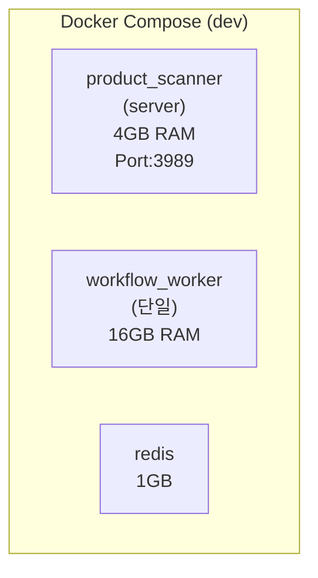
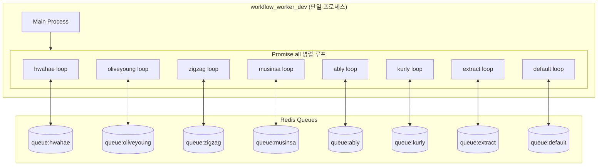
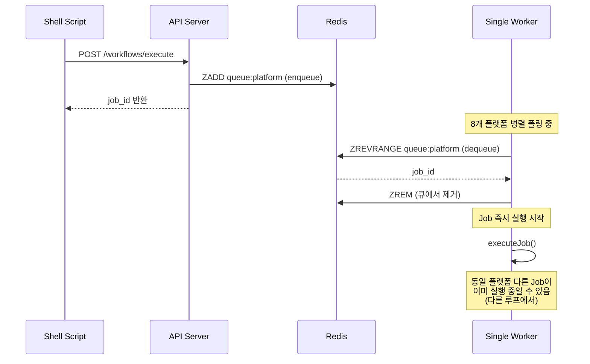
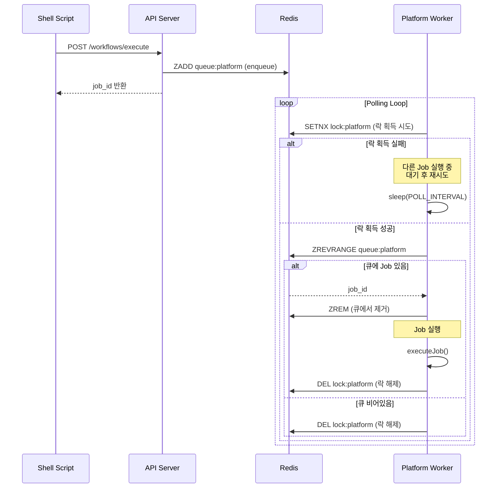
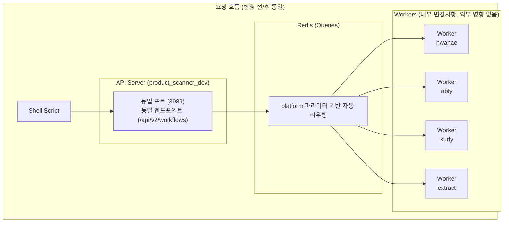
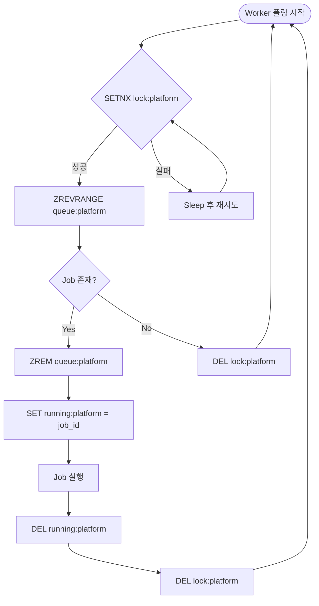
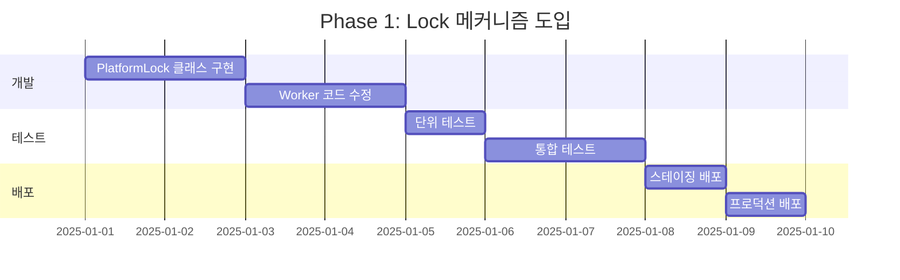
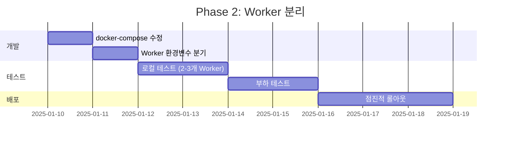

# Multi-Worker Queue System 설계 문서

## 1. 개요

### 1.1 배경

현재 시스템은 단일 Worker 프로세스에서 8개 플랫폼을 병렬 처리하고 있어 리소스 경쟁 문제가 발생합니다.
특히 6개 플랫폼 동시 요청 시 메모리 부족, 브라우저 인스턴스 충돌 등의 문제가 관찰됩니다.

### 1.2 목표

1. **플랫폼별 Worker 분리**: 각 쇼핑몰별 독립 Worker 컨테이너 배정
2. **순차 실행 보장**: 동일 플랫폼 내 Job은 Queue에서 순서대로 실행
3. **Extract Worker 분리**: 간헐적 요청 처리용 별도 Worker 운영

### 1.3 Docker 파일 정책

> ⚠️ **중요**: 개발 환경 파일만 사용합니다.
>
> - ✅ 사용: `Dockerfile.dev`, `docker-compose.dev.yml`
> - ❌ 미사용: `Dockerfile`, `docker-compose.yml` (혼란 방지를 위해 제거 예정)

---

## 2. 현재 상태 분석

### 2.1 Docker Compose 구조



### 2.2 현재 Worker 아키텍처



### 2.3 현재 Job 처리 시퀀스



### 2.4 현재 문제점

| 문제              | 설명                               | 영향                   |
| ----------------- | ---------------------------------- | ---------------------- |
| **리소스 경쟁**   | 단일 프로세스에서 모든 플랫폼 처리 | 메모리 부족, OOM Kill  |
| **브라우저 충돌** | Playwright 인스턴스 공유           | 세션 충돌, 크롤링 실패 |
| **격리 부재**     | 한 플랫폼 문제가 전체 영향         | 연쇄 장애              |
| **스케일 불가**   | Worker 수평 확장 불가              | 처리량 한계            |

---

## 3. 개선 방안

### 3.1 목표 아키텍처

```mermaid
flowchart TB
    subgraph Server["product_scanner (API Server)"]
        API[REST API]
    end

    subgraph Redis["Redis"]
        direction TB
        Q1[(queue:hwahae)]
        Q2[(queue:oliveyoung)]
        Q3[(queue:zigzag)]
        Q4[(queue:musinsa)]
        Q5[(queue:ably)]
        Q6[(queue:kurly)]
        Q7[(queue:extract)]

        Lock1[lock:hwahae]
        Lock2[lock:oliveyoung]
        Lock3[lock:zigzag]
        Lock4[lock:musinsa]
        Lock5[lock:ably]
        Lock6[lock:kurly]
        Lock7[lock:extract]
    end

    subgraph Workers["Independent Workers"]
        W1[worker_hwahae<br/>4GB]
        W2[worker_oliveyoung<br/>4GB]
        W3[worker_zigzag<br/>2GB]
        W4[worker_musinsa<br/>2GB]
        W5[worker_ably<br/>4GB]
        W6[worker_kurly<br/>4GB]
        W7[worker_extract<br/>4GB]
    end

    API -->|enqueue| Redis

    W1 <-->|poll/lock| Q1
    W1 <-->|acquire/release| Lock1

    W2 <-->|poll/lock| Q2
    W2 <-->|acquire/release| Lock2

    W3 <-->|poll/lock| Q3
    W3 <-->|acquire/release| Lock3

    W4 <-->|poll/lock| Q4
    W4 <-->|acquire/release| Lock4

    W5 <-->|poll/lock| Q5
    W5 <-->|acquire/release| Lock5

    W6 <-->|poll/lock| Q6
    W6 <-->|acquire/release| Lock6

    W7 <-->|poll/lock| Q7
    W7 <-->|acquire/release| Lock7
```



### 3.2 개선된 Job 처리 시퀀스



### 3.3 Docker Compose 변경안

```yaml
# docker-compose.dev.yml (개선안)
services:
  # API Server (변경 없음)
  product_scanner_dev:
    # ... 기존 설정 유지

  # Platform Workers (신규)
  worker_hwahae:
    build:
      context: ..
      dockerfile: docker/Dockerfile.dev
    container_name: worker_hwahae
    environment:
      - WORKER_PLATFORM=hwahae
      - WORKER_TYPE=platform
    deploy:
      resources:
        limits:
          memory: 4G
    # ...

  worker_oliveyoung:
    # WORKER_PLATFORM=oliveyoung
    # memory: 4G (Playwright 사용)

  worker_zigzag:
    # WORKER_PLATFORM=zigzag
    # memory: 2G (API 기반)

  worker_musinsa:
    # WORKER_PLATFORM=musinsa
    # memory: 2G (API 기반)

  worker_ably:
    # WORKER_PLATFORM=ably
    # memory: 4G (Playwright 사용)

  worker_kurly:
    # WORKER_PLATFORM=kurly
    # memory: 4G (Playwright 사용)

  # Extract Worker (신규)
  worker_extract:
    environment:
      - WORKER_PLATFORM=url_extraction,single_product,multi_platform
      - WORKER_TYPE=extract
    deploy:
      resources:
        limits:
          memory: 4G
```

### 3.4 메모리 배분 계획

| Worker            | 플랫폼     | 스캔 방식  | 메모리   | 근거          |
| ----------------- | ---------- | ---------- | -------- | ------------- |
| worker_hwahae     | hwahae     | HTTP API   | 2GB      | API 호출만    |
| worker_oliveyoung | oliveyoung | Playwright | 4GB      | 브라우저 필요 |
| worker_zigzag     | zigzag     | GraphQL    | 2GB      | API 호출만    |
| worker_musinsa    | musinsa    | HTTP API   | 2GB      | API 호출만    |
| worker_ably       | ably       | Playwright | 4GB      | 브라우저 필요 |
| worker_kurly      | kurly      | Playwright | 4GB      | 브라우저 필요 |
| worker_extract    | extract\*  | Mixed      | 4GB      | 다양한 플랫폼 |
| **합계**          |            |            | **22GB** |               |

> 기존 단일 Worker 16GB → 분리 후 총 22GB (약 37% 증가)
> 단, 격리로 인한 안정성 향상 및 병렬 처리 가능

### 3.5 Shell Script / Workflow 영향 분석

> ✅ **결론: 변경 불필요**

Shell Script와 Workflow JSON 파일은 **변경 없이** 그대로 사용 가능합니다.

#### 이유



| 구분          | 변경 전                     | 변경 후 | 변경 필요 |
| ------------- | --------------------------- | ------- | --------- |
| API 포트      | 3989                        | 3989    | ❌ 없음   |
| 엔드포인트    | `/api/v2/workflows/execute` | 동일    | ❌ 없음   |
| Workflow JSON | platform 지정               | 동일    | ❌ 없음   |
| Shell Script  | curl 호출                   | 동일    | ❌ 없음   |

#### 라우팅 메커니즘

Workflow의 `platform` 파라미터가 Redis Queue 라우팅을 결정합니다:

```json
// test-hwahae-update.sh → workflow JSON
{
  "params": {
    "platform": "hwahae" // → queue:hwahae로 자동 enqueue
  }
}
```

```typescript
// API Server (WorkflowController.ts)
const platform = determinePlatform(workflow, params);
await repository.enqueueJob(job, platform); // → Redis queue:platform
```

Worker가 분리되어도 이 라우팅 로직은 **동일하게 유지**됩니다.

---

## 4. Redis Lock 메커니즘

### 4.1 Lock 키 설계

```typescript
const REDIS_KEYS = {
  // 기존
  JOB_QUEUE_PLATFORM: (platform: string) =>
    `workflow:queue:platform:${platform}`,
  JOB_DATA: (jobId: string) => `workflow:job:${jobId}`,

  // 신규: 플랫폼별 실행 락
  PLATFORM_LOCK: (platform: string) => `workflow:lock:platform:${platform}`,

  // 신규: 실행 중인 Job 추적
  RUNNING_JOB: (platform: string) => `workflow:running:platform:${platform}`,
};
```

### 4.2 Lock 획득/해제 플로우



### 4.3 Lock 구현 코드 (예시)

```typescript
class PlatformLock {
  private readonly lockKey: string;
  private readonly lockTTL = 3600; // 1시간 (안전장치)

  constructor(
    private redis: Redis,
    private platform: string,
  ) {
    this.lockKey = `workflow:lock:platform:${platform}`;
  }

  async acquire(): Promise<boolean> {
    // SETNX with TTL (atomic)
    const result = await this.redis.set(
      this.lockKey,
      Date.now().toString(),
      "EX",
      this.lockTTL,
      "NX",
    );
    return result === "OK";
  }

  async release(): Promise<void> {
    await this.redis.del(this.lockKey);
  }

  async isLocked(): Promise<boolean> {
    const exists = await this.redis.exists(this.lockKey);
    return exists === 1;
  }
}
```

---

## 5. Worker 코드 변경안

### 5.1 Single Platform Worker

```typescript
// worker-platform.ts (신규)
const PLATFORM = process.env.WORKER_PLATFORM!;

async function processSinglePlatformQueue(
  platform: string,
  service: WorkflowExecutionService,
  repository: RedisWorkflowRepository,
): Promise<void> {
  const lock = new PlatformLock(repository.client, platform);

  while (isRunning) {
    // 1. Lock 획득 시도
    const acquired = await lock.acquire();

    if (!acquired) {
      // 다른 Job이 실행 중 → 대기
      logger.debug({ platform }, "Lock 획득 실패, 대기 중...");
      await sleep(POLL_INTERVAL_MS);
      continue;
    }

    try {
      // 2. 큐에서 Job 가져오기
      const job = await repository.dequeueJobByPlatform(platform);

      if (!job) {
        // 큐 비어있음 → Lock 해제 후 대기
        await lock.release();
        await sleep(POLL_INTERVAL_MS);
        continue;
      }

      // 3. Job 실행 (Lock 유지)
      logger.info({ job_id: job.job_id, platform }, "Job 처리 시작");
      await service.executeJob(job);
      logger.info({ job_id: job.job_id, platform }, "Job 처리 완료");
    } finally {
      // 4. Lock 해제
      await lock.release();
    }
  }
}

// 단일 플랫폼만 처리
startWorker().catch(console.error);
```

### 5.2 환경변수 기반 Worker 설정

```typescript
// worker.ts (수정)
const WORKER_TYPE = process.env.WORKER_TYPE || "legacy";
const WORKER_PLATFORM = process.env.WORKER_PLATFORM;

async function startWorker() {
  if (WORKER_TYPE === "platform" && WORKER_PLATFORM) {
    // 신규: 단일 플랫폼 Worker
    const platforms = WORKER_PLATFORM.split(",");
    await startSinglePlatformWorker(platforms);
  } else {
    // 레거시: 모든 플랫폼 병렬 처리
    await startLegacyWorker();
  }
}
```

---

## 6. 마이그레이션 계획

### 6.1 Phase 1: Lock 메커니즘 도입 (현재 구조 유지)



**목표**: 기존 단일 Worker 구조에서 Lock 메커니즘만 추가

### 6.2 Phase 2: Worker 분리



**목표**: 플랫폼별 독립 Worker 컨테이너 분리

### 6.3 Phase 3: 모니터링 및 최적화

- Prometheus + Grafana 대시보드
- Worker별 메모리/CPU 모니터링
- Queue 길이 알림 설정

---

## 7. 리스크 및 대응

| 리스크            | 확률 | 영향 | 대응 방안                |
| ----------------- | ---- | ---- | ------------------------ |
| Lock 데드락       | 낮음 | 높음 | TTL 설정, 강제 해제 로직 |
| 메모리 증가       | 중간 | 중간 | 모니터링, 동적 스케일링  |
| Redis 장애        | 낮음 | 높음 | Redis Sentinel/Cluster   |
| 마이그레이션 실패 | 중간 | 중간 | 롤백 계획 수립           |

---

## 8. 결론

### 8.1 기대 효과

1. **안정성 향상**: 플랫폼 간 격리로 연쇄 장애 방지
2. **순차 실행 보장**: Lock 메커니즘으로 동시 실행 방지
3. **스케일링 용이**: 플랫폼별 독립 스케일링 가능
4. **디버깅 용이**: 플랫폼별 로그 분리

### 8.2 Trade-off

| 항목        | 개선 전 | 개선 후      |
| ----------- | ------- | ------------ |
| 메모리 사용 | 16GB    | ~22GB (+37%) |
| 컨테이너 수 | 3개     | 9개          |
| 관리 복잡도 | 낮음    | 중간         |
| 안정성      | 낮음    | 높음         |
| 처리량      | 제한적  | 확장 가능    |

### 8.3 권장 사항

1. **Phase 1부터 시작**: Lock 메커니즘 먼저 도입하여 순차 실행 보장
2. **점진적 분리**: 한 번에 모든 Worker 분리하지 않고 단계적 진행
3. **모니터링 선행**: Worker 분리 전 메트릭 수집 체계 구축

---

## 부록: 관련 파일

### 수정 대상

- `docker/docker-compose.dev.yml`: Worker 컨테이너 분리
- `docker/Dockerfile.dev`: 환경변수 기반 Worker 분기 지원
- `src/worker.ts`: 단일 플랫폼 Worker 모드 추가
- `src/repositories/RedisWorkflowRepository.ts`: PlatformLock 통합

### 참조 파일 (읽기 전용)

- `src/config/constants.ts`: WORKFLOW_CONFIG.PLATFORM_QUEUES
- `src/controllers/WorkflowController.ts`: 플랫폼 라우팅 로직
- `scripts/test-*-update.sh`: Shell Script (변경 불필요)
