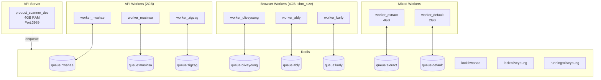
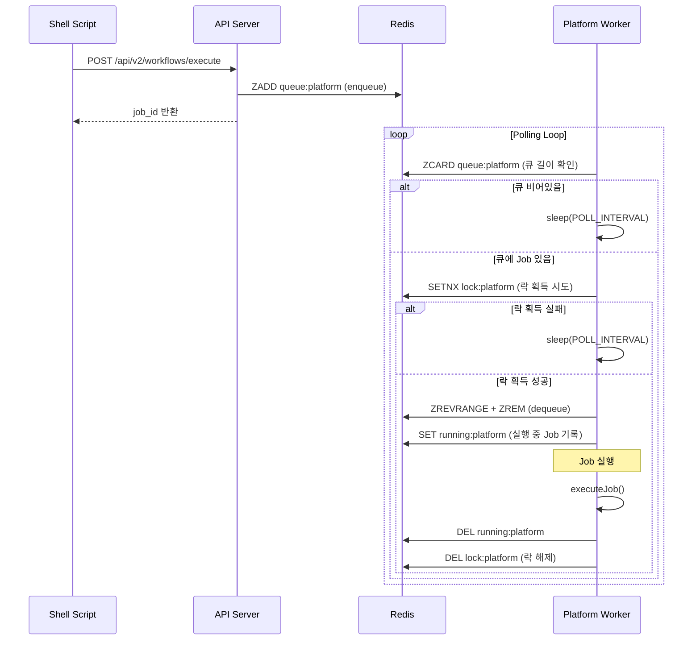

# Multi-Worker Queue System 설계 문서

## 구현 현황

> ✅ **Phase 1, 2 구현 완료** (2025-11-27)

| Phase       | 항목                       | 상태    |
| ----------- | -------------------------- | ------- |
| **Phase 1** | Redis Lock 메커니즘        | ✅ 완료 |
| **Phase 1** | RUNNING_JOB 추적           | ✅ 완료 |
| **Phase 2** | Worker 컨테이너 분리 (8개) | ✅ 완료 |
| **Phase 2** | 모니터링 API/CLI           | ✅ 완료 |
| **Phase 3** | Prometheus + Grafana       | 🔜 향후 |

---

## 1. 개요

### 1.1 배경

현재 시스템은 단일 Worker 프로세스에서 8개 플랫폼을 병렬 처리하고 있어 리소스 경쟁 문제가 발생합니다.
특히 6개 플랫폼 동시 요청 시 메모리 부족, 브라우저 인스턴스 충돌 등의 문제가 관찰됩니다.

### 1.2 목표

1. **플랫폼별 Worker 분리**: 각 쇼핑몰별 독립 Worker 컨테이너 배정
2. **순차 실행 보장**: 동일 플랫폼 내 Job은 Queue에서 순서대로 실행
3. **Extract Worker 분리**: 간헐적 요청 처리용 별도 Worker 운영

### 1.3 Docker 파일 정책

> ⚠️ **중요**: 개발 환경 파일만 사용합니다.
>
> - ✅ 사용: `Dockerfile.dev`, `docker-compose.dev.yml`
> - ❌ 미사용: `Dockerfile`, `docker-compose.yml` (혼란 방지를 위해 제거 예정)

---

## 2. 현재 구현 아키텍처

### 2.1 Docker Compose 구조 (구현 완료)



### 2.2 컨테이너 구성 (10개)

| 컨테이너            | 용도           | 메모리 | 플랫폼                                         |
| ------------------- | -------------- | ------ | ---------------------------------------------- |
| product_scanner_dev | API Server     | 4GB    | -                                              |
| worker_oliveyoung   | Browser Worker | 4GB    | oliveyoung                                     |
| worker_ably         | Browser Worker | 4GB    | ably                                           |
| worker_kurly        | Browser Worker | 4GB    | kurly                                          |
| worker_hwahae       | API Worker     | 2GB    | hwahae                                         |
| worker_musinsa      | API Worker     | 2GB    | musinsa                                        |
| worker_zigzag       | API Worker     | 2GB    | zigzag                                         |
| worker_extract      | Mixed Worker   | 4GB    | url_extraction, single_product, multi_platform |
| worker_default      | Default Worker | 2GB    | default                                        |
| redis               | Redis          | 1GB    | -                                              |

**총 메모리**: 약 27GB (Server 4GB + Workers 22GB + Redis 1GB)

### 2.3 Job 처리 시퀀스 (구현 완료)



---

## 3. Redis Lock 메커니즘 (구현 완료)

### 3.1 Redis 키 설계

```typescript
const LOCK_KEYS = {
  // 플랫폼별 실행 락
  PLATFORM_LOCK: (platform: string) => `workflow:lock:platform:${platform}`,
  // 실행 중인 Job 추적
  RUNNING_JOB: (platform: string) => `workflow:running:platform:${platform}`,
};
```

### 3.2 PlatformLock 클래스

**파일**: `src/repositories/PlatformLock.ts`

```typescript
export class PlatformLock {
  private readonly lockKey: string;
  private readonly runningJobKey: string;
  private readonly lockTTLSeconds: number; // 2시간 (7200초)

  // Lock 획득 (SETNX with TTL)
  async acquire(): Promise<boolean>;

  // Lock 해제
  async release(): Promise<void>;

  // 실행 중인 Job 설정
  async setRunningJob(jobId: string, workflowId?: string): Promise<void>;

  // 실행 중인 Job 초기화
  async clearRunningJob(): Promise<void>;

  // 실행 중인 Job 조회
  async getRunningJob(): Promise<{ job_id; workflow_id?; started_at } | null>;
}
```

### 3.3 Lock 설정

**파일**: `src/config/constants.ts`

```typescript
export const LOCK_CONFIG = {
  LOCK_TTL_MS: 7200000, // 2시간 (Job 최대 1시간 + 마진)
  LOCK_RETRY_INTERVAL_MS: 1000, // 1초
  MAX_LOCK_ATTEMPTS: 10,
};
```

---

## 4. Worker 구현 (구현 완료)

### 4.1 환경변수 기반 Worker 설정

**파일**: `src/worker.ts`

```typescript
// WORKER_PLATFORMS 환경변수로 담당 플랫폼 지정
function getWorkerPlatforms(): string[] {
  const envPlatforms = process.env.WORKER_PLATFORMS;
  if (envPlatforms) {
    return envPlatforms
      .split(",")
      .map((p) => p.trim())
      .filter((p) => p.length > 0);
  }
  return WORKFLOW_CONFIG.PLATFORMS; // 레거시 모드: 모든 플랫폼
}
```

### 4.2 처리 흐름

```typescript
async function processPlatformQueue(platform, service, repository) {
  const lock = new PlatformLock(repository.client, platform);

  while (isRunning) {
    // 1. 큐 길이 확인 (Lock 없이)
    const queueLength = await repository.getQueueLength(platform);
    if (queueLength === 0) {
      await sleep(POLL_INTERVAL_MS);
      continue;
    }

    // 2. Lock 획득 시도
    const acquired = await lock.acquire();
    if (!acquired) {
      await sleep(POLL_INTERVAL_MS);
      continue;
    }

    try {
      // 3. Dequeue
      const job = await repository.dequeueJobByPlatform(platform);
      if (!job) {
        await lock.release();
        continue;
      }

      // 4. Running Job 설정
      await lock.setRunningJob(job.job_id, job.workflow_id);

      // 5. Job 실행
      await service.executeJob(job);
    } finally {
      // 6. 정리
      await lock.clearRunningJob();
      await lock.release();
    }
  }
}
```

---

## 5. 모니터링 (구현 완료)

### 5.1 REST API

**엔드포인트**: `GET /api/v2/jobs/running`

```bash
curl http://localhost:3989/api/v2/jobs/running | jq .
```

**응답**:

```json
{
  "success": true,
  "data": {
    "running": [
      {
        "platform": "oliveyoung",
        "job_id": "019ac45d-9265-...",
        "workflow_id": "oliveyoung-validation-v2",
        "started_at": "2025-11-27T08:11:01.578Z",
        "elapsed_seconds": 930
      }
    ],
    "queued": {
      "hwahae": 3,
      "musinsa": 1
    },
    "summary": {
      "running_count": 1,
      "queued_count": 4
    }
  }
}
```

### 5.2 CLI 스크립트

**파일**: `scripts/check-running-jobs.sh`

```bash
# 로컬 서버 조회
./scripts/check-running-jobs.sh

# 원격 서버 조회
API_URL=http://production-server:3989 ./scripts/check-running-jobs.sh
```

### 5.3 Redis 키 구조

| 키 패턴                                | 용도                            |
| -------------------------------------- | ------------------------------- |
| `workflow:running:platform:{platform}` | 실행 중인 Job 정보 (JSON)       |
| `workflow:lock:platform:{platform}`    | 플랫폼별 분산 Lock              |
| `workflow:queue:platform:{platform}`   | 플랫폼별 Job Queue (Sorted Set) |

---

## 6. Docker Compose 설정 (구현 완료)

**파일**: `docker/docker-compose.dev.yml`

```yaml
# YAML 앵커로 공통 설정 재사용
x-worker-common: &worker-common
  build:
    context: ..
    dockerfile: docker/Dockerfile.dev
  volumes:
    - ../:/app
    - /app/node_modules
  command: npm run worker
  environment: &worker-env-common
    NODE_ENV: development
    REDIS_HOST: redis
    REDIS_PORT: "6379"
    LOG_LEVEL: info

x-browser-worker: &browser-worker
  <<: *worker-common
  shm_size: "2gb"
  deploy:
    resources:
      limits:
        memory: 4G

x-api-worker: &api-worker
  <<: *worker-common
  deploy:
    resources:
      limits:
        memory: 2G

services:
  worker_oliveyoung:
    <<: *browser-worker
    environment:
      <<: *worker-env-common
      SERVICE_NAME: worker-oliveyoung
      WORKER_PLATFORMS: oliveyoung

  worker_hwahae:
    <<: *api-worker
    environment:
      <<: *worker-env-common
      SERVICE_NAME: worker-hwahae
      WORKER_PLATFORMS: hwahae
  # ... (8개 Worker 정의)
```

---

## 7. 마이그레이션 완료 기록

### 7.1 Phase 1: Lock 메커니즘 (✅ 완료)

- `src/config/constants.ts`: LOCK_CONFIG 추가
- `src/repositories/PlatformLock.ts`: 신규 생성
- `src/repositories/RedisWorkflowRepository.ts`: client getter 추가
- `src/worker.ts`: Lock 메커니즘 적용

### 7.2 Phase 2: Worker 분리 (✅ 완료)

- `docker/docker-compose.dev.yml`: 8개 Worker 컨테이너 분리
- `src/worker.ts`: WORKER_PLATFORMS 환경변수 지원
- `src/config/logger.ts`: worker-\* 패턴 라우팅

### 7.3 모니터링 (✅ 완료)

- `src/routes/v2/jobs.router.ts`: /api/v2/jobs/running 엔드포인트
- `scripts/check-running-jobs.sh`: CLI 모니터링 스크립트

---

## 8. 향후 계획: Phase 3 모니터링 강화

### 8.1 Prometheus + Grafana (미구현)

- Worker별 메모리/CPU 메트릭
- Queue 길이 시계열 데이터
- Job 처리 시간 히스토그램

### 8.2 알림 시스템 (미구현)

- Queue 길이 임계치 알림
- Worker 장애 감지
- Slack/Discord 연동

---

## 부록: 관련 파일

### 수정된 파일

| 파일                                          | 변경 내용                      |
| --------------------------------------------- | ------------------------------ |
| `src/config/constants.ts`                     | LOCK_CONFIG 추가               |
| `src/repositories/PlatformLock.ts`            | 신규 생성 (Lock + Running Job) |
| `src/repositories/RedisWorkflowRepository.ts` | client getter 추가             |
| `src/worker.ts`                               | Lock + WORKER_PLATFORMS 지원   |
| `src/config/logger.ts`                        | worker-\* 라우팅               |
| `src/routes/v2/jobs.router.ts`                | 신규 생성                      |
| `src/routes/v2/index.ts`                      | jobs 라우터 등록               |
| `docker/docker-compose.dev.yml`               | 8개 Worker 분리                |
| `scripts/check-running-jobs.sh`               | API 기반 재작성                |

### 참조 파일 (변경 없음)

- `src/controllers/WorkflowController.ts`: 플랫폼 라우팅 로직
- `scripts/test-*-update.sh`: Shell Script
- `workflows/*.json`: Workflow 정의
