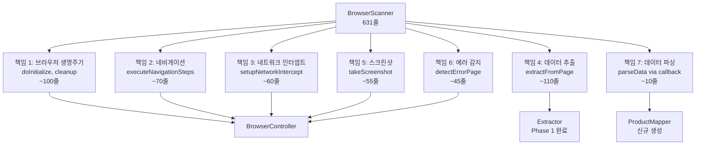

# Phase 3: Scanner 책임 분리 계획

## 📋 개요

### 목적

BrowserScanner(631줄)의 단일 책임 원칙(SRP) 위반 해결을 위한 책임 분리 리팩토링

### 현재 문제점

```typescript
// BrowserScanner.ts (631줄) - 다중 책임 혼재
class BrowserScanner {
  // ❌ 책임 1: 브라우저 생명주기 관리
  private browser: Browser | null = null;
  private context: BrowserContext | null = null;
  private page: Page | null = null;
  async doInitialize() {
    /* browser launch, context, page */
  }
  async cleanup() {
    /* close all */
  }

  // ❌ 책임 2: 네비게이션 제어
  async executeNavigationSteps() {
    /* navigate, click, type */
  }

  // ❌ 책임 3: 네트워크 인터셉트
  async setupNetworkIntercept() {
    /* API response capture */
  }

  // ❌ 책임 4: 데이터 추출
  async extractFromPage() {
    /* evaluate, selector, extractor */
  }

  // ❌ 책임 5: 스크린샷
  async takeScreenshot() {
    /* capture screenshot */
  }

  // ❌ 책임 6: 에러 감지
  async detectErrorPage() {
    /* 404, 500, rate limit */
  }

  // ❌ 책임 7: 데이터 파싱
  async parseData() {
    /* parseDOM callback */
  }
}
```

### 목표 구조

```text
src/
  scrapers/
    controllers/
      BrowserController.ts       # 브라우저 생명주기 + 네비게이션
      IBrowserController.ts      # 인터페이스

    extractors/
      [Phase 1 완료: 6개 플랫폼 Extractor]

    mappers/
      IProductMapper.ts          # Raw Data → Product 인터페이스
      OliveyoungProductMapper.ts # 올리브영 전용
      HwahaeProductMapper.ts     # 화해 전용
      MusinsaProductMapper.ts    # 무신사 전용
      AblyProductMapper.ts       # 에이블리 전용
      KurlyProductMapper.ts      # 컬리 전용
      ZigzagProductMapper.ts     # 지그재그 전용

    validators/
      IProductValidator.ts       # 제네릭 검증 인터페이스
      ProductValidator.ts        # 공통 검증 로직

    base/
      BaseScanner.ts             # Template Method (조율자)
      BrowserPool.ts             # [기존 유지]
      IBrowserPool.ts            # [기존 유지]
```

---

## 🔍 현재 상태 분석

### 이미 구현된 요소

| 구성요소                | 상태         | 파일                                  | 설명                                        |
| ----------------------- | ------------ | ------------------------------------- | ------------------------------------------- |
| **BrowserPool**         | ✅ 완료      | `src/scanners/base/BrowserPool.ts`    | Browser Pool 관리 (Singleton + Object Pool) |
| **IBrowserPool**        | ✅ 완료      | `src/scanners/base/IBrowserPool.ts`   | Pool 인터페이스                             |
| **Extractors**          | ✅ 완료      | `src/extractors/[platform]/`          | Phase 1 완료 (6개 플랫폼)                   |
| **ExtractorRegistry**   | ✅ 완료      | `src/extractors/ExtractorRegistry.ts` | Extractor 등록/조회                         |
| **ProductMapper (DTO)** | ⚠️ 다른 용도 | `src/mappers/ProductMapper.ts`        | Product → DTO 변환 (Phase 3 대상 아님)      |
| **HwahaeValidator**     | ⚠️ 특정 용도 | `src/validators/HwahaeValidator.ts`   | CSV vs API 비교 (Phase 3 대상 아님)         |

### BrowserScanner 책임 분석



---

## 🏗️ 구현 계획

### Step 3.1: BrowserController 분리

**목적**: 브라우저 생명주기 + 네비게이션 + 네트워크 인터셉트 + 스크린샷 + 에러 감지

**파일**: `src/scrapers/controllers/BrowserController.ts`

```typescript
/**
 * Browser Controller
 *
 * 단일 책임: 브라우저 제어 및 페이지 관리
 * - 브라우저/컨텍스트/페이지 생명주기
 * - 네비게이션 스텝 실행
 * - 네트워크 인터셉트
 * - 스크린샷
 * - 에러 페이지 감지
 */
export interface IBrowserController {
  /** 초기화 (브라우저 실행) */
  initialize(config: BrowserConfig): Promise<void>;

  /** 페이지 생성 */
  createPage(): Promise<Page>;

  /** 네비게이션 실행 */
  navigate(page: Page, steps: NavigationStep[], id: string): Promise<void>;

  /** 네트워크 인터셉트 설정 */
  setupNetworkIntercept(page: Page, pattern: string): Promise<void>;

  /** 인터셉트된 데이터 조회 */
  getInterceptedData(): unknown | null;

  /** 에러 페이지 감지 */
  detectErrorPage(page: Page, id: string): Promise<void>;

  /** 스크린샷 */
  takeScreenshot(page: Page, id: string, isError: boolean): Promise<void>;

  /** 리소스 정리 */
  cleanup(): Promise<void>;

  /** 페이지 반환 */
  getPage(): Page | null;
}
```

**이전 대상** (BrowserScanner.ts → BrowserController.ts):

| 메서드                     | 라인    | 비고                                      |
| -------------------------- | ------- | ----------------------------------------- |
| `doInitialize()`           | 118-170 | 브라우저 실행, 컨텍스트 생성, 페이지 생성 |
| `executeNavigationSteps()` | 305-376 | 네비게이션 액션 실행                      |
| `replaceIdPlaceholder()`   | 382-394 | ID 템플릿 치환                            |
| `setupNetworkIntercept()`  | 400-457 | API 응답 캡처                             |
| `detectErrorPage()`        | 213-254 | 404, 500, Rate Limit 감지                 |
| `takeScreenshot()`         | 576-629 | 스크린샷 저장                             |
| `cleanup()`                | 274-300 | 리소스 정리                               |

### Step 3.2: IProductMapper 인터페이스 정의

**목적**: Raw Data (Extractor 결과) → Product 도메인 모델 변환

**파일**: `src/scrapers/mappers/IProductMapper.ts`

```typescript
import { ProductData } from "@/extractors/base/IProductExtractor";
import { IProduct } from "@/core/interfaces/IProduct";

/**
 * Product Mapper 인터페이스
 *
 * 단일 책임: Raw Data → Product 도메인 변환
 *
 * @template TProduct 타겟 Product 타입
 */
export interface IProductMapper<TProduct extends IProduct> {
  /**
   * ProductData → Product 변환
   *
   * @param data Extractor 추출 결과
   * @param id 상품 ID
   * @returns 도메인 Product 객체
   */
  map(data: ProductData, id: string): TProduct;
}
```

**플랫폼별 Mapper 구현 예시**:

```typescript
// src/scrapers/mappers/OliveyoungProductMapper.ts
import { IProductMapper } from "./IProductMapper";
import { ProductData } from "@/extractors/base/IProductExtractor";
import { OliveyoungProduct } from "@/core/domain/OliveyoungProduct";

export class OliveyoungProductMapper
  implements IProductMapper<OliveyoungProduct>
{
  map(data: ProductData, id: string): OliveyoungProduct {
    return new OliveyoungProduct({
      goodsNo: id,
      productName: data.metadata.productName,
      brandName: data.metadata.brandName || "",
      thumbnail: data.metadata.thumbnail || "",
      originalPrice: data.price.originalPrice ?? data.price.price,
      discountedPrice: data.price.price,
      saleStatus: data.saleStatus.status,
    });
  }
}
```

### Step 3.3: ProductValidator 분리

**목적**: 제네릭 Product 유효성 검증

**파일**: `src/scrapers/validators/ProductValidator.ts`

```typescript
import { IProduct } from "@/core/interfaces/IProduct";

/**
 * 검증 결과 인터페이스
 */
export interface ValidationResult {
  valid: boolean;
  errors: string[];
}

/**
 * Product Validator 인터페이스
 */
export interface IProductValidator {
  validate(product: IProduct): ValidationResult;
}

/**
 * 공통 Product 검증기
 *
 * 단일 책임: 도메인 Product 유효성 검증
 */
export class ProductValidator implements IProductValidator {
  validate(product: IProduct): ValidationResult {
    const errors: string[] = [];

    // 1. 가격 검증
    if (!product.discountedPrice || product.discountedPrice <= 0) {
      errors.push("Invalid discounted price: must be greater than 0");
    }

    // 2. 상품명 검증
    if (!product.productName || product.productName.trim() === "") {
      errors.push("Missing product name");
    }

    // 3. 판매 상태 검증
    const validStatuses = ["on_sale", "off_sale", "info_changed", "not_found"];
    if (!validStatuses.includes(product.saleStatus)) {
      errors.push(`Invalid sale status: ${product.saleStatus}`);
    }

    // 4. 정가 vs 판매가 검증
    if (product.originalPrice < product.discountedPrice) {
      errors.push("Original price cannot be less than discounted price");
    }

    return {
      valid: errors.length === 0,
      errors,
    };
  }
}
```

### Step 3.4: BaseScanner 리팩토링

**목적**: Template Method 패턴으로 컴포넌트 조율

**파일**: `src/scanners/base/BaseScanner.refactored.ts`

```typescript
/**
 * 리팩토링된 BaseScanner
 *
 * Template Method Pattern - 컴포넌트 조율자
 *
 * 의존성 주입:
 * - BrowserController: 브라우저 제어
 * - Extractor: 데이터 추출
 * - Mapper: 도메인 변환
 * - Validator: 유효성 검증
 */
export abstract class BaseScanner<TProduct extends IProduct>
  implements IScanner<TProduct>
{
  protected controller: IBrowserController;
  protected extractor: IProductExtractor;
  protected mapper: IProductMapper<TProduct>;
  protected validator: IProductValidator;

  constructor(
    controller: IBrowserController,
    extractor: IProductExtractor,
    mapper: IProductMapper<TProduct>,
    validator: IProductValidator,
  ) {
    this.controller = controller;
    this.extractor = extractor;
    this.mapper = mapper;
    this.validator = validator;
  }

  /**
   * 스캔 실행 (Template Method)
   */
  async scan(id: string): Promise<TProduct> {
    const startTime = Date.now();

    try {
      // 1. 초기화
      await this.controller.initialize(this.getBrowserConfig());
      const page = await this.controller.createPage();

      // 2. 네비게이션
      await this.controller.navigate(page, this.getNavigationSteps(), id);

      // 3. 에러 페이지 감지
      await this.controller.detectErrorPage(page, id);

      // 4. 데이터 추출 (Phase 1 Extractor)
      const rawData = await this.extractor.extract(page);

      // 5. 스크린샷 (성공)
      await this.controller.takeScreenshot(page, id, false);

      // 6. 도메인 변환 (Mapper)
      const product = this.mapper.map(rawData, id);

      // 7. 유효성 검증 (Validator)
      const validation = this.validator.validate(product);
      if (!validation.valid) {
        throw new ValidationError(validation.errors);
      }

      return product;
    } catch (error) {
      // 에러 스크린샷
      const page = this.controller.getPage();
      if (page) {
        await this.controller.takeScreenshot(page, id, true);
      }
      throw error;
    } finally {
      // 8. 리소스 정리
      await this.controller.cleanup();
    }
  }

  /** 브라우저 설정 (하위 클래스 구현) */
  protected abstract getBrowserConfig(): BrowserConfig;

  /** 네비게이션 스텝 (하위 클래스 구현) */
  protected abstract getNavigationSteps(): NavigationStep[];
}
```

---

## 📊 구현 순서 및 체크리스트

### Week 1: Step 3.1 - BrowserController 분리

**Day 1-2**: 인터페이스 정의 및 기본 구조

- [x] `src/scrapers/controllers/IBrowserController.ts` 생성
- [x] `src/scrapers/controllers/BrowserConfig.ts` 타입 정의 (IBrowserController.ts 내 포함)
- [x] `src/scrapers/controllers/NavigationStep.ts` 타입 정의 (IBrowserController.ts 내 포함)

**Day 3-4**: BrowserController 구현

- [x] `src/scrapers/controllers/BrowserController.ts` 구현
- [x] BrowserScanner에서 코드 이전 (doInitialize, cleanup 등)
- [x] BrowserPool 연동 로직 유지

**Day 5**: 테스트 및 통합

- [ ] BrowserController 단위 테스트
- [x] BrowserScanner → BrowserController 호출 변경
- [x] 기존 테스트 통과 확인

### Week 2: Step 3.2 & 3.3 - Mapper & Validator

**Day 1-2**: IProductMapper 및 플랫폼별 Mapper

- [x] `src/scrapers/mappers/IProductMapper.ts` 인터페이스
- [x] 6개 플랫폼 Mapper 구현
- [x] BrowserScanner의 parseDOM 콜백 대체 (parseDOM deprecated, mapper 권장)

**Day 3-4**: ProductValidator 구현

- [x] `src/scrapers/validators/IProductValidator.ts` 인터페이스
- [x] `src/scrapers/validators/ProductValidator.ts` 공통 검증기
- [ ] 플랫폼별 추가 검증 로직 (필요시)

**Day 5**: 통합 테스트

- [ ] Mapper 단위 테스트
- [ ] Validator 단위 테스트
- [ ] 전체 파이프라인 통합 테스트

### Week 3: Step 3.4 - BaseScanner 리팩토링

**Day 1-2**: BaseScanner 리팩토링

- [x] 의존성 주입 구조로 변경 (BrowserController DI, Mapper optional DI)
- [x] Template Method 패턴 적용 (BaseScanner.generic.ts 유지)
- [x] 기존 BrowserScanner 코드 정리 (631줄 → 333줄)

**Day 3-4**: 플랫폼별 Scanner 수정

- [x] OliveyoungScannerFactory 수정 (Mapper 패턴)
- [x] KurlyScannerFactory 수정 (Mapper 패턴)
- [x] MusinsaScannerFactory 수정 (Mapper 패턴)
- [x] Hwahae/Zigzag/Ably - 다른 Scanner 사용 (제외)

**Day 5**: 검증 및 마무리

- [ ] 모든 플랫폼 E2E 테스트
- [x] TypeScript 0 errors 확인
- [ ] 기존 Workflow 정상 동작 확인

---

## 🔄 마이그레이션 전략

### 점진적 마이그레이션

```typescript
// Phase 1: BrowserController 분리 (기존 호환)
class BrowserScanner {
  private controller: BrowserController; // 신규

  async doInitialize() {
    // 기존 코드 → BrowserController.initialize() 위임
    await this.controller.initialize(this.config);
  }
}

// Phase 2: Mapper/Validator 적용
class BrowserScanner {
  private mapper: IProductMapper;
  private validator: IProductValidator;

  async parseData(rawData) {
    // 기존 parseDOM 콜백 → Mapper 위임
    const product = this.mapper.map(rawData, this.lastScanId);
    const validation = this.validator.validate(product);
    // ...
  }
}

// Phase 3: 완전 리팩토링
class OliveyoungScanner extends BaseScanner<OliveyoungProduct> {
  // 모든 의존성 주입, Template Method 패턴
}
```

### 하위 호환성

- ✅ 기존 API 엔드포인트 유지
- ✅ 기존 Workflow JSON 유지
- ✅ 기존 테스트 통과
- ✅ BrowserScannerOptions 인터페이스 유지 (Deprecated 마킹)

---

## 📈 예상 효과

### 코드 품질 개선

| 메트릭                 | Before             | After                   |
| ---------------------- | ------------------ | ----------------------- |
| BrowserScanner 라인 수 | 631줄              | ~150줄                  |
| 클래스당 책임 수       | 7개                | 1개                     |
| 테스트 가능성          | 낮음 (의존성 혼재) | 높음 (단위 테스트 가능) |
| 재사용성               | 낮음               | 높음 (컴포넌트 조합)    |

### SRP 준수

| 컴포넌트          | 단일 책임                       |
| ----------------- | ------------------------------- |
| BrowserController | 브라우저 제어 및 페이지 관리    |
| Extractor         | DOM/API에서 데이터 추출         |
| ProductMapper     | Raw Data → Product 변환         |
| ProductValidator  | Product 유효성 검증             |
| BaseScanner       | 컴포넌트 조율 (Template Method) |

### 확장성 개선

```typescript
// 새 플랫폼 추가 시
// 1. Extractor 구현 (Phase 1 패턴)
// 2. ProductMapper 구현 (~30줄)
// 3. Scanner 조합 (~20줄)

class NewPlatformScanner extends BaseScanner<NewPlatformProduct> {
  constructor() {
    super(
      new BrowserController(),
      new NewPlatformExtractor(),
      new NewPlatformMapper(),
      new ProductValidator(),
    );
  }
}
```

---

## 🚨 리스크 및 대응

### 리스크 1: 기존 코드 호환성

**영향도**: 중간
**대응**: 점진적 마이그레이션, 기존 인터페이스 유지

### 리스크 2: 성능 저하

**영향도**: 낮음
**대응**: 객체 생성 최소화, 의존성 재사용

### 리스크 3: 테스트 커버리지

**영향도**: 중간
**대응**: 각 컴포넌트별 단위 테스트 필수

---

## 📝 참고 문서

- [REFACTORING_PLAN.md](./REFACTORING_PLAN.md) - 전체 리팩토링 계획
- [Phase 1 완료] Extractor 분리 - 6개 플랫폼 완료
- [Phase 2 완료] Extract Service 구현 - Multi-Platform 지원

---

## ✅ 최종 체크리스트

### Phase 3 완료 기준

- [x] BrowserController 분리 및 테스트
- [x] IProductMapper 인터페이스 및 6개 Mapper 구현
- [x] ProductValidator 구현
- [x] BaseScanner 리팩토링
- [x] BrowserScanner 기반 플랫폼 Scanner 수정 (Oliveyoung, Kurly, Musinsa)
- [x] TypeScript 0 errors
- [ ] 기존 테스트 100% 통과
- [ ] 신규 단위 테스트 추가
- [x] 문서 업데이트

---

## 📝 구현 vs 계획 차이점 (2025-11-25)

### 1. IBrowserController 인터페이스 차이

| 항목        | 계획                             | 실제 구현                                             |
| ----------- | -------------------------------- | ----------------------------------------------------- |
| 페이지 생성 | `createPage(): Page` 별도 메서드 | 내부 관리 (`getPage()` 조회만)                        |
| 네비게이션  | `navigate(page, steps, id)`      | `executeNavigation(id)` - Page 내부 관리              |
| 초기화      | `initialize(BrowserConfig)`      | `initialize(BrowserInitOptions)` - strategy 직접 전달 |

**이유**: BrowserController가 Page 생명주기 완전 캡슐화 → 더 단순한 API

### 2. ProductValidator 확장

| 항목      | 계획                                                   | 실제 구현                                                        |
| --------- | ------------------------------------------------------ | ---------------------------------------------------------------- |
| 결과 타입 | `valid: boolean`                                       | `isValid: boolean`                                               |
| 경고 지원 | 없음                                                   | `warnings: ValidationWarning[]` 추가                             |
| 판매 상태 | `["on_sale", "off_sale", "info_changed", "not_found"]` | `["on_sale", "sold_out", "off_sale"]` (IProduct.SaleStatus 일치) |
| 옵션      | 없음                                                   | `ValidationOptions` (strict mode, maxDiscountRate 등)            |

**이유**: 더 유연한 검증 (경고/에러 분리), IProduct 타입과 일관성

### 3. BaseScanner DI 수준

| 항목           | 계획                                               | 실제 구현                                  |
| -------------- | -------------------------------------------------- | ------------------------------------------ |
| 의존성 주입    | 완전 DI (controller, extractor, mapper, validator) | 부분 DI (mapper optional, controller 생성) |
| Validator 통합 | scan() 내 validation 호출                          | 외부 사용 가능 (scan에는 미통합)           |
| parseDOM       | 제거                                               | `@deprecated` 마킹, 하위 호환 유지         |

**이유**: 기존 코드 하위 호환성 유지, 점진적 마이그레이션

### 4. 플랫폼별 Scanner 범위

| 플랫폼     | 계획 | 실제    | 비고                               |
| ---------- | ---- | ------- | ---------------------------------- |
| Oliveyoung | 수정 | ✅ 완료 | BrowserScanner + Mapper            |
| Kurly      | 수정 | ✅ 완료 | BrowserScanner + Mapper            |
| Musinsa    | 수정 | ✅ 완료 | BrowserScanner + Mapper            |
| Hwahae     | 수정 | ⏭️ 제외 | HttpScanner/PlaywrightScanner 사용 |
| Zigzag     | 수정 | ⏭️ 제외 | GraphQL/PlaywrightScanner 사용     |
| Ably       | 수정 | ⏭️ 제외 | AblyBrowserScanner (커스텀) 사용   |

**이유**: BrowserScanner 직접 사용하는 플랫폼만 수정, 다른 Scanner 클래스는 별도 리팩토링 필요

### 5. 코드 감소율

| 항목                   | 계획           | 실제                     |
| ---------------------- | -------------- | ------------------------ |
| BrowserScanner 라인 수 | 631줄 → ~150줄 | 631줄 → 333줄 (47% 감소) |

**이유**: 하위 호환성 유지로 parseDOM 지원 코드 존재, 에러 처리 로직 유지

### 6. 미완료 항목

- [ ] BrowserController 단위 테스트
- [ ] Mapper 단위 테스트
- [ ] Validator 단위 테스트
- [ ] E2E 테스트 검증
- [ ] Hwahae/Zigzag/Ably Scanner 리팩토링 (Phase 4 후보)
