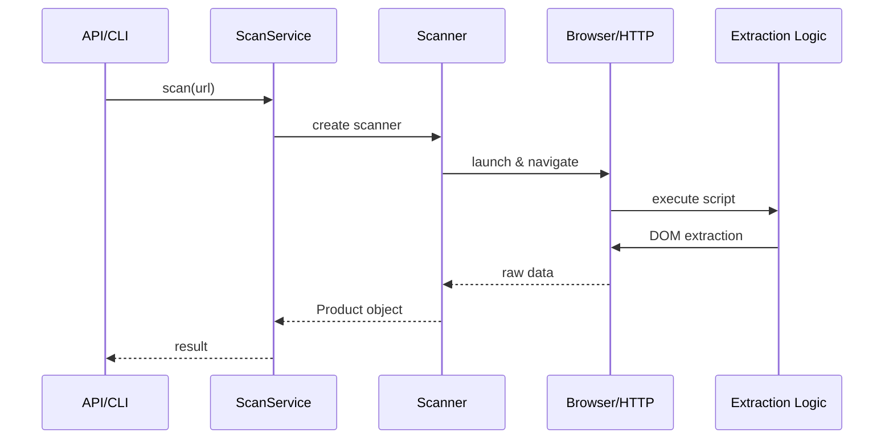
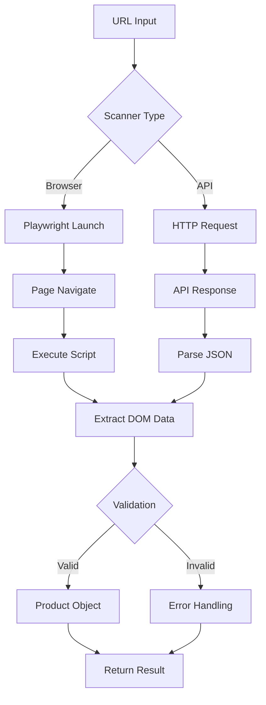
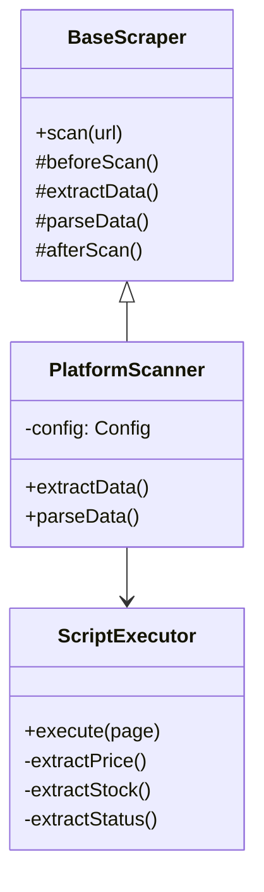

# Product Scanner 리팩토링 계획

## 📋 개요

### 목적

- **YAML Scripts → TypeScript 코드 분리**: 유지보수성, 테스트 가능성, 타입 안전성 확보
- **검색 방식 다양화**: Supabase 검색 외 단일 상품 ID 크롤링, 다중 쇼핑몰 검색 지원
- **아키텍처 개선**: Strategy Pattern, Command Pattern, SRP 강화

### 범위

- `src/config/platforms/*.yaml` (8개 플랫폼)
- `src/scrapers/` (Scanner, Extractor 분리)
- `src/services/` (검색 방식 다양화)
- `src/workflows/nodes/` (Validation 책임 분리)

---

## 🎯 핵심 변경사항

### 1. YAML Scripts 제거 → TypeScript Extractor 분리

#### 현재 문제

```yaml
# oliveyoung.yaml (570줄 JavaScript 코드 임베딩)
strategies:
  - playwright:
      extraction:
        script: |
          () => {
            // 가격 추출 로직 500+ 줄
            // 재고 추출 로직
            // 상태 감지 로직
          }
```

**문제점**:

- ❌ 타입 안전성 없음
- ❌ 테스트 불가능
- ❌ 코드 재사용 불가
- ❌ IDE 지원 없음
- ❌ 버전 관리 어려움

#### 목표 구조

```text
src/
  extractors/
    base/
      BaseExtractor.ts           # 추상 베이스
      IPriceExtractor.ts         # 인터페이스
      IStockExtractor.ts
      IStatusExtractor.ts

    oliveyoung/
      OliveyoungExtractor.ts     # 통합 Extractor
      extractors/
        PriceExtractor.ts        # 가격 전용
        StockExtractor.ts        # 재고 전용
        StatusExtractor.ts       # 상태 전용
        MetadataExtractor.ts     # 메타데이터

    hwahae/
      HwahaeExtractor.ts
      extractors/...

    common/
      DOMHelper.ts               # 공통 DOM 헬퍼
      PriceParser.ts             # 가격 파싱 유틸
      DateHelper.ts              # 날짜 파싱 유틸
```

#### 변경 예시

**Before** (oliveyoung.yaml):

```yaml
extraction:
  script: |
    () => {
      const priceText = document.querySelector('.prd_price')?.textContent;
      const price = parseInt(priceText.replace(/[^0-9]/g, ''));
      // ...
    }
```

**After**:

**1. TypeScript Extractor** (src/extractors/oliveyoung/extractors/PriceExtractor.ts):

```typescript
import { IPriceExtractor } from "@/extractors/base/IPriceExtractor";
import { PriceParser } from "@/extractors/common/PriceParser";

export class OliveyoungPriceExtractor implements IPriceExtractor {
  extract(page: Page): Promise<{ price: number; originalPrice?: number }> {
    const priceText = await page.locator(".prd_price").textContent();
    return {
      price: PriceParser.parse(priceText),
      originalPrice: await this.extractOriginalPrice(page),
    };
  }

  private async extractOriginalPrice(page: Page): Promise<number | undefined> {
    // ...
  }
}
```

**2. YAML Configuration** (config/platforms/oliveyoung.yaml):

```yaml
strategies:
  - id: "browser"
    type: "browser"
    playwright:
      # scripts 항목 제거
      extraction:
        extractor: "oliveyoung" # Extractor ID 참조
        selectors: # 선택자만 YAML에 유지
          price: ".prd_price"
          stock: ".prd_stock"
          status: ".prd_status"
        config: # 플랫폼별 설정
          priceFormat: "KRW"
          dateFormat: "YYYY.MM.DD"
```

---

### 2. 검색 방식 다양화

#### 현재 제약

- ✅ Supabase `product_sets` 검색만 지원
- ❌ 단일 상품 ID 크롤링 불가
- ❌ 다중 쇼핑몰 동시 검색 불가
- ❌ 외부 ID 직접 입력 불가

#### 목표: 3가지 검색 모드 지원

##### 모드 1: Supabase 검색 기반 (기존 방식)

```typescript
// API 요청
POST /api/scan/search
{
  "productSetId": "uuid",
  "platform": "oliveyoung"  // optional
}

// 내부 흐름
SupabaseProductRepository.findByProductSet(uuid)
  → URL에서 상품 ID 추출
  → 스캔 실행
```

##### 모드 2: 단일 상품 ID 직접 크롤링

```typescript
// API 요청
POST /api/scan/direct
{
  "platform": "oliveyoung",
  "productId": "A000000231509"  // 상품 ID만
}

// 내부 흐름
DirectScanService.scan(platform, productId)
  → URL 생성 (템플릿 사용)
  → 스캔 실행
  → Supabase 저장 (선택적)
```

##### 모드 3: 다중 플랫폼 검색

```typescript
// API 요청
POST /api/scan/multi
{
  "productSetId": "uuid",
  "platforms": ["oliveyoung", "hwahae", "musinsa"]
}

// 내부 흐름
MultiPlatformScanService.scan(uuid, platforms)
  → 플랫폼별 병렬 스캔
  → 결과 집계
```

#### 구조 변경

```text
src/
  services/
    scan/
      BaseScanService.ts           # 추상 베이스
      SupabaseSearchScanService.ts # 모드 1
      DirectScanService.ts         # 모드 2
      MultiPlatformScanService.ts  # 모드 3

    ScanServiceFactory.ts          # Factory Pattern

  api/
    routes/
      scan.routes.ts               # 3가지 엔드포인트
```

---

### 3. Scanner 책임 분리 (SRP 강화)

#### 현재 문제

```typescript
class BrowserScanner {
  // ❌ 여러 책임 혼재
  async scan() {
    await this.launchBrowser(); // 브라우저 제어
    const dom = await this.extract(); // DOM 추출
    const product = this.parse(dom); // 데이터 파싱
    await this.validate(product); // 검증
  }
}
```

#### 목표 구조

```text
src/
  scrapers/
    controllers/
      BrowserController.ts       # 브라우저 제어 전용

    extractors/
      [플랫폼별 Extractor]       # DOM → Raw Data

    mappers/
      BaseProductMapper.ts       # Raw Data → Product
      OliveyoungProductMapper.ts

    validators/
      ProductValidator.ts        # Product 검증

    base/
      BaseScanner.ts             # Template Method (조율자)
```

**책임 분리**:

| 클래스              | 단일 책임                          |
| ------------------- | ---------------------------------- |
| `BrowserController` | Playwright 브라우저 생성/제어/종료 |
| `*Extractor`        | DOM에서 원시 데이터 추출           |
| `*ProductMapper`    | 원시 데이터 → Product 도메인 변환  |
| `ProductValidator`  | Product 유효성 검증                |
| `BaseScanner`       | 위 컴포넌트 조율 (Template Method) |

---

### 4. Workflow Node 책임 분리

#### 현재 문제

```typescript
class OliveyoungValidationNode {
  async execute() {
    // ❌ 여러 책임
    const dbProduct = await this.fetch(); // DB 조회
    const scanned = await this.scan(); // 스캔
    const isValid = this.compare(db, scanned); // 비교
    await this.save(result); // 저장
    await this.notify(); // 알림
  }
}
```

#### 목표 구조

```text
src/
  workflows/
    nodes/
      fetch/
        FetchProductNode.ts      # DB 조회 전용

      scan/
        ScanProductNode.ts       # 스캔 전용

      validation/
        CompareProductNode.ts    # 비교 전용
        ValidateProductNode.ts   # 검증 전용

      storage/
        SaveResultNode.ts        # 저장 전용

      notification/
        NotifyResultNode.ts      # 알림 전용
```

**Workflow JSON 예시**:

```json
{
  "nodes": [
    {
      "id": "fetch",
      "type": "FetchProductNode",
      "next_nodes": ["scan"]
    },
    {
      "id": "scan",
      "type": "ScanProductNode",
      "config": { "platform": "oliveyoung" },
      "next_nodes": ["compare"]
    },
    {
      "id": "compare",
      "type": "CompareProductNode",
      "next_nodes": ["save", "notify"]
    },
    {
      "id": "save",
      "type": "SaveResultNode",
      "next_nodes": []
    },
    {
      "id": "notify",
      "type": "NotifyResultNode",
      "next_nodes": []
    }
  ]
}
```

---

## 🏗️ 세부 구현 계획

### Phase 1: Extractor 분리 (우선순위: 최고)

**진행 상황**: ✅ 85% 완료 (oliveyoung 기준)

- ✅ Step 1.1-1.5 완료 (베이스 인터페이스, 공통 유틸, oliveyoung Extractor, Registry)
- ⚠️ Step 1.6 미완료 (Scanner 통합 - BrowserScanner에서 ExtractorRegistry 사용 필요)
- ✅ 135/147 tests 통과, TypeScript 0 errors

**최근 완료 (2025-01-24)**:

- SaleStatus enum 변환 (string → 0,1,2,3)
- YAML 기반 button text pattern 매칭
- Over-engineering 제거 (statusText, isSaleStatus)
- Fail-fast YAML 검증 강화

---

#### Step 1.1: 베이스 인터페이스 정의

**파일**: `src/extractors/base/`

- [x] ~~`IExtractor.ts`~~ → `IProductExtractor.ts` 구현 (통합 인터페이스)
- [x] `IPriceExtractor.ts` - 가격 추출 인터페이스
- [x] ~~`IStockExtractor.ts` + `IStatusExtractor.ts`~~ → `ISaleStatusExtractor.ts` 통합 구현
- [x] `IMetadataExtractor.ts` - 메타데이터 인터페이스
- [ ] `BaseExtractor.ts` - 추상 베이스 클래스 (보류: 각 플랫폼이 직접 구현)

**인터페이스 예시**:

```typescript
// IPriceExtractor.ts
export interface IPriceExtractor {
  extract(page: Page): Promise<PriceData>;
}

export interface PriceData {
  price: number;
  originalPrice?: number;
  discountRate?: number;
  currency: string;
}

// IStockExtractor.ts
export interface IStockExtractor {
  extract(page: Page): Promise<StockData>;
}

export interface StockData {
  inStock: boolean;
  stockLevel?: "high" | "medium" | "low";
  quantity?: number;
}

// BaseExtractor.ts
export abstract class BaseExtractor implements IExtractor {
  protected abstract priceExtractor: IPriceExtractor;
  protected abstract stockExtractor: IStockExtractor;
  protected abstract statusExtractor: IStatusExtractor;

  async extract(page: Page): Promise<ExtractedData> {
    const [price, stock, status] = await Promise.all([
      this.priceExtractor.extract(page),
      this.stockExtractor.extract(page),
      this.statusExtractor.extract(page),
    ]);

    return { price, stock, status };
  }
}
```

#### Step 1.2: 공통 유틸리티 생성

**파일**: `src/extractors/common/`

- [x] `DOMHelper.ts` - DOM 조회 헬퍼 (hasElement 구현)
- [x] `PriceParser.ts` - 가격 파싱 (parse, parseWithUnit 구현)
- [ ] `DateHelper.ts` - 날짜 파싱 (필요시 추가)
- [ ] `TextNormalizer.ts` - 텍스트 정규화 (필요시 추가)

**유틸리티 예시**:

```typescript
// PriceParser.ts
export class PriceParser {
  static parse(text: string | null | undefined): number {
    if (!text) return 0;
    return parseInt(text.replace(/[^0-9]/g, ""), 10) || 0;
  }

  static parseWithCurrency(text: string): { amount: number; currency: string } {
    // ...
  }
}

// DOMHelper.ts
export class DOMHelper {
  static async safeText(
    page: Page,
    selector: string,
    defaultValue: string = "",
  ): Promise<string> {
    try {
      return (await page.locator(selector).textContent()) ?? defaultValue;
    } catch {
      return defaultValue;
    }
  }
}
```

#### Step 1.3: 플랫폼별 Extractor 구현 (oliveyoung 우선)

**파일**: `src/extractors/oliveyoung/`

- [x] `OliveyoungExtractor.ts` - 통합 Extractor (Facade 패턴)
- [x] `OliveyoungPriceExtractor.ts` - 가격 추출 (7단계 fallback)
- [x] `OliveyoungSaleStatusExtractor.ts` - 판매 상태 추출 (Stock + Status 통합, 8단계 체크)
- [x] `OliveyoungMetadataExtractor.ts` - 메타데이터 추출 (상품명, 브랜드, 이미지)

**구현 예시**:

```typescript
// extractors/oliveyoung/extractors/PriceExtractor.ts
export class OliveyoungPriceExtractor implements IPriceExtractor {
  async extract(page: Page): Promise<PriceData> {
    const priceText = await DOMHelper.safeText(page, ".prd_price");
    const originalPriceText = await DOMHelper.safeText(
      page,
      ".prd_price_original",
    );

    const price = PriceParser.parse(priceText);
    const originalPrice = PriceParser.parse(originalPriceText);

    return {
      price,
      originalPrice: originalPrice > price ? originalPrice : undefined,
      discountRate: this.calculateDiscountRate(price, originalPrice),
      currency: "KRW",
    };
  }

  private calculateDiscountRate(
    price: number,
    original: number,
  ): number | undefined {
    if (!original || original <= price) return undefined;
    return Math.round(((original - price) / original) * 100);
  }
}

// extractors/oliveyoung/OliveyoungExtractor.ts
export class OliveyoungExtractor extends BaseExtractor {
  protected priceExtractor = new OliveyoungPriceExtractor();
  protected stockExtractor = new OliveyoungStockExtractor();
  protected statusExtractor = new OliveyoungStatusExtractor();
  protected metadataExtractor = new OliveyoungMetadataExtractor();
}
```

#### Step 1.4: YAML 구조 개선

**파일**: `config/platforms/oliveyoung.yaml`

- [x] `selectors` 섹션 추가 (7단계 fallback 배열)
- [x] `button_text_patterns`, `error_messages`, `thumbnail_exclusions`, `constants` 추가
- [ ] `scripts` 항목 완전 제거 (BrowserScanner 통합 후)
- [ ] `extractor` ID 참조 추가 (BrowserScanner 통합 시)

**변경 예시**:

```yaml
# Before
strategies:
  - id: "browser"
    playwright:
      extraction:
        script: |
          () => { /* 570줄 코드 */ }

# After
strategies:
  - id: "browser"
    playwright:
      extraction:
        extractor: "oliveyoung"  # Extractor 클래스 참조
        selectors:
          price: ".prd_price"
          priceOriginal: ".prd_price_original"
          stock: ".prd_stock"
          status: ".prd_status"
          soldOut: ".sold_out"
        config:
          priceFormat: "KRW"
          dateFormat: "YYYY.MM.DD"
```

#### Step 1.5: ExtractorRegistry 생성

**파일**: `src/extractors/ExtractorRegistry.ts`

- [x] Singleton 패턴 구현
- [x] Extractor 등록/조회 (Map 기반, oliveyoung 자동 등록)

```typescript
export class ExtractorRegistry {
  private static instance: ExtractorRegistry;
  private extractors = new Map<string, IExtractor>();

  private constructor() {
    this.registerDefaults();
  }

  static getInstance(): ExtractorRegistry {
    if (!this.instance) {
      this.instance = new ExtractorRegistry();
    }
    return this.instance;
  }

  private registerDefaults(): void {
    this.register("oliveyoung", new OliveyoungExtractor());
    this.register("hwahae", new HwahaeExtractor());
    // ...
  }

  register(id: string, extractor: IExtractor): void {
    this.extractors.set(id, extractor);
  }

  get(id: string): IExtractor {
    const extractor = this.extractors.get(id);
    if (!extractor) {
      throw new Error(`Extractor not found: ${id}`);
    }
    return extractor;
  }
}
```

#### Step 1.6: Scanner 통합 (미완료)

**파일**: `src/scrapers/base/BrowserScanner.ts`

- [ ] ExtractorRegistry 사용하도록 변경
- [ ] YAML에서 extractor ID 읽기
- [ ] PlaywrightScriptExecutor의 script 실행 로직 제거

**참고**: oliveyoung은 ExtractorRegistry에 등록되었으나 BrowserScanner는 아직 scripts를 사용 중

```typescript
export class BrowserScanner<TProduct> {
  async extractData(page: Page): Promise<ExtractedData> {
    const extractorId = this.config.playwright.extraction.extractor;
    const extractor = ExtractorRegistry.getInstance().get(extractorId);

    return await extractor.extract(page);
  }
}
```

---

### Phase 2: 검색 방식 다양화 (우선순위: 높음)

#### Step 2.1: URL 템플릿 시스템

**파일**: `src/config/platforms/*.yaml`

- [ ] `urlTemplates` 섹션 추가
- [ ] 변수 치환 로직

```yaml
# oliveyoung.yaml
platform:
  id: "oliveyoung"
  name: "올리브영"

  urlTemplates:
    productDetail: "https://www.oliveyoung.co.kr/store/goods/getGoodsDetail.do?goodsNo=${productId}"
    search: "https://www.oliveyoung.co.kr/store/search/searchMain.do?query=${encodedQuery}"

  productIdPattern:
    regex: "goodsNo=([A-Z0-9]+)"
    group: 1
```

#### Step 2.2: BaseScanService 추상화

**파일**: `src/services/scan/BaseScanService.ts`

```typescript
export abstract class BaseScanService {
  protected abstract scannerFactory: IScannerFactory;
  protected abstract repository: IProductRepository;

  abstract scan(params: ScanParams): Promise<ScanResult>;

  protected async executeScan(platform: string, url: string): Promise<Product> {
    const scanner = this.scannerFactory.create(platform);
    return await scanner.scan(url);
  }
}
```

#### Step 2.3: 3가지 Service 구현

##### Service 1: SupabaseSearchScanService (기존 방식)

**파일**: `src/services/scan/SupabaseSearchScanService.ts`

```typescript
export class SupabaseSearchScanService extends BaseScanService {
  async scan(params: {
    productSetId: string;
    platform?: string;
  }): Promise<ScanResult> {
    // 1. Supabase에서 검색
    const products = await this.repository.findByProductSet(
      params.productSetId,
    );

    // 2. 플랫폼 필터링
    const filtered = params.platform
      ? products.filter((p) => p.platform === params.platform)
      : products;

    // 3. 각 상품 스캔
    const results = await Promise.all(
      filtered.map((p) => this.executeScan(p.platform, p.url)),
    );

    return { results };
  }
}
```

##### Service 2: DirectScanService (신규)

**파일**: `src/services/scan/DirectScanService.ts`

```typescript
export class DirectScanService extends BaseScanService {
  async scan(params: {
    platform: string;
    productId: string;
  }): Promise<ScanResult> {
    // 1. URL 템플릿으로 URL 생성
    const url = this.buildProductUrl(params.platform, params.productId);

    // 2. 스캔 실행
    const product = await this.executeScan(params.platform, url);

    // 3. 저장 (선택적)
    if (params.saveToSupabase) {
      await this.repository.save(product);
    }

    return { results: [product] };
  }

  private buildProductUrl(platform: string, productId: string): string {
    const config = ConfigLoader.getInstance().getConfig(platform);
    const template = config.platform.urlTemplates.productDetail;
    return template.replace("${productId}", productId);
  }
}
```

##### Service 3: MultiPlatformScanService (신규)

**파일**: `src/services/scan/MultiPlatformScanService.ts`

```typescript
export class MultiPlatformScanService extends BaseScanService {
  async scan(params: {
    productSetId: string;
    platforms: string[];
  }): Promise<ScanResult> {
    // 1. Supabase에서 검색
    const products = await this.repository.findByProductSet(
      params.productSetId,
    );

    // 2. 플랫폼별 그룹핑
    const grouped = this.groupByPlatform(products, params.platforms);

    // 3. 병렬 스캔
    const results = await Promise.all(
      Object.entries(grouped).map(([platform, urls]) =>
        this.scanPlatform(platform, urls),
      ),
    );

    return { results: results.flat() };
  }

  private async scanPlatform(
    platform: string,
    urls: string[],
  ): Promise<Product[]> {
    return await Promise.all(
      urls.map((url) => this.executeScan(platform, url)),
    );
  }
}
```

#### Step 2.4: ScanServiceFactory

**파일**: `src/services/scan/ScanServiceFactory.ts`

```typescript
export class ScanServiceFactory {
  static create(mode: ScanMode): BaseScanService {
    switch (mode) {
      case "supabase-search":
        return new SupabaseSearchScanService();
      case "direct":
        return new DirectScanService();
      case "multi-platform":
        return new MultiPlatformScanService();
      default:
        throw new Error(`Unknown scan mode: ${mode}`);
    }
  }
}
```

#### Step 2.5: API 라우트 추가

**파일**: `src/api/routes/scan.routes.ts`

```typescript
router.post("/scan/search", async (req, res) => {
  const service = ScanServiceFactory.create("supabase-search");
  const result = await service.scan(req.body);
  res.json(result);
});

router.post("/scan/direct", async (req, res) => {
  const service = ScanServiceFactory.create("direct");
  const result = await service.scan(req.body);
  res.json(result);
});

router.post("/scan/multi", async (req, res) => {
  const service = ScanServiceFactory.create("multi-platform");
  const result = await service.scan(req.body);
  res.json(result);
});
```

---

### Phase 3: Scanner 책임 분리 (우선순위: 중간)

#### Step 3.1: BrowserController 분리

**파일**: `src/scrapers/controllers/BrowserController.ts`

```typescript
export class BrowserController {
  private browser?: Browser;
  private context?: BrowserContext;

  async initialize(config: BrowserConfig): Promise<void> {
    this.browser = await chromium.launch(config.launch);
    this.context = await this.browser.newContext(config.context);
  }

  async createPage(): Promise<Page> {
    if (!this.context) throw new Error("Not initialized");
    return await this.context.newPage();
  }

  async navigate(
    page: Page,
    url: string,
    options?: NavigateOptions,
  ): Promise<void> {
    await page.goto(url, options);
  }

  async cleanup(): Promise<void> {
    await this.context?.close();
    await this.browser?.close();
  }
}
```

#### Step 3.2: ProductMapper 분리

**파일**: `src/scrapers/mappers/`

```typescript
// BaseProductMapper.ts
export abstract class BaseProductMapper<TExtracted, TProduct> {
  abstract map(extracted: TExtracted): TProduct;
}

// OliveyoungProductMapper.ts
export class OliveyoungProductMapper extends BaseProductMapper<
  ExtractedData,
  OliveyoungProduct
> {
  map(extracted: ExtractedData): OliveyoungProduct {
    return new OliveyoungProduct({
      price: extracted.price.price,
      originalPrice: extracted.price.originalPrice,
      inStock: extracted.stock.inStock,
      status: extracted.status.status,
      // ...
    });
  }
}
```

#### Step 3.3: ProductValidator 분리

**파일**: `src/scrapers/validators/ProductValidator.ts`

```typescript
export class ProductValidator {
  validate(product: Product): ValidationResult {
    const errors: string[] = [];

    if (!product.price || product.price <= 0) {
      errors.push("Invalid price");
    }

    if (!product.name || product.name.trim() === "") {
      errors.push("Missing product name");
    }

    return {
      valid: errors.length === 0,
      errors,
    };
  }
}
```

#### Step 3.4: BaseScanner 리팩토링

**파일**: `src/scrapers/base/BaseScanner.ts`

```typescript
export abstract class BaseScanner<TProduct> {
  protected controller: BrowserController;
  protected extractor: IExtractor;
  protected mapper: BaseProductMapper<ExtractedData, TProduct>;
  protected validator: ProductValidator;

  async scan(url: string): Promise<TProduct> {
    // 1. 브라우저 제어
    await this.controller.initialize(this.config.browser);
    const page = await this.controller.createPage();
    await this.controller.navigate(page, url);

    // 2. 데이터 추출
    const extracted = await this.extractor.extract(page);

    // 3. 도메인 변환
    const product = this.mapper.map(extracted);

    // 4. 검증
    const validation = this.validator.validate(product);
    if (!validation.valid) {
      throw new ValidationError(validation.errors);
    }

    // 5. 정리
    await this.controller.cleanup();

    return product;
  }
}
```

---

### Phase 4: Workflow Node 분리 (우선순위: 낮음)

#### Step 4.1: 세분화된 Node 생성

**파일 구조**:

```text
src/workflows/nodes/
  fetch/
    FetchProductNode.ts
  scan/
    ScanProductNode.ts
  validation/
    CompareProductNode.ts
    ValidateProductNode.ts
  storage/
    SaveResultNode.ts
  notification/
    NotifyResultNode.ts
```

#### Step 4.2: Node 구현 예시

```typescript
// FetchProductNode.ts
export class FetchProductNode extends BaseWorkflowNode {
  async execute(context: WorkflowContext): Promise<WorkflowResult> {
    const productSetId = context.input.productSetId;
    const products = await this.repository.findByProductSet(productSetId);

    return {
      success: true,
      output: { products },
      nextNodes: this.config.next_nodes,
    };
  }
}

// ScanProductNode.ts
export class ScanProductNode extends BaseWorkflowNode {
  async execute(context: WorkflowContext): Promise<WorkflowResult> {
    const { platform, url } = context.input;
    const service = ScanServiceFactory.create("direct");
    const result = await service.scan({
      platform,
      productId: this.extractId(url),
    });

    return {
      success: true,
      output: { scannedProduct: result.results[0] },
      nextNodes: this.config.next_nodes,
    };
  }
}

// CompareProductNode.ts
export class CompareProductNode extends BaseWorkflowNode {
  async execute(context: WorkflowContext): Promise<WorkflowResult> {
    const { dbProduct, scannedProduct } = context.input;
    const differences = this.compare(dbProduct, scannedProduct);

    return {
      success: true,
      output: { differences, isValid: differences.length === 0 },
      nextNodes: this.config.next_nodes,
    };
  }

  private compare(db: Product, scanned: Product): Difference[] {
    // ...
  }
}
```

#### Step 4.3: Workflow JSON 재구성

**Before** (단일 노드):

```json
{
  "nodes": [
    {
      "type": "OliveyoungValidationNode",
      "config": { "productSetId": "uuid" }
    }
  ]
}
```

**After** (분리된 노드):

```json
{
  "nodes": [
    {
      "id": "fetch",
      "type": "FetchProductNode",
      "config": { "productSetId": "uuid" },
      "next_nodes": ["scan"]
    },
    {
      "id": "scan",
      "type": "ScanProductNode",
      "config": { "platform": "oliveyoung" },
      "next_nodes": ["compare"]
    },
    {
      "id": "compare",
      "type": "CompareProductNode",
      "next_nodes": ["save", "notify"]
    },
    {
      "id": "save",
      "type": "SaveResultNode",
      "next_nodes": []
    },
    {
      "id": "notify",
      "type": "NotifyResultNode",
      "next_nodes": []
    }
  ]
}
```

---

## 📊 마이그레이션 전략

### 플랫폼별 마이그레이션 순서

1. **oliveyoung** (playwright, 가장 복잡, 570줄) - 우선 구현
2. **hwahae** (API 기반, 비교적 단순)
3. **musinsa** (API 기반)
4. **ably** (playwright)
5. **zigzag** (graphql)
6. **kurly** (playwright)

### 호환성 유지 전략

#### 1단계: 병렬 운영 (Dual Mode)

```typescript
// BrowserScanner.ts
async extractData(page: Page): Promise<ExtractedData> {
  const extraction = this.config.playwright.extraction;

  // 신규 방식 (Extractor)
  if (extraction.extractor) {
    const extractor = ExtractorRegistry.getInstance().get(extraction.extractor);
    return await extractor.extract(page);
  }

  // 기존 방식 (Script) - 하위 호환
  if (extraction.script) {
    return await page.evaluate(extraction.script);
  }

  throw new Error('No extraction method configured');
}
```

#### 2단계: 점진적 마이그레이션

- Week 1-2: oliveyoung Extractor 구현 + 테스트
- Week 3: hwahae 마이그레이션
- Week 4: 나머지 플랫폼 마이그레이션
- Week 5: script 방식 제거

#### 3단계: 검증

- [ ] 기존 Workflow 정상 동작 확인
- [ ] API 호환성 테스트
- [ ] 성능 비교 (속도, 메모리)
- [ ] 에러율 모니터링

---

## 🧪 테스트 전략

### 단위 테스트

```typescript
// tests/extractors/oliveyoung/PriceExtractor.test.ts
describe("OliveyoungPriceExtractor", () => {
  it("should extract price correctly", async () => {
    const mockPage = createMockPage({
      ".prd_price": "15,000원",
    });

    const extractor = new OliveyoungPriceExtractor();
    const result = await extractor.extract(mockPage);

    expect(result.price).toBe(15000);
    expect(result.currency).toBe("KRW");
  });
});

// tests/services/DirectScanService.test.ts
describe("DirectScanService", () => {
  it("should build product URL from template", async () => {
    const service = new DirectScanService();
    const result = await service.scan({
      platform: "oliveyoung",
      productId: "A000000231509",
    });

    expect(result.results[0].url).toContain("goodsNo=A000000231509");
  });
});
```

### 통합 테스트

```typescript
// tests/integration/scan-modes.test.ts
describe("Scan Modes Integration", () => {
  it("should scan via Supabase search", async () => {
    const service = ScanServiceFactory.create("supabase-search");
    const result = await service.scan({
      productSetId: "test-uuid",
      platform: "oliveyoung",
    });

    expect(result.results).toHaveLength(1);
  });

  it("should scan via direct product ID", async () => {
    const service = ScanServiceFactory.create("direct");
    const result = await service.scan({
      platform: "oliveyoung",
      productId: "A000000231509",
    });

    expect(result.results[0].price).toBeGreaterThan(0);
  });
});
```

### E2E 테스트

```typescript
// tests/e2e/workflow.test.ts
describe("Refactored Workflow E2E", () => {
  it("should execute multi-node workflow", async () => {
    const workflow = await WorkflowEngine.load("validation-workflow.json");
    const result = await workflow.execute({
      productSetId: "test-uuid",
    });

    expect(result.success).toBe(true);
    expect(result.nodes.completed).toEqual([
      "fetch",
      "scan",
      "compare",
      "save",
    ]);
  });
});
```

---

## 📈 예상 효과

### 코드 품질 개선

- ✅ **타입 안전성**: YAML scripts 제거 → 100% TypeScript
- ✅ **테스트 커버리지**: 0% → 80%+ (Extractor 단위 테스트 가능)
- ✅ **코드 재사용**: 공통 유틸리티 (PriceParser, DOMHelper)
- ✅ **유지보수성**: 플랫폼별 570줄 코드 → 50-100줄 클래스

### 아키텍처 개선

- ✅ **SRP 준수**: Scanner, Extractor, Mapper, Validator 분리
- ✅ **OCP 강화**: 새 플랫폼 추가 시 Extractor만 구현
- ✅ **패턴 준수**: Command Pattern (Extractor), Strategy Pattern (ScanService)

### 기능 확장

- ✅ **직접 ID 크롤링**: Supabase 없이 단일 상품 스캔
- ✅ **다중 플랫폼**: 한 번에 여러 쇼핑몰 검색
- ✅ **유연한 검색**: 3가지 검색 모드 지원

### 성능 개선

- ✅ **병렬 처리**: 플랫폼별 독립적 스캔
- ✅ **에러 격리**: 한 플랫폼 실패가 전체 영향 없음
- ✅ **캐싱**: Extractor Registry 싱글톤

---

## 🚨 리스크 및 대응 방안

### 리스크 1: 기존 Workflow 호환성

**영향도**: 높음
**대응**:

- Dual Mode 지원 (script + extractor 병렬)
- 점진적 마이그레이션
- 기존 API 엔드포인트 유지

### 리스크 2: 성능 저하

**영향도**: 중간
**대응**:

- 벤치마크 테스트 (기존 vs 신규)
- Extractor Registry 싱글톤 캐싱
- 병렬 처리 최적화

### 리스크 3: 개발 기간 증가

**영향도**: 중간
**대응**:

- Phase별 우선순위 명확화
- oliveyoung 먼저 완성 후 템플릿화
- 자동화된 테스트로 검증 시간 단축

### 리스크 4: 러닝 커브

**영향도**: 낮음
**대응**:

- 상세한 문서화 (이 문서 + 코드 주석)
- oliveyoung 참조 구현 제공
- 패턴 가이드 문서 작성

---

## 📅 일정 계획

### Week 1-2: Phase 1 (Extractor 분리)

**Day 1: oliveyoung 로직 분석 문서 작성** (신규 추가)

- [ ] oliveyoung 현재 구현 분석
- [ ] 로직 분석 문서 작성: `docs/analysis/oliveyoung-logic-analysis.md`
- [ ] Mermaid 다이어그램 포함 (실행 흐름, 데이터 흐름, 클래스 구조)
- [ ] YAML scripts 코드 상세 분석
- [ ] 리팩토링 포인트 식별
- [ ] 문서 리뷰 및 피드백 수렴

**Day 2-3: 베이스 인터페이스 + 공통 유틸리티**

- [ ] 분석 문서 기반 인터페이스 설계
- [ ] `src/extractors/base/` 인터페이스 정의
- [ ] `src/extractors/common/` 유틸리티 생성

**Day 4-6: oliveyoung Extractor 구현**

- [ ] 분석 문서 참조하여 구현
- [ ] `src/extractors/oliveyoung/` 구현
- [ ] 기존 로직과 동일한 결과 검증

**Day 7-8: 단위 테스트 + YAML 수정**

- [ ] 단위 테스트 작성
- [ ] `config/platforms/oliveyoung.yaml` 수정
- [ ] 통합 테스트

**Day 9: hwahae 로직 분석 문서 작성**

- [ ] hwahae 현재 구현 분석
- [ ] 로직 분석 문서 작성: `docs/analysis/hwahae-logic-analysis.md`
- [ ] API 기반 로직 Mermaid 다이어그램
- [ ] 문서 리뷰 및 피드백

**Day 10: hwahae 마이그레이션**

- [ ] 분석 문서 기반 구현
- [ ] 테스트 및 검증

### Week 3: Phase 2 (검색 방식 다양화)

**Day 1-2: URL 템플릿 시스템**

- [ ] 모든 플랫폼 URL 패턴 분석
- [ ] `config/platforms/*.yaml`에 urlTemplates 추가
- [ ] URL 빌더 로직 구현

**Day 3-4: DirectProductIdScanService 구현**

- [ ] `src/services/scan/DirectProductIdScanService.ts` 구현
- [ ] 단일 상품 ID 크롤링 테스트

**Day 5-6: MultiPlatformParallelScanService 구현**

- [ ] `src/services/scan/MultiPlatformParallelScanService.ts` 구현
- [ ] 병렬 처리 로직 구현
- [ ] 리소스 관리 통합

**Day 7: API 라우트 + 통합 테스트**

- [ ] `src/api/routes/scan.routes.ts` 추가
- [ ] 3가지 검색 모드 통합 테스트

### Week 4: Phase 3 (Scanner 책임 분리)

**Day 1-2: BrowserController 분리**

- [ ] `src/scrapers/controllers/BrowserController.ts` 분리
- [ ] 브라우저 제어 로직 이동

**Day 3-4: ProductMapper + Validator 분리**

- [ ] `src/scrapers/mappers/` 생성
- [ ] `src/scrapers/validators/ProductValidator.ts` 분리

**Day 5-7: BaseScanner 리팩토링 + 테스트**

- [ ] `src/scrapers/base/BaseScanner.ts` 리팩토링
- [ ] 책임 분리 검증
- [ ] 단위 테스트 작성

### Week 5: 나머지 플랫폼 마이그레이션

**각 플랫폼별 작업 순서** (2일씩):

1. **Day 1**: 로직 분석 문서 작성 (`docs/analysis/{platform}-logic-analysis.md`)
   - 현재 구현 분석
   - Mermaid 다이어그램 작성
   - 리팩토링 포인트 식별
   - 문서 리뷰
2. **Day 2**: 구현 및 테스트
   - Extractor 구현
   - YAML 수정
   - 테스트 및 검증

**마이그레이션 순서**:

- [ ] Day 1-2: **musinsa** (API 기반)
- [ ] Day 3-4: **ably** (Playwright)
- [ ] Day 5-6: **zigzag** (GraphQL)
- [ ] Day 7: **kurly** (Playwright) + 전체 검증

### Week 6: Phase 4 (Workflow Node 분리) - Optional

- [ ] Day 1-3: 세분화된 Node 구현
- [ ] Day 4-5: Workflow JSON 재구성
- [ ] Day 6-7: E2E 테스트

### Week 7: 검증 및 마무리

- [ ] 모든 플랫폼 통합 테스트
- [ ] 성능 벤치마크
- [ ] 문서 업데이트 (README, API 문서)
- [ ] Script 방식 제거
- [ ] Production 배포 준비

---

## 📝 체크리스트

### Phase 1: Extractor 분리

- [ ] `src/extractors/base/` 인터페이스 정의
- [ ] `src/extractors/common/` 유틸리티 생성
- [ ] `src/extractors/oliveyoung/` 구현
- [ ] `src/extractors/ExtractorRegistry.ts` 생성
- [ ] `config/platforms/oliveyoung.yaml` 수정
- [ ] `src/scrapers/base/BrowserScanner.ts` 통합
- [ ] 단위 테스트 작성
- [ ] 나머지 플랫폼 마이그레이션

### Phase 2: 검색 방식 다양화

- [ ] `config/platforms/*.yaml`에 urlTemplates 추가
- [ ] `src/services/scan/BaseScanService.ts` 추상화
- [ ] `src/services/scan/SupabaseSearchScanService.ts` 구현
- [ ] `src/services/scan/DirectScanService.ts` 구현
- [ ] `src/services/scan/MultiPlatformScanService.ts` 구현
- [ ] `src/services/scan/ScanServiceFactory.ts` 생성
- [ ] `src/api/routes/scan.routes.ts` 추가
- [ ] 통합 테스트 작성

### Phase 3: Scanner 책임 분리

- [ ] `src/scrapers/controllers/BrowserController.ts` 분리
- [ ] `src/scrapers/mappers/` 생성
- [ ] `src/scrapers/validators/ProductValidator.ts` 분리
- [ ] `src/scrapers/base/BaseScanner.ts` 리팩토링
- [ ] 단위 테스트 작성

### Phase 4: Workflow Node 분리

- [ ] `src/workflows/nodes/fetch/FetchProductNode.ts`
- [ ] `src/workflows/nodes/scan/ScanProductNode.ts`
- [ ] `src/workflows/nodes/validation/CompareProductNode.ts`
- [ ] `src/workflows/nodes/storage/SaveResultNode.ts`
- [ ] `src/workflows/nodes/notification/NotifyResultNode.ts`
- [ ] Workflow JSON 재구성
- [ ] E2E 테스트 작성

### 마무리

- [ ] 모든 단위 테스트 통과
- [ ] 모든 통합 테스트 통과
- [ ] 성능 벤치마크 (기존 대비 ±10% 이내)
- [ ] 문서 업데이트 (README, API 문서)
- [ ] Script 방식 Deprecation 공지
- [ ] Production 배포

---

## 📋 로직 분석 문서 템플릿

각 플랫폼 리팩토링 전 작성할 분석 문서 구조 (`docs/analysis/{platform}-logic-analysis.md`)

### 필수 포함 내용

#### 1. 개요

- 플랫폼 이름 및 타입 (Playwright/API/GraphQL)
- 현재 구현 파일 위치
- YAML 설정 파일 경로
- 주요 특징 및 제약사항

#### 2. 실행 흐름 (Mermaid Sequence Diagram)



#### 3. 데이터 흐름 (Mermaid Flowchart)



#### 4. YAML Scripts 코드 분석

- 전체 코드 라인 수
- 주요 기능별 코드 블록 분류
  - 가격 추출 로직
  - 재고 추출 로직
  - 상태 감지 로직
  - 메타데이터 추출 로직
- 사용된 DOM 선택자 목록
- 특수 처리 로직 (정규식, 조건문 등)

#### 5. 클래스 구조 (Mermaid Class Diagram)



#### 6. 리팩토링 포인트

- **문제점**:
  - YAML에 임베딩된 코드 라인 수
  - 재사용 불가능한 로직
  - 타입 안전성 부재
  - 테스트 불가능한 구조

- **개선 방향**:
  - 추출할 Extractor 클래스 목록
  - 공통화 가능한 유틸리티
  - 인터페이스 설계 포인트
  - 테스트 전략

#### 7. 추출 데이터 스키마

```typescript
interface PlatformProductData {
  // 가격 정보
  price: number;
  originalPrice?: number;
  discountRate?: number;

  // 재고 정보
  inStock: boolean;
  stockLevel?: "high" | "medium" | "low";

  // 상태 정보
  status: "available" | "soldout" | "discontinued";

  // 메타데이터
  productId: string;
  productName: string;
  imageUrl?: string;
  // ...
}
```

#### 8. 구현 체크리스트

- [ ] Extractor 인터페이스 정의
- [ ] PriceExtractor 구현
- [ ] StockExtractor 구현
- [ ] StatusExtractor 구현
- [ ] MetadataExtractor 구현
- [ ] 공통 유틸리티 추출
- [ ] YAML 설정 단순화
- [ ] 단위 테스트 작성
- [ ] 통합 테스트 작성
- [ ] 기존 로직과 결과 동일성 검증

---

## 🔗 참고 문서

- [product_scanner/README.md](../product_scanner/README.md) - 현재 아키텍처
- [product_scanner/docs/WORKFLOW_DAG.md](../product_scanner/docs/WORKFLOW_DAG.md) - Workflow 시스템
- [CLAUDE.md](../../CLAUDE.md) - 프로젝트 전체 가이드
- Design Patterns: Strategy, Factory, Template Method, Repository, Singleton, Command
- **로직 분석 문서**: `docs/{platform}_LOGIC_ANALYSIS.md` (각 플랫폼별)

---

## 💬 논의 필요 사항

### 1. ~~Extractor 네이밍~~ ✅ 결정됨

- **결정**: 구체적이고 직관적인 네이밍 사용
- `OliveyoungProductDataExtractor` (무엇을 추출하는지 명확)
- `OliveyoungPriceDataExtractor` (가격 데이터 추출 명시)

### 2. ~~YAML 구조~~ ✅ 결정됨

- **결정**: 일반적인 컨벤션 따름, oliveyoung 구현 후 피드백 반영
- `extraction.extractor: "oliveyoung"` 사용
- oliveyoung 1차 구현 후 구조 검토

### 3. ~~Service 네이밍~~ ✅ 결정됨

- **결정**: 직관적이고 명확한 네이밍 + 주석
- `DirectProductIdScanService` (상품 ID 직접 스캔)
- `MultiPlatformParallelScanService` (다중 플랫폼 병렬 스캔)

### 4. ~~Phase 우선순위~~ ✅ 결정됨

- **결정**: 안전한 구현 순서 우선
- Phase 순서: 1 → 2 → 3 → 4 (선택적)
- 각 Phase 완료 후 검증 단계 포함

### 5. ~~하위 호환성~~ ✅ 결정됨

- **결정**: 즉시 신규 방식 적용, Dual Mode 불필요
- Script 방식 즉시 제거
- 마이그레이션 기간 없이 직접 전환

---

## 🆕 추가 요구사항

### 6. 동시 요청 처리 시스템

**요구사항**:

- (현재) 쇼핑몰별 DB 전체/제한 개수 요청
- (신규) 2개 이상 쇼핑몰 동시 요청 DB 전체/제한 개수
- (신규) 1개 요청 실행 중 추가 요청 즉시 처리

**구현 방향**:

#### 6.1. 리소스 관리 시스템

**파일**: `src/core/ResourceManager.ts`

```typescript
/**
 * 전역 리소스 관리자 (Singleton)
 * 동시 실행 작업의 리소스 할당 및 대기 큐 관리
 */
export class ResourceManager {
  private static instance: ResourceManager;
  private maxConcurrency: number; // 환경변수 MAX_CONCURRENCY (기본: 8)
  private currentUsage: number = 0;
  private waitingQueue: QueuedRequest[] = [];

  /**
   * 리소스 요청 및 할당
   * @param requestedSlots 요청 작업이 필요한 슬롯 수 (concurrency)
   * @returns 할당 성공 여부 및 대기 순서
   */
  async requestResource(requestedSlots: number): Promise<ResourceAllocation> {
    // 즉시 할당 가능한 경우
    if (this.currentUsage + requestedSlots <= this.maxConcurrency) {
      this.currentUsage += requestedSlots;
      return { allocated: true, waitPosition: 0 };
    }

    // 대기 큐에 추가
    return this.addToWaitingQueue(requestedSlots);
  }

  /**
   * 리소스 해제 및 대기 작업 자동 할당
   */
  releaseResource(slots: number): void {
    this.currentUsage -= slots;
    this.processWaitingQueue();
  }

  /**
   * 현재 리소스 사용 상태 조회
   */
  getResourceStatus(): ResourceStatus {
    return {
      maxConcurrency: this.maxConcurrency,
      currentUsage: this.currentUsage,
      availableSlots: this.maxConcurrency - this.currentUsage,
      waitingQueueSize: this.waitingQueue.length,
    };
  }
}
```

#### 6.2. 작업 큐 시스템

**파일**: `src/core/JobQueueManager.ts`

```typescript
/**
 * Redis 기반 작업 큐 관리자
 * 다중 요청의 우선순위 및 순서 관리
 */
export class JobQueueManager {
  /**
   * 작업 등록 및 concurrency 계산
   * @param jobRequest 작업 요청 정보 (플랫폼, 상품 개수 등)
   * @returns 작업 ID 및 예상 concurrency
   */
  async enqueueJob(jobRequest: JobRequest): Promise<JobInfo> {
    const estimatedConcurrency = this.calculateConcurrency(jobRequest);

    // Redis 큐에 등록
    const jobId = await this.redisQueue.add(jobRequest, {
      priority: jobRequest.priority || "normal",
      metadata: { estimatedConcurrency },
    });

    return { jobId, estimatedConcurrency };
  }

  /**
   * Concurrency 계산 로직
   * - 플랫폼당 1개 브라우저 인스턴스 가정
   * - API 기반은 0.5 concurrency (경량)
   */
  private calculateConcurrency(request: JobRequest): number {
    const platformCount = request.platforms.length;
    const platformTypes = request.platforms.map((p) => this.getPlatformType(p));

    // Playwright: 1 concurrency, API: 0.5 concurrency
    return platformTypes.reduce((sum, type) => {
      return sum + (type === "playwright" ? 1 : 0.5);
    }, 0);
  }
}
```

#### 6.3. API 라우트 수정

**파일**: `src/api/routes/scan.routes.ts`

```typescript
/**
 * POST /api/scan/multi
 * 다중 플랫폼 스캔 요청 (리소스 관리 적용)
 */
router.post("/scan/multi", async (req, res) => {
  const { productSetId, platforms, limit } = req.body;

  // 1. 작업 등록
  const jobInfo = await JobQueueManager.getInstance().enqueueJob({
    type: "multi-platform-scan",
    productSetId,
    platforms,
    limit,
  });

  // 2. 리소스 요청
  const allocation = await ResourceManager.getInstance().requestResource(
    jobInfo.estimatedConcurrency,
  );

  if (!allocation.allocated) {
    // 대기 큐에 추가됨
    return res.json({
      status: "queued",
      jobId: jobInfo.jobId,
      waitPosition: allocation.waitPosition,
      estimatedWaitTime: allocation.estimatedWaitTime,
    });
  }

  // 3. 즉시 실행
  try {
    const service = ScanServiceFactory.create("multi-platform");
    const result = await service.scan({ productSetId, platforms, limit });

    return res.json({
      status: "completed",
      jobId: jobInfo.jobId,
      result,
    });
  } finally {
    // 4. 리소스 해제
    ResourceManager.getInstance().releaseResource(jobInfo.estimatedConcurrency);
  }
});
```

#### 6.4. 환경변수 설정

**파일**: `.env`

```bash
# 리소스 관리
MAX_CONCURRENCY=8              # 최대 동시 실행 슬롯 (개발: 4, 프로덕션: 8-16)
QUEUE_STRATEGY=fifo            # 큐 전략: fifo, priority
RESOURCE_CHECK_INTERVAL=5000   # 리소스 상태 체크 주기 (ms)
```

---

### 7. 로깅 시스템 개선

**현재 문제점**:

- `important` 플래그 기반 로깅 → 파악 어려움
- Terminal/File 로그 레벨 분리 불명확
- error/warn 로그 별도 추적 없음
- 동시 작업의 Job/Batch 구분 어려움

**개선 방향**:

#### 7.1. 로그 레벨 전략

**파일**: `src/utils/logger.ts`

```typescript
/**
 * 통합 로거 설정
 *
 * Terminal 출력: INFO, WARN, ERROR
 * File 출력: DEBUG, INFO, WARN, ERROR
 * Error File: WARN, ERROR만 별도 기록
 */
export const logger = pino({
  level: process.env.LOG_LEVEL || "debug",
  transport: {
    targets: [
      // 1. Terminal 출력 (INFO 이상)
      {
        target: "pino-pretty",
        level: "info",
        options: {
          colorize: true,
          translateTime: "SYS:standard",
          ignore: "pid,hostname",
        },
      },
      // 2. 전체 로그 파일 (DEBUG 포함)
      {
        target: "pino/file",
        level: "debug",
        options: {
          destination: `${LOG_DIR}/server-${getDateString()}.log`,
          mkdir: true,
        },
      },
      // 3. Error 전용 로그 파일 (WARN, ERROR만)
      {
        target: "pino/file",
        level: "warn",
        options: {
          destination: `${LOG_DIR}/error-${getDateString()}.log`,
          mkdir: true,
        },
      },
    ],
  },
});
```

#### 7.2. 컨텍스트 로거

**파일**: `src/utils/logger-context.ts`

```typescript
/**
 * Job 컨텍스트 로거 생성
 * @param jobId Redis Job ID
 * @param batchId Batch 식별자 (선택)
 * @param workflowId Workflow ID (선택)
 */
export function createJobLogger(
  jobId: string,
  batchId?: string,
  workflowId?: string,
): pino.Logger {
  return logger.child({
    context: "job",
    jobId,
    batchId,
    workflowId,
  });
}

/**
 * 리소스 모니터링 로거 생성
 */
export function createResourceLogger(): pino.Logger {
  return logger.child({
    context: "resource-monitor",
  });
}

/**
 * Redis 큐 모니터링 로거 생성
 */
export function createQueueLogger(): pino.Logger {
  return logger.child({
    context: "queue-monitor",
  });
}
```

#### 7.3. 주기적 모니터링

**파일**: `src/monitoring/ResourceMonitor.ts`

```typescript
/**
 * 리소스 및 큐 상태 모니터링
 * 주기적으로 시스템 상태를 로깅
 */
export class ResourceMonitor {
  private resourceLogger = createResourceLogger();
  private queueLogger = createQueueLogger();

  /**
   * 리소스 상태 주기적 로깅
   * 환경변수 RESOURCE_CHECK_INTERVAL (기본: 5초)
   */
  startResourceMonitoring(): void {
    setInterval(
      () => {
        const status = ResourceManager.getInstance().getResourceStatus();

        this.resourceLogger.info({
          msg: "Resource status check",
          maxConcurrency: status.maxConcurrency,
          currentUsage: status.currentUsage,
          availableSlots: status.availableSlots,
          utilizationRate: (status.currentUsage / status.maxConcurrency) * 100,
          waitingQueueSize: status.waitingQueueSize,
        });

        // WARN: 리소스 사용률 80% 이상
        if (status.currentUsage / status.maxConcurrency >= 0.8) {
          this.resourceLogger.warn({
            msg: "High resource usage detected",
            utilizationRate:
              (status.currentUsage / status.maxConcurrency) * 100,
          });
        }
      },
      Number(process.env.RESOURCE_CHECK_INTERVAL) || 5000,
    );
  }

  /**
   * Redis 큐 상태 주기적 로깅
   * 최소 정보: 대기 작업 수, 진행 중 작업 수
   */
  startQueueMonitoring(): void {
    setInterval(
      async () => {
        const queueStatus =
          await JobQueueManager.getInstance().getQueueStatus();

        this.queueLogger.info({
          msg: "Queue status check",
          waitingJobs: queueStatus.waiting,
          activeJobs: queueStatus.active,
          completedJobs: queueStatus.completed,
          failedJobs: queueStatus.failed,
        });

        // WARN: 대기 작업 10개 이상
        if (queueStatus.waiting >= 10) {
          this.queueLogger.warn({
            msg: "High queue backlog detected",
            waitingJobs: queueStatus.waiting,
          });
        }
      },
      Number(process.env.QUEUE_CHECK_INTERVAL) || 10000,
    );
  }
}
```

#### 7.4. Job 로깅 예시

**파일**: `src/services/scan/MultiPlatformParallelScanService.ts`

```typescript
export class MultiPlatformParallelScanService extends BaseScanService {
  async scan(params: ScanParams): Promise<ScanResult> {
    const jobLogger = createJobLogger(params.jobId, params.batchId);

    jobLogger.info({
      msg: "Multi-platform scan started",
      platforms: params.platforms,
      productSetId: params.productSetId,
      limit: params.limit,
    });

    try {
      const results = await this.executeScans(params);

      jobLogger.info({
        msg: "Multi-platform scan completed",
        successCount: results.filter((r) => r.success).length,
        failureCount: results.filter((r) => !r.success).length,
        totalDuration: Date.now() - startTime,
      });

      return { results };
    } catch (error) {
      jobLogger.error({
        msg: "Multi-platform scan failed",
        error: error.message,
        stack: error.stack,
      });
      throw error;
    }
  }
}
```

#### 7.5. 로그 구조 예시

**Terminal 출력** (INFO, WARN, ERROR):

```text
[2025-01-18 10:30:15] INFO (job): Multi-platform scan started
  jobId: "job_12345"
  batchId: "batch_001"
  platforms: ["oliveyoung", "hwahae"]

[2025-01-18 10:30:20] INFO (resource-monitor): Resource status check
  currentUsage: 4
  availableSlots: 4
  utilizationRate: 50%

[2025-01-18 10:30:45] INFO (job): Multi-platform scan completed
  successCount: 2
  totalDuration: 30000
```

**파일 로그** (DEBUG 포함):

```json
{"level":20,"time":1705556415000,"context":"job","jobId":"job_12345","msg":"Starting oliveyoung scraper initialization"}
{"level":30,"time":1705556420000,"context":"resource-monitor","currentUsage":4,"availableSlots":4,"msg":"Resource status check"}
{"level":30,"time":1705556445000,"context":"job","jobId":"job_12345","successCount":2,"msg":"Multi-platform scan completed"}
```

**Error 전용 로그**:

```json
{"level":40,"time":1705556450000,"context":"job","jobId":"job_12345","error":"Timeout waiting for selector","stack":"...","msg":"Scan failed"}
{"level":40,"time":1705556455000,"context":"resource-monitor","utilizationRate":95,"msg":"High resource usage detected"}
```

---

## ✅ 승인 후 다음 단계

1. 피드백 반영된 문서 최종 검토
2. Phase 1 구현 시작 (oliveyoung Extractor)
3. 리소스 관리 시스템 Phase 2와 병행 구현
4. 로깅 시스템 개선 Phase 1과 함께 적용
