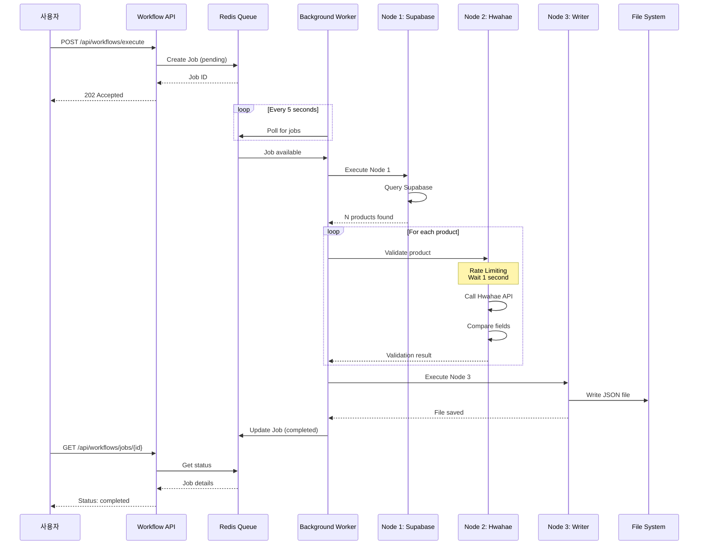
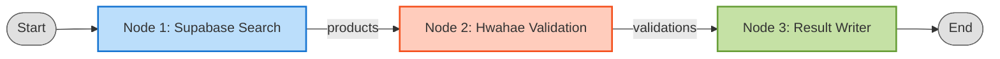
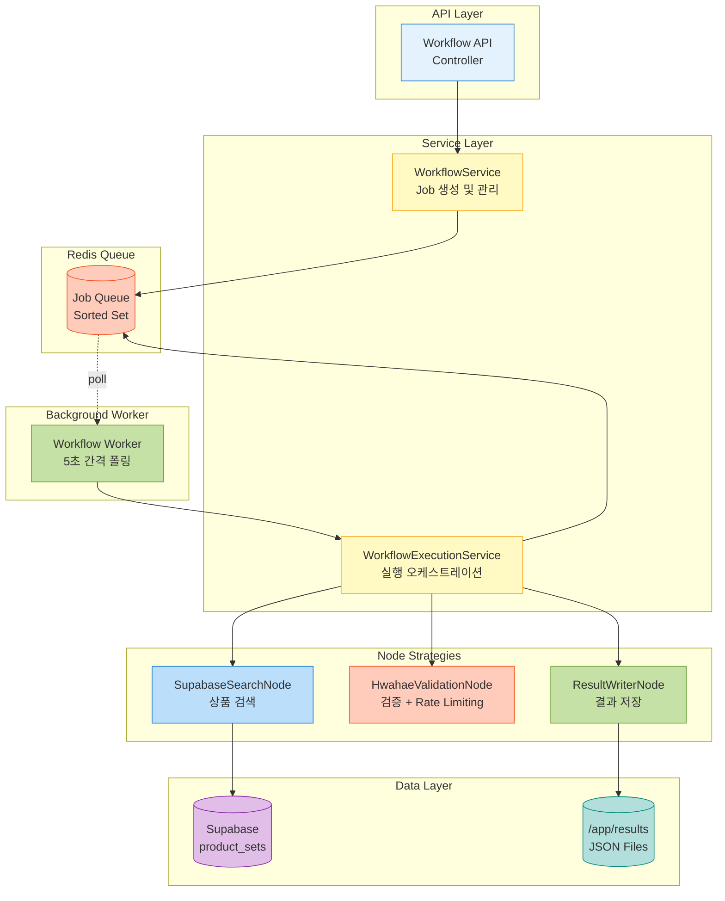
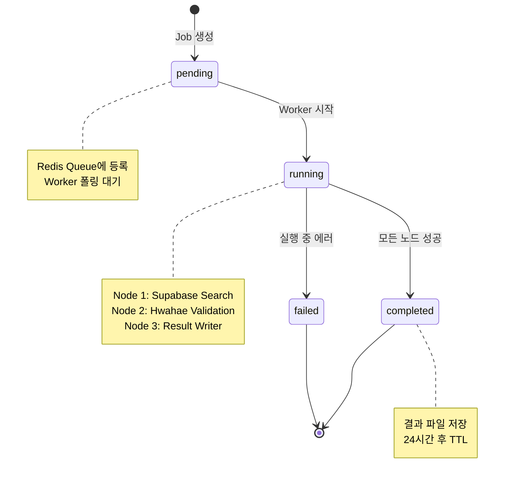

# Workflow System 가이드

대량 상품 검증을 자동화하는 워크플로우 시스템입니다. Supabase 상품 검색 → 화해 API 검증 → 결과 저장을 자동으로 처리합니다.

## 📚 목차

- [빠른 시작](#-빠른-시작)
- [시스템 개요](#-시스템-개요)
- [워크플로우 정의](#-워크플로우-정의)
- [API 가이드](#-api-가이드)
- [Worker 관리](#-worker-관리)
- [아키텍처](#-아키텍처)
- [문제 해결](#-문제-해결)

---

## 🚀 빠른 시작

### 1. 전체 시스템 시작

```bash
# 개발 환경 시작 (서버 + Worker + Redis)
make dev

# 또는 직접 실행
cd product_scanner
docker-compose -f docker/docker-compose.dev.yml up -d
```

### 2. Job 등록 및 자동 처리

```bash
# Job 등록
curl -X POST http://localhost:3989/api/workflows/execute \
  -H "Content-Type: application/json" \
  -d '{
    "workflow_id": "bulk-validation-v1",
    "params": {
      "link_url_pattern": "%hwahae%",
      "limit": 5
    }
  }'

# 응답: {"success":true,"job_id":"xxx-xxx-xxx","message":"Workflow execution started"}
```

Worker가 자동으로 처리합니다 (5초 간격 폴링).

### 3. 상태 확인

```bash
# Job 상태 조회
curl http://localhost:3989/api/workflows/jobs/{job_id} | jq

# 결과 파일 확인
ls -lh results/*.json
cat results/{job_id}.json | jq
```

---

## 🎯 시스템 개요

### 주요 기능

- **자동화된 워크플로우**: 검색 → 검증 → 저장을 자동 실행
- **비동기 처리**: Redis 기반 Job Queue로 대량 데이터 처리
- **결과 추적**: 필드별 비교 및 변경 사항 저장
- **Rate Limiting**: 화해 API 요청 간격 1초 이상 보장

### 실행 흐름



### 주요 컴포넌트

| 컴포넌트             | 역할                            | 기술                          |
| -------------------- | ------------------------------- | ----------------------------- |
| **Workflow Service** | Job 생성 및 실행 오케스트레이션 | TypeScript, Strategy Pattern  |
| **Worker**           | Job 큐 폴링 및 자동 처리        | Background process (5초 간격) |
| **Redis**            | Job Queue 및 상태 관리          | Redis 8.2, Sorted Set         |
| **Node Strategies**  | 3가지 노드 타입 처리            | Factory Pattern, DI           |

---

## 📝 워크플로우 정의

### 워크플로우 아키텍처

**DAG (Directed Acyclic Graph)** 구조를 지원하여 복잡한 워크플로우 구성이 가능합니다.

- ✅ **분기 (Fork)**: 하나의 노드에서 여러 노드로 분기
- ✅ **합류 (Join)**: 여러 노드가 하나의 노드로 합류
- ✅ **조건부 분기**: 런타임에 동적으로 다음 노드 결정
- ⚠️ **순차 실행**: 현재는 큐 기반 순차 실행 (병렬 실행 향후 지원)

### 워크플로우 노드 구조



### 현재 지원 워크플로우

#### `bulk-validation-v1` - 대량 상품 검증 (선형 체인)

```json
{
  "workflow_id": "bulk-validation-v1",
  "name": "Bulk Product Validation",
  "description": "Supabase 상품 검색 후 화해 API로 대량 검증",
  "start_node": "1",
  "nodes": {
    "1": {
      "type": "supabase_search",
      "name": "Search Products from Supabase",
      "config": {
        "link_url_pattern": "${link_url_pattern}",
        "limit": "${limit}"
      },
      "next_nodes": ["2"]
    },
    "2": {
      "type": "hwahae_validation",
      "name": "Validate with Hwahae API",
      "config": {
        "strategy_id": "hwahae_api_v2",
        "concurrency": 1
      },
      "next_nodes": ["3"]
    },
    "3": {
      "type": "result_writer",
      "name": "Save Results to File",
      "config": {
        "output_dir": "/app/results",
        "format": "json",
        "pretty": true
      },
      "next_nodes": []
    }
  }
}
```

#### `dag-example-v1` - DAG 구조 예제 (다이아몬드 패턴)

```json
{
  "workflow_id": "dag-example-v1",
  "name": "DAG Structure Example",
  "description": "DAG 구조 예제: 분기와 합류",
  "start_node": "search",
  "nodes": {
    "search": {
      "type": "supabase_search",
      "next_nodes": ["validate_api", "validate_scraper"]
    },
    "validate_api": {
      "type": "hwahae_validation",
      "config": { "strategy_id": "hwahae_api_v2" },
      "next_nodes": ["merge_results"]
    },
    "validate_scraper": {
      "type": "hwahae_validation",
      "config": { "strategy_id": "hwahae_scraper_v1" },
      "next_nodes": ["merge_results"]
    },
    "merge_results": {
      "type": "result_writer",
      "next_nodes": []
    }
  }
}
```

### 노드 타입 및 연결 규칙

#### 노드 정의 구조

```json
{
  "type": "node_type", // 노드 타입 (Strategy 식별자)
  "name": "Node Name", // 노드 이름 (로깅용)
  "config": {}, // 노드별 설정
  "next_nodes": ["id1", "id2"], // 다음 노드 ID 배열 (빈 배열이면 종료)
  "retry": {
    // 재시도 설정 (선택)
    "max_attempts": 3,
    "backoff_ms": 1000
  },
  "timeout_ms": 30000 // 타임아웃 (선택)
}
```

**중요**: `next_nodes`는 배열이므로 여러 노드로 분기 가능합니다.

#### 1. `supabase_search` - Supabase 검색

**설명**: Supabase `product_sets` 테이블에서 상품 검색

**Config**:

```json
{
  "link_url_pattern": "%hwahae%", // ILIKE 패턴
  "sale_status": "on_sale", // 옵션
  "limit": 10 // 기본값: 100, 최대: 1000
}
```

**Output**: `{ products: ProductSetSearchResult[], count: number }`

#### 2. `hwahae_validation` - 화해 검증

**설명**: 화해 API로 각 상품 검증 및 비교

**Config**:

```json
{
  "strategy_id": "hwahae_api_v2", // 옵션: API 전략 ID
  "concurrency": 1 // 동시 처리 수 (기본: 1)
}
```

**Rate Limiting**: 각 요청 사이 1초 이상 대기 (필수)

**Output**: `{ validations: ProductValidationResult[], summary: {...} }`

#### 3. `result_writer` - 결과 저장

**설명**: 검증 결과를 JSON 파일로 저장

**Config**:

```json
{
  "output_dir": "/app/results", // 저장 경로
  "format": "json", // json | jsonl | csv
  "pretty": true // JSON 포맷팅
}
```

**Output**: `{ file_path: string, file_size: number, record_count: number }`

### 새로운 워크플로우 추가하기

1. **JSON 파일 작성** (`workflows/my-workflow.json`)
2. **노드 조합**: 미리 정의된 노드 타입 사용
3. **DAG 구성**: `next_nodes` 배열로 자유롭게 연결
4. **자동 검증**: 시스템이 구조 검증 및 실행

**상세 가이드**: [WORKFLOW_DAG.md](./WORKFLOW_DAG.md) 참조

### 결과 파일 형식

```json
{
  "job_id": "xxx-xxx-xxx",
  "executed_at": "2025-10-29T08:50:35.847Z",
  "summary": {
    "total": 5,
    "success": 5,
    "failed": 0,
    "not_found": 0,
    "match_rate": 80
  },
  "validations": [
    {
      "product_set_id": "uuid",
      "supabase_data": {
        "product_name": "블랙빈 탈모증상 개선 샴푸 520ml",
        "thumbnail": "https://...",
        "original_price": 31000,
        "discounted_price": 18500,
        "sale_status": "on_sale"
      },
      "hwahae_data": {
        "product_name": "블랙빈 탈모증상 개선 샴푸 520ml",
        "thumbnail": "https://...",
        "original_price": 31000,
        "discounted_price": 18500,
        "sale_status": "on_sale"
      },
      "comparison": {
        "product_name": { "match": true, "supabase": "...", "hwahae": "..." },
        "thumbnail": { "match": false, "supabase": "...", "hwahae": "..." },
        "original_price": { "match": true, "supabase": 31000, "hwahae": 31000 },
        "discounted_price": {
          "match": true,
          "supabase": 18500,
          "hwahae": 18500
        },
        "sale_status": {
          "match": true,
          "supabase": "on_sale",
          "hwahae": "on_sale"
        }
      },
      "status": "success",
      "validated_at": "2025-10-29T08:50:27.254Z"
    }
  ]
}
```

---

## 🔌 API 가이드

### 1. 워크플로우 목록 조회

```bash
GET /api/workflows

# 응답
{
  "success": true,
  "workflows": [
    {
      "workflow_id": "bulk-validation-v1",
      "name": "Bulk Product Validation",
      "description": "...",
      "version": "1.0.0"
    }
  ]
}
```

### 2. 워크플로우 실행

```bash
POST /api/workflows/execute
Content-Type: application/json

{
  "workflow_id": "bulk-validation-v1",
  "params": {
    "link_url_pattern": "%hwahae%",
    "limit": 10
  }
}

# 응답
{
  "success": true,
  "job_id": "xxx-xxx-xxx",
  "message": "Workflow execution started"
}
```

### 3. Job 상태 조회

```bash
GET /api/workflows/jobs/{job_id}

# 응답
{
  "success": true,
  "data": {
    "job_id": "xxx-xxx-xxx",
    "workflow_id": "bulk-validation-v1",
    "status": "completed",           // pending | running | completed | failed
    "progress": 1,                   // 0.0 ~ 1.0
    "params": {...},
    "result": {...},                 // 완료 시 결과 데이터
    "created_at": "2025-10-29T...",
    "started_at": "2025-10-29T...",
    "completed_at": "2025-10-29T..."
  }
}
```

### 4. 헬스 체크

```bash
# 서버 헬스체크
GET /health

# Workflow 시스템 헬스체크 (Redis 연결)
GET /api/workflows/health
```

---

## ⚙️ Worker 관리

### Worker 시작

```bash
# Docker Compose로 자동 시작
make dev

# 또는 수동 시작
docker-compose -f docker/docker-compose.dev.yml up -d workflow_worker_dev
```

### Worker 로그 확인

```bash
# 실시간 로그
docker logs -f workflow_worker_dev

# 최근 100줄
docker logs --tail 100 workflow_worker_dev
```

### Worker 재시작

```bash
docker restart workflow_worker_dev
```

### Worker 중지

```bash
docker stop workflow_worker_dev
```

### 수동 Job 처리 (테스트용)

```bash
# Docker 컨테이너 안에서 실행
docker exec product_scanner_dev npm run script:process-job
```

### Worker 설정

**환경변수** (`docker-compose.dev.yml`):

```yaml
environment:
  - WORKER_POLL_INTERVAL=5000 # 폴링 간격 (ms)
  - REDIS_HOST=redis
  - REDIS_PORT=6379
```

---

## 🏗️ 아키텍처

### 시스템 구조



### 디자인 패턴

- **Strategy Pattern**: 노드별 독립적인 실행 전략
- **Factory Pattern**: NodeStrategyFactory로 노드 생성
- **Repository Pattern**: Redis/Supabase 데이터 접근
- **Singleton Pattern**: Redis 클라이언트, ConfigLoader

### Job 상태 전이



### Redis 데이터 구조

```redis
# Job Queue (Sorted Set)
workflow:jobs:queue
  score: priority (timestamp + priority)
  member: job_id

# Job Details (Hash)
workflow:job:{job_id}
  workflow_id: "bulk-validation-v1"
  status: "pending" | "running" | "completed" | "failed"
  params: JSON string
  result: JSON string (완료 시)
  progress: 0.0 ~ 1.0
  created_at: ISO 8601
  started_at: ISO 8601
  completed_at: ISO 8601

# TTL
- PENDING: 1시간
- RUNNING: 2시간
- COMPLETED: 24시간
```

### 파일 구조

```
product_scanner/
├── src/
│   ├── services/
│   │   └── WorkflowExecutionService.ts  # 워크플로우 실행 로직
│   ├── strategies/
│   │   ├── SupabaseSearchNode.ts        # Node 1
│   │   ├── HwahaeValidationNode.ts      # Node 2 (Rate Limiting)
│   │   └── ResultWriterNode.ts          # Node 3
│   ├── repositories/
│   │   └── RedisWorkflowRepository.ts   # Redis 데이터 접근
│   ├── core/
│   │   └── interfaces/
│   │       ├── INodeStrategy.ts         # 노드 인터페이스
│   │       └── IWorkflowRepository.ts   # Repository 인터페이스
│   ├── controllers/
│   │   └── WorkflowController.ts        # HTTP API
│   ├── worker.ts                        # Background Worker
│   └── server.ts                        # Express Server
├── workflows/
│   └── bulk-validation-v1.json          # 워크플로우 정의
├── scripts/
│   └── process-job.ts                   # 수동 Job 처리
└── results/
    └── {job_id}.json                    # 결과 파일
```

---

## 🛠️ 문제 해결

### Job이 pending 상태로 멈춤

**원인**: Worker가 실행되지 않음

**해결**:

```bash
# Worker 컨테이너 확인
docker ps | grep workflow_worker

# Worker 재시작
docker restart workflow_worker_dev

# 또는 수동 처리
docker exec product_scanner_dev npm run script:process-job
```

### Worker가 Job을 처리하지 않음

**원인**: Redis 연결 문제

**해결**:

```bash
# Redis 헬스체크
curl http://localhost:3989/api/workflows/health

# Redis 재시작
docker restart product_scanner_redis_dev

# Redis 로그 확인
docker logs product_scanner_redis_dev
```

### 화해 API 403 에러

**원인**: Rate limiting 위반

**확인사항**:

- HwahaeValidationNode에서 각 요청 사이 1초 이상 대기하는지 확인
- Worker 로그에서 "Rate limiting: waiting 1000ms" 메시지 확인

```bash
docker logs workflow_worker_dev | grep "Rate limiting"
```

### 결과 파일이 없음

**원인**: Job이 완료되지 않았거나 경로 문제

**해결**:

```bash
# Job 상태 확인
curl http://localhost:3989/api/workflows/jobs/{job_id}

# 결과 파일 경로 확인
ls -lh /Users/gzu/project/cosmetic/scoob-scraper/product_scanner/results/

# Docker 컨테이너 내부 확인
docker exec product_scanner_dev ls -lh /app/results/
```

---

## 📊 성능 및 제약사항

### Rate Limiting

- **화해 API**: 각 요청 사이 **최소 1초 이상** 대기 (필수)
- **실제 간격**: 약 2.1초 (Scanner의 requestDelay 포함)
- **구현 위치**: `HwahaeValidationNode.ts:122-127`

### 처리 성능

- **5개 상품**: 약 8-10초
- **10개 상품**: 약 18-20초
- **50개 상품**: 약 100-110초
- **100개 상품**: 약 200-220초

### 제약사항

- **동시 처리**: 순차 처리 (concurrency: 1)
- **최대 상품 수**: 1000개 (Supabase limit)
- **Redis TTL**: 완료된 Job은 24시간 후 삭제
- **결과 파일**: 무제한 보관 (수동 삭제 필요)

---

## 📚 참고 자료

### 워크플로우 관련

- **[WORKFLOW_DAG.md](./WORKFLOW_DAG.md)** - DAG 구조 상세 가이드
- [Workflow.ts](../src/core/domain/Workflow.ts) - 도메인 모델
- [WorkflowExecutionService.ts](../src/services/WorkflowExecutionService.ts) - 실행 엔진
- [WorkflowLoaderService.ts](../src/services/WorkflowLoaderService.ts) - 로더 및 검증

### 노드 구현

- [INodeStrategy.ts](../src/core/interfaces/INodeStrategy.ts) - 노드 인터페이스
- [SupabaseSearchNode.ts](../src/strategies/SupabaseSearchNode.ts) - Node 1
- [HwahaeValidationNode.ts](../src/strategies/HwahaeValidationNode.ts) - Node 2
- [ResultWriterNode.ts](../src/strategies/ResultWriterNode.ts) - Node 3

### 워크플로우 예제

- [bulk-validation-v1.json](../workflows/bulk-validation-v1.json) - 선형 체인
- [dag-example-v1.json](../workflows/dag-example-v1.json) - DAG 구조

### 기타

- [Product Scanner README](../README.md)
- [Supabase Repository](../src/repositories/SupabaseProductRepository.ts)
- [Redis Workflow Repository](../src/repositories/RedisWorkflowRepository.ts)

---

**작성일**: 2025-01-30
**버전**: 2.0.0 (DAG 구조 지원)
**Status**: Production Ready ✅
