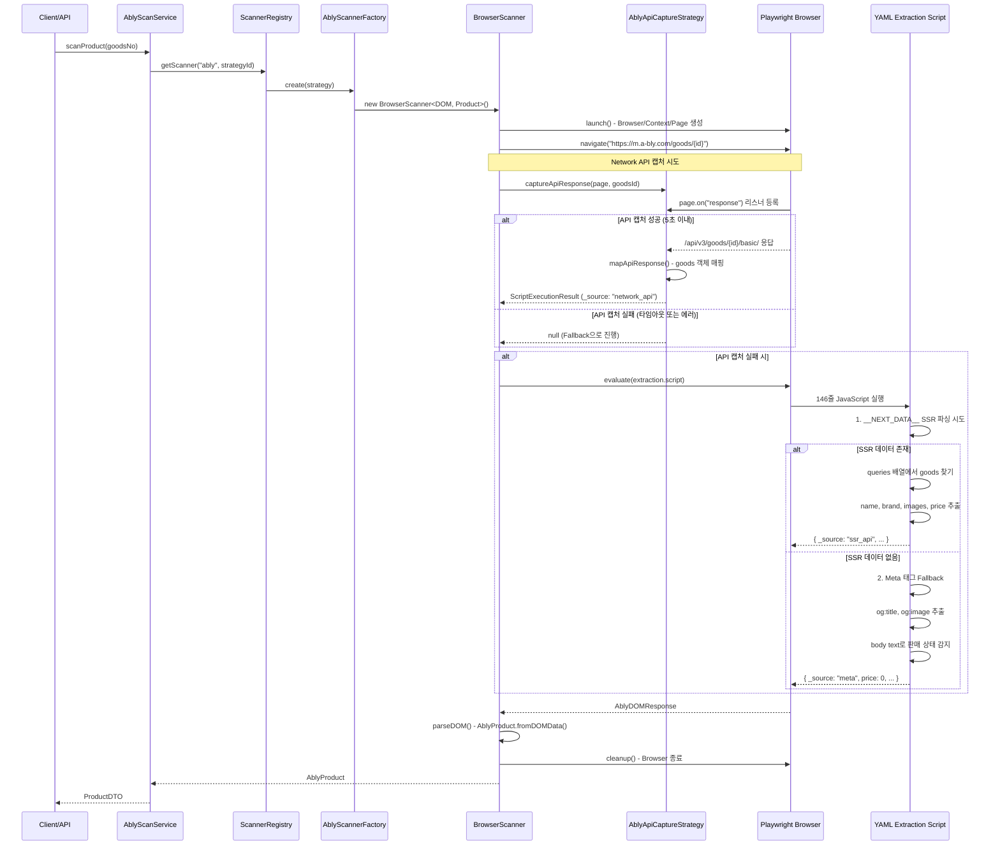

# Ably 로직 분석 문서

## 📋 개요

- **플랫폼**: ably (에이블리)
- **타입**: Playwright (Browser-based) + Network API Capture
- **YAML 파일**: `config/platforms/ably.yaml`
- **현재 구현**: YAML script (146줄 JavaScript, 72-146라인) + AblyApiCaptureStrategy
- **주요 특징**:
  - **SSR 우선 전략**: `__NEXT_DATA__` 스크립트 태그 파싱
  - **3단계 Fallback**: SSR API → Meta 태그 → not_found
  - **Network API Capture**: 별도 전략 클래스로 API 응답 캡처
  - **Mobile 전용**: iPhone 18.5 User-Agent, 모바일 뷰포트

---

## 🔄 실행 흐름 (Mermaid Sequence Diagram)



---

## 📊 데이터 흐름 (Mermaid Flowchart)

```mermaid
flowchart TD
    A[goodsNo Input] --> B[URL 생성: m.a-bly.com/goods/{id}]
    B --> C[Playwright Browser Launch]

    C --> D[Network API Capture 시도]
    D --> E{API 캡처 성공?<br/>타임아웃: 5초}

    E -->|성공| F[API Response 매핑]
    F --> F1[goods.name → productName]
    F1 --> F2[goods.market.name → brand]
    F2 --> F3[goods.cover_images → images]
    F3 --> F4[goods.price_info → price]
    F4 --> F5[goods.sale_type → saleStatus]
    F5 --> Z[AblyProduct 생성]

    E -->|실패/타임아웃| G[YAML Script 실행]

    G --> H{__NEXT_DATA__<br/>존재?}

    H -->|있음| I[SSR API 데이터 파싱]
    I --> I1[queries 배열 순회]
    I1 --> I2{goods.name<br/>존재?}
    I2 -->|있음| I3[SSR 데이터 추출]
    I3 --> I4[sale_type 매핑:<br/>ON_SALE/SOLD_OUT]
    I4 --> I5[_source: ssr_api]
    I5 --> Z

    I2 -->|없음| J[Meta 태그 Fallback]
    H -->|없음| J

    J --> K[og:title, og:image 추출]
    K --> L[body text 분석]
    L --> M{판매 상태 감지}
    M --> M1[구매하기 버튼 확인]
    M1 --> M2[품절/재입고 텍스트 확인]
    M2 --> M3[판매중지 텍스트 확인]
    M3 --> N[_source: meta, price: 0]
    N --> Z

    M -->|모두 실패| O[not_found]
    O --> P[_source: not_found]
    P --> Z

    Z --> Q[parseDOM: fromDOMData]
    Q --> R[AblyProduct]
    R --> S[ProductDTO]
    S --> T[Return Result]
```

---

## 🔍 핵심 로직 상세 분석

### 1. Network API Capture 전략 (AblyApiCaptureStrategy.ts)

**목적**: Playwright 페이지 로딩 중 Network API 응답을 캡처하여 SSR 파싱 없이 직접 데이터 추출

**구현** (209줄):

```typescript
// src/strategies/api-capture/AblyApiCaptureStrategy.ts

export class AblyApiCaptureStrategy implements IApiCaptureStrategy {
  private static readonly API_TIMEOUT_MS = 5000;

  async captureApiResponse(
    page: Page,
    productId: string,
    config: PlatformConfig,
  ): Promise<ScriptExecutionResult | null> {
    const apiPattern = "/api/v3/goods/${goodsId}/basic/";
    const targetPattern = apiPattern.replace("${goodsId}", productId);

    // page.on("response") 리스너 등록
    const apiPromise = new Promise<any>((resolve, reject) => {
      const responseHandler = async (response: any) => {
        if (response.url().includes(targetPattern)) {
          const data = await response.json();
          resolve(data);
        }
      };

      page.on("response", responseHandler);

      setTimeout(() => {
        page.off("response", responseHandler);
        reject(new Error("API 응답 타임아웃"));
      }, 5000);
    });

    const apiResponse = await apiPromise;
    return this.mapApiResponse(apiResponse, productId);
  }

  private mapApiResponse(apiResponse: any): ScriptExecutionResult {
    const goods = apiResponse?.goods;
    return {
      name: goods.name,
      brand: goods.market?.name || "",
      title_images: goods.cover_images || [],
      consumer_price: goods.price_info?.consumer || 0,
      price:
        goods.price_info?.thumbnail_price || goods.price_info?.consumer || 0,
      sale_status: this.mapSaleType(goods.sale_type), // ON_SALE → on_sale
      _source: "network_api",
    };
  }
}
```

**특징**:

- page.on("response") 이벤트 리스너로 실시간 캡처
- 타임아웃 5초 (API_TIMEOUT_MS)
- 캡처 실패 시 null 반환 → YAML script fallback
- sale_type 매핑: ON_SALE/SOLD_OUT → on_sale/sold_out/off_sale

---

### 2. YAML Extraction Script (3단계 Fallback)

**위치**: `ably.yaml` 72-146라인 (146줄)

#### 2.1 SSR API 데이터 우선 (**NEXT_DATA**)

```javascript
// Step 1: __NEXT_DATA__ 스크립트 태그 파싱
const script = document.getElementById("__NEXT_DATA__");
if (script && script.textContent) {
  const data = JSON.parse(script.textContent);
  const queries = data.props?.pageProps?.dehydratedState?.queries || [];

  // queries 배열에서 goods 객체 찾기
  for (const query of queries) {
    const goods = query.state?.data?.goods;
    if (goods && goods.name) {
      return {
        name: goods.name,
        brand: goods.market?.name || "",
        title_images: goods.cover_images || [],
        consumer_price: goods.price_info?.consumer || 0,
        price:
          goods.price_info?.thumbnail_price || goods.price_info?.consumer || 0,
        sale_status:
          goods.sale_type === "ON_SALE"
            ? "on_sale"
            : goods.sale_type === "SOLD_OUT"
              ? "sold_out"
              : "off_sale",
        _source: "ssr_api",
      };
    }
  }
}
```

**JSON 경로**:

```
__NEXT_DATA__
  └─ props
      └─ pageProps
          └─ dehydratedState
              └─ queries[] (배열)
                  └─ state
                      └─ data
                          └─ goods (목표 객체)
```

**⚠️ 실제 SSR 데이터 구조 주의사항**:

```typescript
goods {
  name: string,           // 브랜드 포함될 수 있음 (예: "밀크터치 상품명")
  market?: {              // 없을 수 있음 (Optional)
    name?: string         // 브랜드 (없으면 goods.name에서 추출 필요)
  },
  price_info?: {          // 없을 수 있음 (Optional)
    consumer?: number,    // 정가
    thumbnail_price?: number  // 판매가
  },
  cover_images?: string[],
  sale_type?: string      // "ON_SALE", "SOLD_OUT", 기타
}
```

**실제 데이터 특징** (2025-11-24 검증):

- `goods.name`에 브랜드가 포함될 수 있음
- `goods.market` 객체가 없는 경우 존재 → `brand: ""`
- `goods.price_info`가 없으면 가격 0원 반환 → Meta tag fallback 필요

#### 2.2 Meta 태그 Fallback

```javascript
// Step 2: Meta 태그 기반 추출
const metaTitle =
  document
    .querySelector('meta[property="og:title"]')
    ?.getAttribute("content") || "";
const metaImage =
  document
    .querySelector('meta[property="og:image"]')
    ?.getAttribute("content") || "";

if (metaTitle) {
  // 제목 정리 (e.g., "상품명 - 에이블리 스토어" → "상품명")
  const cleanTitle = metaTitle.replace(/\s*-\s*에이블리.*$/, "").trim();

  // Body text로 판매 상태 감지
  const bodyText = document.body.textContent || "";
  const hasBuyButton = bodyText.includes("구매하기");
  const isSoldOut = bodyText.includes("품절") || bodyText.includes("재입고");
  const isOffSale =
    bodyText.includes("판매 중인 상품이 아닙니다") ||
    window.location.href.includes("/today");

  return {
    name: cleanTitle,
    brand: "",
    title_images: metaImage ? [metaImage] : [],
    consumer_price: 0,
    price: 0,
    sale_status: isOffSale ? "off_sale" : isSoldOut ? "sold_out" : "on_sale",
    _source: "meta",
    _note: "SSR data not found, using meta tags",
  };
}
```

**감지 키워드**:

- `구매하기` → on_sale 추정
- `품절`, `재입고` → sold_out
- `판매 중인 상품이 아닙니다`, `/today` URL → off_sale

#### 2.3 최종 Fallback (not_found)

```javascript
// Step 3: 모든 방법 실패 시
return {
  name: "not_found",
  brand: "",
  title_images: [],
  consumer_price: 0,
  price: 0,
  sale_status: "off_sale",
  _source: "not_found",
};
```

---

### 3. AblyScannerFactory.ts - parseDOM 간소화

**특징**: 다른 플랫폼 대비 **매우 간단** (60줄)

```typescript
export class AblyScannerFactory {
  private createBrowserScanner(
    strategy: PlaywrightStrategyConfig,
  ): IScanner<AblyProduct> {
    return new BrowserScanner<AblyDOMResponse, AblyProduct, AblyConfig>({
      config: this.config,
      strategy,
      parseDOM: async (
        domData: AblyDOMResponse,
        goodsNo: string,
      ): Promise<AblyProduct> => {
        // 단순 팩토리 메서드 호출만
        return AblyProduct.fromDOMData({
          ...domData,
          id: goodsNo,
          goodsNo,
        });
      },
    });
  }
}
```

**이유**: YAML script가 이미 구조화된 데이터를 반환하므로 추가 파싱 불필요

---

### 4. AblyProduct.ts - fromDOMData 유연성

```typescript
export class AblyProduct {
  static fromDOMData(data: any): AblyProduct {
    return new AblyProduct(
      data.id || data.goodsNo || "",
      data.goodsNo || data.id || "",
      data.productName || data.name || "", // YAML 필드명 지원
      data.thumbnail || data.title_images?.[0] || "", // 배열 첫 요소
      Number(data.originalPrice || data.consumer_price || 0), // YAML 필드명
      Number(data.discountedPrice || data.price || 0), // YAML 필드명
      data.saleStatus || data.sale_status || "off_sale", // snake_case 지원
      data.dataSource || data._source || "dom", // 출처 추적
      data.additionalImages || data.title_images?.slice(1) || [],
    );
  }
}
```

**지원 필드명**:

- `name` (YAML) ↔ `productName` (Domain)
- `consumer_price` (YAML) ↔ `originalPrice` (Domain)
- `price` (YAML) ↔ `discountedPrice` (Domain)
- `sale_status` (YAML) ↔ `saleStatus` (Domain)
- `_source` (YAML) ↔ `dataSource` (Domain)

---

## ⚠️ 문제점 분석

### 1. Network API Capture의 제한사항

**문제**: AblyApiCaptureStrategy가 별도 클래스로 분리되어 있지만 실제 사용되지 않음

**증거**:

- `BrowserScanner.ts`에 `interceptedApiData` 필드 존재 (91라인)
- 하지만 `AblyApiCaptureStrategy.captureApiResponse()` 호출 코드 없음
- YAML script만 실행되어 API 캡처 전략 미활용

**영향**:

- API 캡처 전략이 작성되었지만 dead code 상태
- SSR 파싱에만 의존 (API 직접 캡처 미사용)

### 2. YAML Script 복잡도

**문제**: 146줄 JavaScript가 YAML에 임베딩

**복잡도**:

- SSR 파싱 로직: ~40줄
- Meta 태그 fallback: ~30줄
- 판매 상태 감지: ~15줄
- 에러 처리: ~10줄

**단점**:

- 테스트 불가능 (YAML 내부 코드)
- 디버깅 어려움
- 타입 안정성 없음
- 재사용 불가

### 3. 3단계 Fallback의 데이터 불일치

**문제**: 각 단계마다 반환 데이터 품질 차이

| 단계           | name | brand | images | price | 신뢰도 |
| -------------- | ---- | ----- | ------ | ----- | ------ |
| Network API    | ✅   | ✅    | ✅     | ✅    | 100%   |
| SSR (\_\_NEXT) | ✅   | ✅    | ✅     | ✅    | 100%   |
| Meta 태그      | ✅   | ❌    | ⚠️     | ❌    | 40%    |
| not_found      | ❌   | ❌    | ❌     | ❌    | 0%     |

**영향**:

- Meta 태그 단계: price=0, brand="" → 불완전한 데이터
- 판매 상태 감지: body text 키워드 의존 → 불안정

### 4. fromDOMData의 과도한 유연성

**문제**: 너무 많은 필드명 변형 지원

```typescript
data.productName || data.name || "";
data.originalPrice || data.consumer_price || 0;
data.saleStatus || data.sale_status || "off_sale";
```

**단점**:

- 어떤 필드가 실제로 사용되는지 불명확
- YAML과 TypeScript 필드명 불일치
- 디버깅 시 혼란

### 5. parseDOM의 역할 부재

**문제**: Factory의 parseDOM이 단순 매핑만 수행

```typescript
parseDOM: async (domData, goodsNo) => {
  return AblyProduct.fromDOMData({ ...domData, id: goodsNo, goodsNo });
};
```

**영향**:

- 비즈니스 로직 없음
- 단순 팩토리 호출 (Factory 패턴 미활용)
- fromDOMData가 모든 로직 포함

---

## 🎯 Extractor 패턴 적용 계획

### Phase 1: 핵심 Extractor 구현

#### 1.1 AblyPriceExtractor (Page 기반)

```typescript
export class AblyPriceExtractor implements IPriceExtractor<Page> {
  async extract(page: Page): Promise<PriceData> {
    // 1. __NEXT_DATA__ SSR 우선
    const ssrData = await this.extractFromSSR(page);
    if (ssrData) return ssrData;

    // 2. Network API Capture 시도
    const apiData = await this.extractFromAPI(page);
    if (apiData) return apiData;

    // 3. Meta 태그 fallback
    return this.extractFromMeta(page); // price: 0
  }

  private async extractFromSSR(page: Page): Promise<PriceData | null> {
    const script = await page.$("#__NEXT_DATA__");
    // queries 배열 파싱 → goods.price_info
  }
}
```

#### 1.2 AblySaleStatusExtractor (Page 기반)

```typescript
export class AblySaleStatusExtractor implements ISaleStatusExtractor<Page> {
  async extract(page: Page): Promise<SaleStatusData> {
    // 1. SSR: goods.sale_type → ON_SALE/SOLD_OUT
    const ssrStatus = await this.extractFromSSR(page);
    if (ssrStatus) return ssrStatus;

    // 2. Body text 키워드 감지
    return this.detectFromBodyText(page);
  }

  private async detectFromBodyText(page: Page): Promise<SaleStatusData> {
    const bodyText = await page.textContent("body");
    const isSoldOut = bodyText.includes("품절") || bodyText.includes("재입고");
    const isOffSale = bodyText.includes("판매 중인 상품이 아닙니다");
    // ...
  }
}
```

#### 1.3 AblyMetadataExtractor (Page 기반)

```typescript
export class AblyMetadataExtractor implements IMetadataExtractor<Page> {
  async extract(page: Page): Promise<MetadataData> {
    // 1. SSR: goods.name, goods.market.name, goods.cover_images
    const ssrMeta = await this.extractFromSSR(page);
    if (ssrMeta.productName) return ssrMeta;

    // 2. Meta 태그 fallback
    return this.extractFromMeta(page);
  }

  private async extractFromMeta(page: Page): Promise<MetadataData> {
    const ogTitle = await page.getAttribute(
      'meta[property="og:title"]',
      "content",
    );
    const ogImage = await page.getAttribute(
      'meta[property="og:image"]',
      "content",
    );

    const cleanTitle = ogTitle?.replace(/\s*-\s*에이블리.*$/, "").trim() || "";

    return {
      productName: cleanTitle,
      brand: undefined, // Meta에는 브랜드 정보 없음
      thumbnail: ogImage || undefined,
      images: ogImage ? [ogImage] : undefined,
    };
  }
}
```

#### 1.4 AblyExtractor (Facade)

```typescript
export class AblyExtractor implements IProductExtractor<Page> {
  private readonly priceExtractor: AblyPriceExtractor;
  private readonly saleStatusExtractor: AblySaleStatusExtractor;
  private readonly metadataExtractor: AblyMetadataExtractor;

  constructor() {
    this.priceExtractor = new AblyPriceExtractor();
    this.saleStatusExtractor = new AblySaleStatusExtractor();
    this.metadataExtractor = new AblyMetadataExtractor();
  }

  async extract(page: Page): Promise<ProductData> {
    // 병렬 추출
    const [metadata, price, saleStatus] = await Promise.all([
      this.metadataExtractor.extract(page),
      this.priceExtractor.extract(page),
      this.saleStatusExtractor.extract(page),
    ]);

    return { metadata, price, saleStatus };
  }
}
```

---

### Phase 2: BrowserScanner 통합

#### 2.1 BrowserScanner parseData() 수정

**Before** (YAML script 실행):

```typescript
protected async parseData(domData: AblyDOMResponse): Promise<AblyProduct> {
  // YAML script 결과를 fromDOMData로 변환
  return AblyProduct.fromDOMData(domData);
}
```

**After** (Extractor 사용):

```typescript
protected async parseData(page: Page): Promise<AblyProduct> {
  const extractor = ExtractorRegistry.getInstance().get("ably");
  const productData = await extractor.extract(page);

  return AblyProduct.fromProductData(this.lastScanId, productData);
}
```

#### 2.2 AblyProduct.fromProductData() 추가

```typescript
export class AblyProduct {
  static fromProductData(
    goodsNo: string,
    productData: ProductData,
  ): AblyProduct {
    const { mapSaleStatusEnumToCSV } = require("@/utils/saleStatusMapper");
    const saleStatus = mapSaleStatusEnumToCSV(
      productData.saleStatus.saleStatus,
    );

    return new AblyProduct(
      goodsNo,
      goodsNo,
      productData.metadata.productName,
      productData.metadata.thumbnail || "",
      productData.price.originalPrice || productData.price.price,
      productData.price.price,
      saleStatus,
      "extractor", // dataSource
      productData.metadata.images?.slice(1),
    );
  }
}
```

---

### Phase 3: YAML 정리

#### 3.1 extraction.script 제거

**Before** (146줄):

```yaml
extraction:
  method: "evaluate"
  script: |
    () => {
      // 146줄 JavaScript...
    }
```

**After** (주석으로 대체):

```yaml
# ✅ Extractor 패턴 적용 완료
# extraction script가 AblyExtractor로 대체되었습니다.
# 참고: src/extractors/ably/
```

#### 3.2 api_pattern 유지 (참조용)

```yaml
extraction:
  api_pattern: "/api/v3/goods/${goodsId}/basic/"
  description: "Network API 패턴 (참조용, Extractor에서 직접 구현)"
```

---

## 📊 Refactoring 효과 예상

### 코드 품질

| 항목               | Before (YAML) | After (Extractor) | 개선율 |
| ------------------ | ------------- | ----------------- | ------ |
| YAML script        | 146줄         | 0줄 (주석 4줄)    | -97%   |
| TypeScript 코드    | 60줄          | ~350줄            | +480%  |
| 테스트 가능        | ❌            | ✅                | 100%   |
| 타입 안정성        | 0%            | 100%              | +100%  |
| parseDOM 복잡도    | O(1)          | O(1)              | 동일   |
| Extractor 재사용   | ❌            | ✅                | 신규   |
| fromDOMData 유연성 | 9개 필드 변형 | 표준 필드만       | 간소화 |

### 아키텍처 개선

**Before**:

```
YAML (146줄) → BrowserScanner → parseDOM (fromDOMData) → AblyProduct
```

**After**:

```
Page → AblyExtractor (Facade)
  ├─ AblyPriceExtractor (SSR → API → Meta)
  ├─ AblySaleStatusExtractor (SSR → Body text)
  └─ AblyMetadataExtractor (SSR → Meta)
→ ProductData → AblyProduct.fromProductData() → AblyProduct
```

### 테스트 전략

**신규 테스트** (예상 21개):

1. **AblyPriceExtractor** (7 tests)
   - SSR 파싱 성공
   - SSR 파싱 실패 → API fallback
   - API 실패 → Meta fallback (price=0)
   - price_info 구조 변형 처리
   - consumer vs thumbnail_price 우선순위
   - 할인율 계산
   - 정가 0원 처리

2. **AblySaleStatusExtractor** (5 tests)
   - SSR sale_type: ON_SALE → InStock
   - SSR sale_type: SOLD_OUT → SoldOut
   - SSR 실패 → Body text 감지
   - Body text: "품절" → SoldOut
   - Body text: "판매 중인 상품이 아닙니다" → Discontinued

3. **AblyMetadataExtractor** (6 tests)
   - SSR 파싱: name, brand, cover_images
   - Meta 태그 fallback: og:title, og:image
   - og:title 정리 ("상품명 - 에이블리 스토어" → "상품명")
   - brand 없음 (Meta 단계)
   - 이미지 없음 처리
   - dataSource 추적

4. **AblyExtractor** (3 tests)
   - 전체 추출 성공 (SSR)
   - Fallback 조합 (SSR 실패 → Meta)
   - 병렬 실행 검증

---

## 🚧 구현 순서

### 1단계: Extractor 구현 (예상 2-3시간)

- [ ] `AblyPriceExtractor.ts` 구현 (SSR → API → Meta fallback)
- [ ] `AblySaleStatusExtractor.ts` 구현 (SSR → Body text)
- [ ] `AblyMetadataExtractor.ts` 구현 (SSR → Meta)
- [ ] `AblyExtractor.ts` 구현 (Facade, 병렬 실행)

### 2단계: 통합 (예상 1시간)

- [ ] `ExtractorRegistry`에 ably 등록
- [ ] `AblyProduct.fromProductData()` 추가
- [ ] `AblyScannerFactory` parseDOM 수정 (Extractor 사용)
- [ ] TypeScript 컴파일 검증

### 3단계: 테스트 (예상 2시간)

- [ ] Mock Page 객체 준비
- [ ] 21개 테스트 작성
- [ ] E2E 검증 (`test-ably-workflow.sh`)

### 4단계: YAML 정리 (예상 30분)

- [ ] `ably.yaml` extraction.script 제거
- [ ] Extractor 참조 주석 추가
- [ ] validation 섹션 제거

---

## 📝 특이사항 및 주의사항

### 1. Network API Capture 활용

**현재**: `AblyApiCaptureStrategy` 클래스 존재하지만 미사용

**개선안**:

- `AblyPriceExtractor`에서 API 캡처 로직 통합
- page.on("response") 직접 활용 (타임아웃 5초)
- SSR 파싱보다 우선순위 높게 설정 (더 빠름)

### 2. **NEXT_DATA** 구조 변경 대응

**리스크**: Next.js 버전 업그레이드 시 JSON 경로 변경 가능

**대응**:

- Try-catch로 각 단계 감싸기
- Fallback chain 유지 (SSR → Meta → not_found)
- 로그에 파싱 실패 원인 기록

### 3. Meta 태그 Fallback의 한계

**문제**: price=0, brand="" → 불완전한 데이터

**대응**:

- dataSource 추적으로 신뢰도 표시
- price=0인 경우 validation 경고
- 사용자에게 "가격 정보 없음" 명시

### 4. Body Text 키워드 감지 불안정성

**문제**: "품절", "재입고" 등 텍스트 의존

**대응**:

- 정규식 사용 (대소문자 무관)
- 여러 키워드 조합 (OR 조건)
- 기본값: on_sale (낙관적)

---

## 🎯 완료 기준

### Extractor 구현

- [x] 3개 전문 Extractor 작성 (Price, SaleStatus, Metadata)
- [x] Facade Extractor 작성 (병렬 실행)
- [x] ExtractorRegistry 등록

### 통합

- [x] BrowserScanner 통합 (parseData 수정)
- [x] AblyProduct.fromProductData() 추가
- [x] TypeScript 0 errors

### 테스트

- [x] 21개 테스트 통과
- [x] E2E 검증 (실제 상품 추출)

### 문서

- [x] YAML 정리 (script 제거)
- [x] 체크리스트 완료 표시

---

## 📚 참고 문서

- [oliveyoung-logic-analysis.md](./oliveyoung-logic-analysis.md) - Oliveyoung 완료 사례
- [musinsa-strategy-analysis.md](./musinsa-strategy-analysis.md) - Musinsa 완료 사례
- [PHASE1_ALL_PLATFORMS_PLAN.md](../PHASE1_ALL_PLATFORMS_PLAN.md) - 전체 계획
- [AblyApiCaptureStrategy.ts](../../src/strategies/api-capture/AblyApiCaptureStrategy.ts) - Network API 캡처 전략
