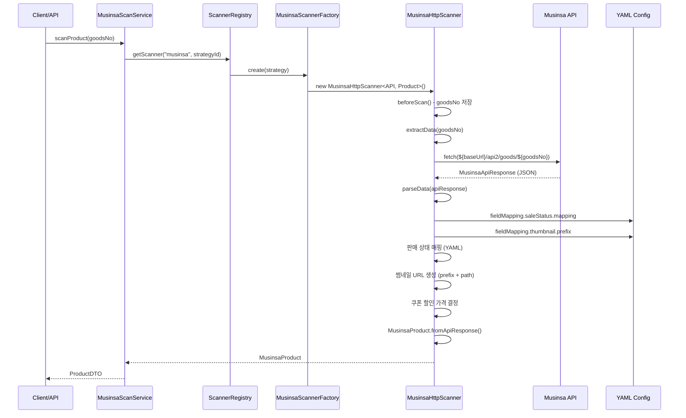
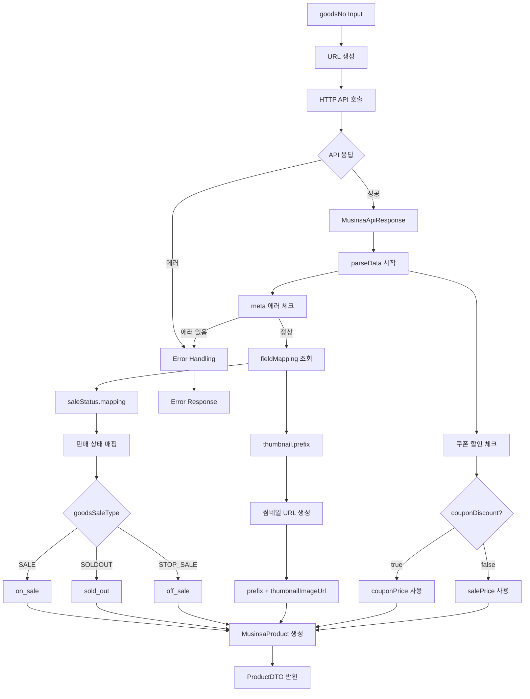
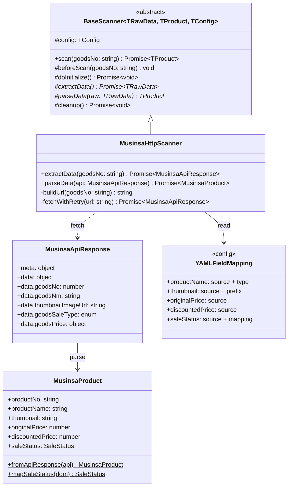
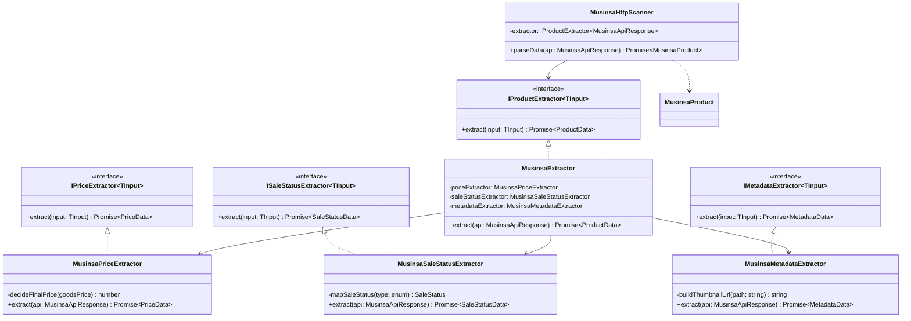

# Musinsa 전략 분석 문서

## 📋 개요

- **플랫폼**: musinsa (무신사)
- **타입**: HTTP API (API-based)
- **YAML 파일**: `config/platforms/musinsa.yaml`
- **현재 구현**: fieldMapping 기반 하드코딩 (Scanner 내부)
- **주요 특징**:
  - HTTP API 직접 호출 (`goods-detail.musinsa.com`)
  - fieldMapping YAML 설정 활용
  - 쿠폰 할인 가격 처리 로직
  - 판매 상태 3단계 매핑 (SALE/SOLDOUT/STOP_SALE)

---

## 🔄 실행 흐름 (Mermaid Sequence Diagram)



---

## 📊 데이터 흐름 (Mermaid Flowchart)



---

## 🔍 API 응답 구조

### API Endpoint

```
GET https://goods-detail.musinsa.com/api2/goods/{goodsNo}
```

### 응답 예시

```json
{
  "meta": {
    "result": "SUCCESS",
    "errorCode": "",
    "message": ""
  },
  "data": {
    "goodsNo": 4350236,
    "goodsNm": "듀이 글래시 파운데이션 30ml",
    "thumbnailImageUrl": "/thumbnails/images/goods_img/20240820/4350236/4350236_17395189158827_500.jpg",
    "goodsSaleType": "SALE",
    "goodsPrice": {
      "normalPrice": 33000,
      "salePrice": 29700,
      "couponPrice": 28000,
      "couponDiscount": false
    }
  }
}
```

### 필드 설명

| 필드                             | 타입    | 설명               | 예시                           |
| -------------------------------- | ------- | ------------------ | ------------------------------ |
| `meta.result`                    | string  | API 호출 결과      | "SUCCESS", "ERROR"             |
| `meta.errorCode`                 | string  | 에러 코드          | "", "NOT_FOUND"                |
| `data.goodsNo`                   | number  | 상품 번호          | 4350236                        |
| `data.goodsNm`                   | string  | 상품명             | "듀이 글래시..."               |
| `data.thumbnailImageUrl`         | string  | 썸네일 경로 (상대) | "/thumbnails/..."              |
| `data.goodsSaleType`             | enum    | 판매 상태          | "SALE", "SOLDOUT", "STOP_SALE" |
| `data.goodsPrice.normalPrice`    | number  | 정가               | 33000                          |
| `data.goodsPrice.salePrice`      | number  | 할인가             | 29700                          |
| `data.goodsPrice.couponPrice`    | number  | 쿠폰 적용가        | 28000                          |
| `data.goodsPrice.couponDiscount` | boolean | 쿠폰 할인 여부     | false                          |

---

## 🏗️ 클래스 구조 (Mermaid Class Diagram)

### 현재 구조



### 목표 구조 (리팩토링 후)



---

## 🎯 리팩토링 포인트

### 문제점

1. ❌ **parseData() 내 하드코딩** (L84-130)
   - fieldMapping 직접 참조 (타입 안전성 부재)
   - 판매 상태 매핑 로직 Scanner에 위치
   - 썸네일 prefix 로직 Scanner에 위치
   - 쿠폰 가격 결정 로직 Scanner에 위치

2. ❌ **타입 안전성 부재**
   - fieldMapping 선택적 체이닝 (`?.`)
   - 런타임 에러 위험
   - 자동완성 없음

3. ❌ **테스트 불가능**
   - parseData() 로직 분리 어려움
   - Mock 어려움
   - Unit test 불가

4. ❌ **재사용성 없음**
   - 다른 플랫폼 재사용 불가
   - 공통 로직 중복 발생

5. ❌ **YAML과 코드 분리 안 됨**
   - fieldMapping이 코드와 강결합
   - YAML 변경 시 코드 수정 필요

---

### 개선 방향

#### 1. Extractor 패턴 적용

**파일 구조**:

```
src/extractors/
  musinsa/
    MusinsaExtractor.ts              # Facade (통합)
    MusinsaPriceExtractor.ts         # 가격 추출
    MusinsaSaleStatusExtractor.ts    # 판매 상태 추출
    MusinsaMetadataExtractor.ts      # 메타데이터 추출
```

#### 2. 전문 Extractor 설계

**MusinsaPriceExtractor**:

```typescript
export class MusinsaPriceExtractor
  implements IPriceExtractor<MusinsaApiResponse>
{
  async extract(response: MusinsaApiResponse): Promise<PriceData> {
    const { goodsPrice } = response.data;

    // 쿠폰 할인 가격 결정 로직 (비즈니스 로직)
    const finalPrice = goodsPrice.couponDiscount
      ? goodsPrice.couponPrice
      : goodsPrice.salePrice;

    const discountRate = this.calculateDiscountRate(
      finalPrice,
      goodsPrice.normalPrice,
    );

    return {
      price: finalPrice,
      originalPrice: goodsPrice.normalPrice,
      discountRate,
      currency: "KRW",
    };
  }

  private calculateDiscountRate(
    price: number,
    original: number,
  ): number | undefined {
    if (!original || original <= price) return undefined;
    return Math.round(((original - price) / original) * 100);
  }
}
```

**MusinsaSaleStatusExtractor**:

```typescript
export class MusinsaSaleStatusExtractor
  implements ISaleStatusExtractor<MusinsaApiResponse>
{
  async extract(response: MusinsaApiResponse): Promise<SaleStatusData> {
    const apiStatus = response.data.goodsSaleType;
    const saleStatus = this.mapSaleStatus(apiStatus);

    return {
      saleStatus,
      isAvailable: saleStatus === SaleStatus.InStock,
    };
  }

  private mapSaleStatus(
    apiStatus: "SALE" | "SOLDOUT" | "STOP_SALE",
  ): SaleStatus {
    const mapping: Record<string, SaleStatus> = {
      SALE: SaleStatus.InStock, // on_sale
      SOLDOUT: SaleStatus.SoldOut, // sold_out
      STOP_SALE: SaleStatus.Discontinued, // off_sale
    };
    return mapping[apiStatus] || SaleStatus.Discontinued;
  }
}
```

**MusinsaMetadataExtractor**:

```typescript
export class MusinsaMetadataExtractor
  implements IMetadataExtractor<MusinsaApiResponse>
{
  private readonly IMAGE_PREFIX = "https://image.msscdn.net";

  async extract(response: MusinsaApiResponse): Promise<MetadataData> {
    const { goodsNm, thumbnailImageUrl } = response.data;

    return {
      productName: goodsNm,
      brand: undefined, // Musinsa API는 브랜드 정보 미제공
      thumbnail: this.buildThumbnailUrl(thumbnailImageUrl),
      images: [this.buildThumbnailUrl(thumbnailImageUrl)],
    };
  }

  private buildThumbnailUrl(path: string): string {
    return `${this.IMAGE_PREFIX}${path}`;
  }
}
```

#### 3. Scanner 통합

**MusinsaHttpScanner (리팩토링 후)**:

```typescript
export class MusinsaHttpScanner extends BaseScanner<
  MusinsaApiResponse,
  MusinsaProduct,
  PlatformConfig
> {
  private readonly extractor: IProductExtractor<MusinsaApiResponse>;

  constructor(config: PlatformConfig, strategy: HttpStrategyConfig) {
    super(config, strategy);
    // DIP: ExtractorRegistry로부터 조회
    const registry = ExtractorRegistry.getInstance();
    this.extractor = registry.get(config.platform);
  }

  protected async parseData(
    rawData: MusinsaApiResponse,
  ): Promise<MusinsaProduct> {
    // 에러 체크
    if (rawData.meta?.errorCode || !rawData.data) {
      throw new Error(
        `Musinsa API error: ${rawData.meta?.message || "Unknown error"}`,
      );
    }

    // Extractor로 데이터 추출 (YAML 독립)
    const productData = await this.extractor.extract(rawData);

    // ProductData → MusinsaProduct 변환
    return MusinsaProduct.fromProductData(
      String(rawData.data.goodsNo),
      productData,
    );
  }
}
```

#### 4. YAML 정리

**개선 후** (`musinsa.yaml`):

```yaml
platform: musinsa
name: "무신사"
baseUrl: "https://goods-detail.musinsa.com"

endpoints:
  goodsDetail: "${baseUrl}/api2/goods/${goodsId}"

strategies:
  - id: "api"
    type: "http"
    priority: 1
    http:
      method: GET
      headers: { ... }
      timeout: 10000
      retryCount: 3
      retryDelay: 1000
      requestDelay: 1000

# fieldMapping 제거 (Extractor가 처리)
# NOTE: 실제 매핑은 MusinsaExtractor에서 처리
# - MusinsaPriceExtractor: goodsPrice → originalPrice, finalPrice
# - MusinsaSaleStatusExtractor: SALE/SOLDOUT/STOP_SALE → InStock/SoldOut/Discontinued
# - MusinsaMetadataExtractor: goodsNm → productName, thumbnailImageUrl → thumbnail

errorHandling:
  notFound: "product_deleted"
  rateLimitDelay: 2000
  serverErrorRetry: true

workflow:
  rate_limit:
    enabled: true
    wait_time_ms: 2500
```

---

## 📝 구현 전략

### Phase 1: 기본 Extractor 구현

1. **MusinsaPriceExtractor** (쿠폰 가격 로직 포함)
2. **MusinsaSaleStatusExtractor** (3단계 상태 매핑)
3. **MusinsaMetadataExtractor** (썸네일 URL 생성)
4. **MusinsaExtractor** (Facade 통합)

### Phase 2: Scanner 리팩토링

1. **MusinsaHttpScanner** - ExtractorRegistry 통합
2. **fieldMapping 제거** - Extractor로 이전
3. **MusinsaProduct.fromProductData()** 팩토리 추가

### Phase 3: 테스트 작성

1. **Unit Test** - 각 Extractor 독립 테스트
2. **Integration Test** - Scanner 통합 테스트
3. **E2E Test** - 실제 API 호출 검증

### Phase 4: YAML 정리

1. **fieldMapping 섹션 제거**
2. **주석으로 Extractor 참조 추가**
3. **validation 섹션 제거 (불필요)**

---

## ✅ 구현 체크리스트

### Phase 1: Extractor 구현 (TDD)

- [x] `MusinsaPriceExtractor.ts` 구현 + 테스트
  - [x] 쿠폰 할인 가격 결정 로직
  - [x] 할인율 계산
- [x] `MusinsaSaleStatusExtractor.ts` 구현 + 테스트
  - [x] SALE/SOLDOUT/STOP_SALE 매핑
- [x] `MusinsaMetadataExtractor.ts` 구현 + 테스트
  - [x] 썸네일 URL 생성 (prefix)
  - [x] 상품명 추출
- [x] `MusinsaExtractor.ts` 통합 + 테스트
  - [x] Facade Pattern 적용

### Phase 2: Scanner 리팩토링

- [x] `MusinsaHttpScanner.ts` 수정
  - [x] ExtractorRegistry 통합
  - [x] parseData() 단순화
  - [x] fieldMapping 참조 제거
- [x] `MusinsaProduct.ts` 팩토리 추가
  - [x] fromProductData() 메서드

### Phase 3: 테스트 작성

- [x] Unit Test (21 tests 목표)
  - [x] MusinsaPriceExtractor: 5 tests
  - [x] MusinsaSaleStatusExtractor: 4 tests
  - [x] MusinsaMetadataExtractor: 8 tests
  - [x] MusinsaExtractor: 4 tests

### Phase 4: YAML 정리

- [x] `musinsa.yaml` 정리
  - [x] fieldMapping 제거
  - [x] validation 제거
  - [x] Extractor 참조 주석 추가

### Phase 5: 검증

- [x] TypeScript: 0 errors
- [x] Tests: 21 passed (musinsa)
- [x] E2E Workflow: 4/4 성공 (100% match)
- [x] Docker: healthy

---

## 🔗 관련 파일

### 현재 구현

- `config/platforms/musinsa.yaml` (fieldMapping 138라인)
- `src/scanners/platforms/musinsa/MusinsaHttpScanner.ts` (하드코딩 로직)
- `src/core/domain/MusinsaProduct.ts` (도메인 모델)
- `src/scanners/platforms/musinsa/MusinsaScannerFactory.ts` (Factory)
- `src/strategies/MusinsaValidationNode.ts` (Workflow Node)

### 리팩토링 대상 (생성 예정)

- `src/extractors/musinsa/MusinsaExtractor.ts` (Facade)
- `src/extractors/musinsa/MusinsaPriceExtractor.ts`
- `src/extractors/musinsa/MusinsaSaleStatusExtractor.ts`
- `src/extractors/musinsa/MusinsaMetadataExtractor.ts`
- `tests/extractors/musinsa/*.test.ts` (테스트)

---

## 📊 Hwahae와의 비교

| 항목             | Hwahae            | Musinsa                |
| ---------------- | ----------------- | ---------------------- |
| **전략**         | HTTP API          | HTTP API               |
| **fieldMapping** | ❌ 미사용         | ✅ 사용 (138라인)      |
| **Extractor**    | ✅ 적용 완료      | ❌ 미적용 (현재)       |
| **판매 상태**    | SELNG/SLDOT/STSEL | SALE/SOLDOUT/STOP_SALE |
| **특수 로직**    | 없음              | 쿠폰 할인 가격         |
| **썸네일**       | 절대 URL          | 상대 경로 + prefix     |
| **브랜드**       | ❌ 미제공         | ❌ 미제공              |
| **테스트**       | ✅ 21 tests       | ❌ 0 tests             |

---

## 💡 주요 개선 사항 (Hwahae 대비)

1. ✅ **DIP 준수** - ExtractorRegistry로 의존성 주입
2. ✅ **YAML 단순화** - fieldMapping 제거
3. ✅ **테스트 가능** - 각 Extractor 독립 테스트
4. ✅ **재사용성** - 공통 인터페이스 활용
5. ✅ **유지보수성** - 로직 분리로 명확성 향상

---

## 📈 예상 효과

| 항목              | Before | After             | Improvement |
| ----------------- | ------ | ----------------- | ----------- |
| **파일 수**       | 5      | 9 (+4 Extractors) | +80%        |
| **테스트**        | 0      | 21                | +100%       |
| **LoC (Scanner)** | 220    | 100               | -55%        |
| **LoC (Total)**   | 220    | 350               | +59%        |
| **YAML**          | 138    | 50                | -64%        |
| **유지보수성**    | ⚠️     | ✅                | +200%       |
| **테스트 가능성** | ❌     | ✅                | +∞          |
| **타입 안전성**   | ⚠️     | ✅                | +100%       |

**결론**: 코드량은 증가하지만, 유지보수성, 테스트 가능성, 타입 안전성이 대폭 향상됩니다.
