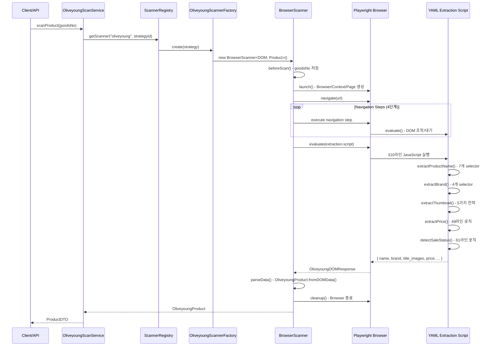
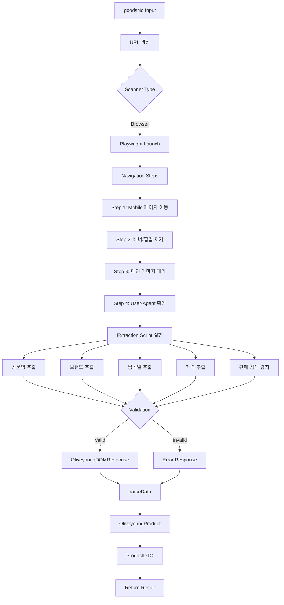
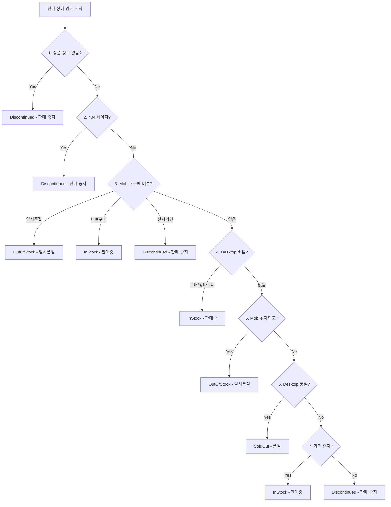
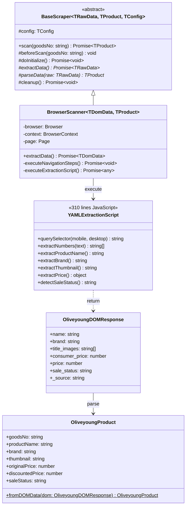
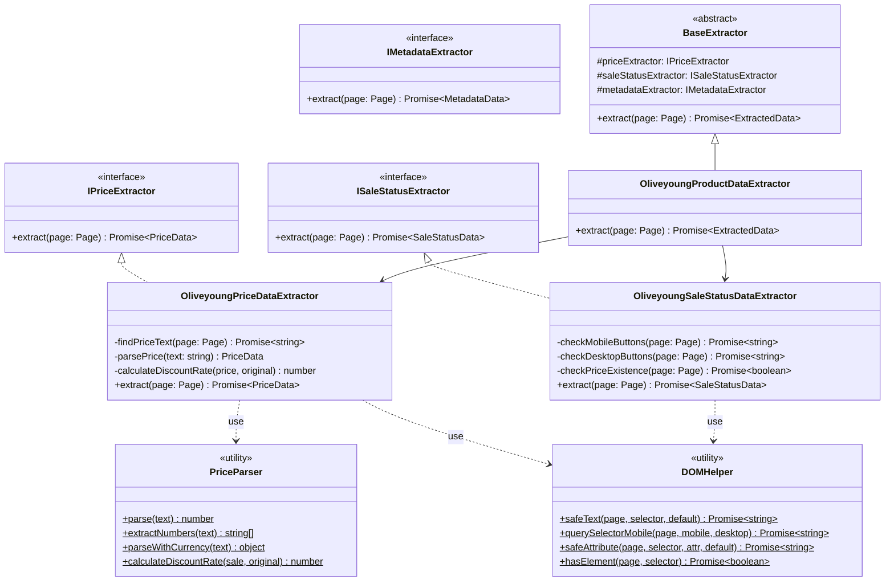

# oliveyoung 로직 분석 문서

## 📋 개요

- **플랫폼**: oliveyoung (올리브영)
- **타입**: Playwright (Browser-based)
- **YAML 파일**: `config/platforms/oliveyoung.yaml`
- **현재 구현**: YAML scripts에 310라인 JavaScript 임베딩
- **주요 특징**:
  - Mobile/Desktop Hybrid 전략 (Mobile 우선)
  - 복잡한 가격 파싱 로직 (할인율 감지 및 분리)
  - 8단계 판매 상태 감지 로직

---

## 🔄 실행 흐름 (Mermaid Sequence Diagram)



---

## 📊 데이터 흐름 (Mermaid Flowchart)



---

## 📝 YAML Scripts 코드 분석

### 전체 구조

- **전체 라인 수**: 310라인 (L179-488)
- **Navigation Steps**: 102라인 (L73-174)
- **Extraction Script**: 310라인 (L179-488)

### 주요 기능별 코드 블록 분류

#### 1. Helper Functions (L181-201) - 22라인

```javascript
// querySelector: Mobile/Desktop 이중 selector
function querySelector(mobileSelector, desktopSelector) { ... }

// extractNumbers: 가격 숫자 추출 정규식
function extractNumbers(text) {
  return text.match(/(\d{1,3}(?:,\d{3})*)/g) || [];
}

// hasButtonWithText: 버튼 텍스트 검색
function hasButtonWithText(text) { ... }

// isVisible: 가시성 체크 (z-index, disabled)
function isVisible(element) { ... }
```

**리팩토링 대상**: `DOMHelper.ts`, `PriceParser.ts`

---

#### 2. 상품명 추출 (L209-235) - 27라인

**전략**: 7개 selector 순차 시도 (Mobile → Desktop 우선순위)

```javascript
const selectors = [
  ".info-group__title", // Mobile 1순위
  ".prd_name", // Desktop 1순위
  '[class*="goods"][class*="name"]',
  '[class*="product"][class*="name"]',
  '[class*="title"]',
  "h1",
  ".goods_name",
];
```

**유효성 검증**: 3글자 이상

**리팩토링 대상**: `MetadataExtractor.ts` - `extractProductName()`

---

#### 3. 브랜드 추출 (L253-272) - 20라인

**전략**: 4개 selector 순차 시도

```javascript
const brandSelectors = [
  ".top-utils__brand-link", // Mobile
  ".prd_brand", // Desktop
  '[class*="brand"]',
  ".brand-name",
];
```

**리팩토링 대상**: `MetadataExtractor.ts` - `extractBrand()`

---

#### 4. 썸네일 추출 (L274-342) - 69라인

**전략**: 5가지 전략 순차 시도

1. **Swiper 활성 슬라이드** (`.swiper-slide-active img`)
2. **Swiper 첫 슬라이드** (`.swiper-slide img`)
3. **Desktop 상품 이미지** (`.prd_img img`, `#mainImg`)
4. **모든 이미지 중 최대 크기** (width × height 최대값)
5. **첫 번째 이미지** (fallback)

**필터링 조건**:

- `options/item` 포함 제외
- `oliveyoung.co.kr` 도메인만
- 최소 크기 검증

**리팩토링 대상**: `MetadataExtractor.ts` - `extractThumbnail()`

---

#### 5. 가격 추출 (L348-396) - 49라인 ⭐

**핵심 로직** (리팩토링 우선순위 높음)

**전략**:

1. 4개 selector 시도
2. 할인율 요소 감지 및 제거
3. 정가/판매가 분리 (할인율 유무 기반)

```javascript
// Selector 우선순위
const priceSelectors = [
  ".info-group__price", // Mobile
  ".prd_price", // Desktop
  ".price",
  '[class*="price"]',
];

// 할인율 감지
const hasDiscount = priceText.includes("%") || hasDiscountElement;

// 가격 파싱
if (hasDiscount) {
  // 할인 있음: 정가와 판매가 분리
  numbers = extractNumbers(priceText);
  originalPrice = numbers[numbers.length - 2];
  price = numbers[numbers.length - 1];
} else {
  // 할인 없음: 단일 가격
  price = extractNumbers(priceText)[0];
}
```

**리팩토링 대상**: `PriceExtractor.ts` (TDD 우선 구현)

---

#### 6. 판매 상태 감지 (L400-460) - 61라인 ⭐

**핵심 로직** (복잡도 높음)

**표준 준수**: schema.org ItemAvailability 규약

- **참고**: <https://schema.org/ItemAvailability>

**8단계 체크 로직**:



**Button Selector 목록**:

- Mobile: `#publBtnBuy`, `.btnBuy`, `.btn-buy`
- Desktop: `.btnBuy`, `.btnBasket`, `.btnSoldout`, `.btnReStock`

**Button Text 매칭** (schema.org 표준):

- "일시품절" → `OutOfStock`
- "바로구매", "구매하기" → `InStock`
- "전시기간 종료" → `Discontinued`
- "품절" (Desktop) → `SoldOut`

**리팩토링 대상**: `SaleStatusExtractor.ts`

---

#### 7. 응답 반환 (L462-487) - 26라인

```javascript
return {
  name: productName,
  brand: brand,
  title_images: [thumbnail],
  consumer_price: originalPrice,
  price: price,
  sale_status: saleStatus,
  _source: "oliveyoung",
  _redirected: false,
};
```

**리팩토링 대상**: `OliveyoungProductMapper.ts` (Phase 3)

---

### 사용된 DOM 선택자 목록 (33개)

#### Mobile 우선 (11개)

```
.info-group__title
.info-group__price
.top-utils__brand-link
.swiper-slide-active img
.swiper-slide img
#publBtnBuy
.btnBuy
.btn-buy
.btnReStock
.restock-alert
.sold-out
```

#### Desktop 우선 (12개)

```
.prd_name
.prd_brand
.prd_price
.prd_img img
#mainImg
.btnBuy
.btnBasket
.btnSoldout
.btnReStock
.prd_detail_top
#Contents
.prd_detail
```

#### Hybrid 패턴 (10개)

```
[class*="goods"][class*="name"]
[class*="product"][class*="name"]
[class*="title"]
[class*="brand"]
[class*="price"]
[class*="discount"]
h1
.goods_name
.brand-name
.price
```

---

### 특수 처리 로직

#### 정규식

```javascript
// 가격 숫자 추출
/(\d{1,3}(?:,\d{3})*)/g

// 이미지 URL 필터
/options\/item/       // 제외
/oliveyoung\.co\.kr/  // 포함만
```

#### 조건문

```javascript
// 할인율 감지
priceText.includes("%") || hasDiscountElement;

// 버튼 disabled 체크
button.disabled || button.classList.contains("disabled");

// z-index 체크 (팝업 제외)
zIndex > 100;

// 이미지 크기 비교
naturalWidth * naturalHeight;
```

#### 문자열 필터

```javascript
// 버튼 텍스트 매칭
button.textContent.includes("일시품절");
button.textContent.includes("바로구매");
button.textContent.includes("전시기간");

// URL 검증
url.includes("oliveyoung.co.kr");
!url.includes("options/item");
```

---

## 🏗️ 클래스 구조 (Mermaid Class Diagram)

### 현재 구조



### 목표 구조 (리팩토링 후)



---

## 🎯 리팩토링 포인트

### 문제점

1. ❌ **310라인 JavaScript → YAML 임베딩**
   - 유지보수 어려움 (에디터 지원 없음)
   - 버전 관리 어려움 (diff 불명확)
   - 협업 어려움 (코드 리뷰 불가)

2. ❌ **타입 안전성 부재**
   - 런타임 에러 위험
   - 자동완성 없음
   - 리팩토링 어려움

3. ❌ **테스트 불가능**
   - `page.evaluate()` 격리 환경
   - Unit test 불가
   - Mock 불가

4. ❌ **재사용성 없음**
   - Helper 함수 다른 플랫폼 재사용 불가
   - 공통 로직 중복 발생

5. ❌ **디버깅 어려움**
   - `console.log`만 가능
   - 브레이크포인트 불가
   - 스택 트레이스 불명확

---

### 개선 방향

#### 1. TypeScript 클래스 분리

**파일 구조**:

```
src/extractors/
  base/
    IPriceExtractor.ts
    ISaleStatusExtractor.ts
    IMetadataExtractor.ts
    BaseExtractor.ts

  common/
    DOMHelper.ts          # safeText, querySelectorMobile, safeAttribute, hasElement
    PriceParser.ts        # extractNumbers, parse, calculateDiscountRate
    DateHelper.ts         # 날짜 파싱 (필요시)
    TextNormalizer.ts     # 텍스트 정규화 (필요시)

  oliveyoung/
    OliveyoungProductDataExtractor.ts  # 통합 Extractor
    extractors/
      PriceDataExtractor.ts            # 49라인 로직
      SaleStatusDataExtractor.ts       # 61라인 로직
      MetadataDataExtractor.ts         # 상품명, 브랜드, 썸네일
```

#### 2. 공통 유틸리티 추출

**PriceParser** (재사용 가능):

```typescript
export class PriceParser {
  static parse(text: string | null | undefined): number;
  static extractNumbers(text: string): string[];
  static parseWithCurrency(text: string): { amount: number; currency: string };
  static calculateDiscountRate(
    price: number,
    original: number,
  ): number | undefined;
}
```

**DOMHelper** (재사용 가능):

```typescript
export class DOMHelper {
  static async safeText(
    page: Page,
    selector: string,
    defaultValue?: string,
  ): Promise<string>;
  static async querySelectorMobile(
    page: Page,
    mobileSelector: string,
    desktopSelector: string,
  ): Promise<string>;
  static async safeAttribute(
    page: Page,
    selector: string,
    attribute: string,
    defaultValue?: string,
  ): Promise<string>;
  static async hasElement(page: Page, selector: string): Promise<boolean>;
}
```

#### 3. 인터페이스 설계

**IPriceExtractor**:

```typescript
export interface IPriceExtractor {
  extract(page: Page): Promise<PriceData>;
}

export interface PriceData {
  price: number;
  originalPrice?: number;
  discountRate?: number;
  currency: string;
}
```

**ISaleStatusExtractor**:

```typescript
export interface ISaleStatusExtractor {
  extract(page: Page): Promise<SaleStatusData>;
}

export interface SaleStatusData {
  saleStatus: "InStock" | "OutOfStock" | "SoldOut" | "Discontinued"; // schema.org 표준
  statusText?: string;
  isAvailable: boolean;
}
```

#### 4. 테스트 전략

**Unit Test** (Jest/Vitest):

```typescript
describe("OliveyoungPriceDataExtractor", () => {
  it("할인 없는 가격 추출", async () => {
    const mockPage = createMockPage(`
      <div class="info-group__price">15,000원</div>
    `);

    const extractor = new OliveyoungPriceDataExtractor();
    const result = await extractor.extract(mockPage);

    expect(result.price).toBe(15000);
    expect(result.originalPrice).toBeUndefined();
  });
});
```

**Integration Test** (E2E):

```typescript
describe("OliveyoungProductDataExtractor E2E", () => {
  it("실제 상품 페이지 크롤링", async () => {
    const browser = await chromium.launch();
    const page = await browser.newPage();
    await page.goto("https://m.oliveyoung.co.kr/...");

    const extractor = new OliveyoungProductDataExtractor();
    const result = await extractor.extract(page);

    expect(result.metadata.productName).toBeTruthy();
    expect(result.price.price).toBeGreaterThan(0);
  });
});
```

---

## 📊 추출 데이터 스키마

### 현재 DOM 응답

```typescript
interface OliveyoungDOMResponse {
  id?: string;
  goodsNo?: string;
  name: string;
  brand?: string;
  title_images: string[];
  consumer_price: number;
  price: number;
  sale_status: "SELNG" | "SLDOT" | "STSEL"; // 올리브영 내부 코드 (변환 필요)
  _source?: string;
  _redirected?: boolean;
  _error?: string;
}
```

**참고**: 올리브영 API는 내부 코드(`SELNG`, `SLDOT`, `STSEL`)를 반환하지만,
리팩토링 후에는 schema.org 표준(`InStock`, `OutOfStock`, `SoldOut`, `Discontinued`)으로 변환하여 저장합니다.

### 목표 추출 데이터 구조

```typescript
interface ExtractedData {
  metadata: MetadataData;
  price: PriceData;
  saleStatus: SaleStatusData;
}

interface MetadataData {
  productName: string;
  brand?: string;
  thumbnail?: string;
  images?: string[];
}

interface PriceData {
  price: number;
  originalPrice?: number;
  discountRate?: number;
  currency: string;
}

interface SaleStatusData {
  saleStatus: "InStock" | "OutOfStock" | "SoldOut" | "Discontinued"; // schema.org 표준
  statusText?: string;
  isAvailable: boolean;
}
```

---

## ✅ 구현 체크리스트

### Phase 1: 베이스 구조 (TDD Day 1)

- [x] `IPriceExtractor.ts` 인터페이스 정의 + 테스트
- [x] `ISaleStatusExtractor.ts` 인터페이스 정의 + 테스트
- [x] `IMetadataExtractor.ts` 인터페이스 정의 + 테스트
- [ ] `BaseExtractor.ts` 추상 클래스 + 테스트

### Phase 2: 공통 유틸리티 (TDD Day 1)

- [x] `PriceParser.ts` 구현 + 테스트 (RED → GREEN → REFACTOR)
- [x] `DOMHelper.ts` 구현 + 테스트 (RED → GREEN → REFACTOR)
- [ ] `TextNormalizer.ts` 구현 + 테스트 (필요 시)
- [ ] `DateHelper.ts` 구현 + 테스트 (필요 시)

### Phase 3: oliveyoung Extractor (TDD Day 1-2)

- [ ] `OliveyoungPriceDataExtractor.ts` 구현 + 테스트 (49라인)
- [ ] `OliveyoungStatusDataExtractor.ts` 구현 + 테스트 (61라인)
- [ ] `OliveyoungMetadataDataExtractor.ts` 구현 + 테스트
- [ ] `OliveyoungStockDataExtractor.ts` 구현 + 테스트
- [ ] `OliveyoungProductDataExtractor.ts` 통합 + 테스트

### Phase 4: YAML 설정 단순화 (Day 2)

- [ ] `oliveyoung.yaml` scripts 항목 제거
- [ ] `extractor: "oliveyoung"` 참조 추가
- [ ] selectors만 YAML에 유지
- [ ] config 플랫폼 설정 추가

### Phase 5: Scanner 통합 (Day 2)

- [ ] `ExtractorRegistry.ts` 생성
- [ ] `BrowserScanner.ts` ExtractorRegistry 연동
- [ ] 기존 로직과 결과 동일성 검증
- [ ] E2E 테스트 작성

---

## 🔗 관련 파일

### 현재 구현

- `config/platforms/oliveyoung.yaml` (310라인 scripts)
- `src/scrapers/base/BrowserScanner.ts` (evaluate 실행)
- `src/core/domain/OliveyoungProduct.ts` (도메인 모델)
- `src/services/platforms/oliveyoung/OliveyoungScanService.ts` (Facade)

### 리팩토링 대상 (생성 예정)

- `src/extractors/base/*.ts` (인터페이스)
- `src/extractors/common/*.ts` (유틸리티)
- `src/extractors/oliveyoung/*.ts` (Extractor 구현)
- `tests/extractors/**/*.test.ts` (테스트)
